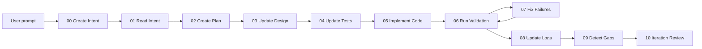

# Agentic Application Development Workflow

This folder defines the canonical AppFlow 11-step workflow. Every development prompt should automatically enter this workflow unless the user explicitly asks for an answer-only or planning-only response.

The workflow is artifact-driven, not chat-driven: each step reads specific upstream artifacts, produces specific downstream artifacts, and must respect the repo contract before moving forward.

## Automatic Prompt Routing

For ordinary development prompts such as "Improve the UI", "Fix the failing test", or "Add export support", the agent should not wait for the user to invoke workflow files manually.

Default behavior:

1. Treat the prompt as AppFlow input.
2. Start at `.codex/dev_workflow/00-create-intent.md`.
3. Read `.devmode/mode.yaml`, the selected `.devmode/*` entry point, `.codex/project-context.md`, and `.codex/tech-stack.md`.
4. Execute steps `00` through `10` as far as the task can safely proceed.
5. Use `.codex/agents/`, `.codex/skills/`, `.codex/orchestration/`, `.codex/rules/`, and `.codex/tools/` as support.
6. Stop only at completion, explicit user boundary, or a genuine blocker/HITL checkpoint.

## Core Operating Model

The agent is not supposed to improvise outside this chain. It converts the prompt into current-turn intent, reconciles that intent with project artifacts, plans work, updates design and validation expectations, implements approved behavior, proves the result, records what happened, and feeds discovered gaps back into the next loop.

## Workflow Principles

| Principle | Exact rule | Prevents |
| --- | --- | --- |
| Prompt to intent | Convert the user prompt into current-turn intent first | Coding directly from chat text |
| Contract first | Read `.devmode/mode.yaml`, the selected `.devmode/*` entry point, and project context before substantial work | Local edits that violate repo policy |
| Intent first | Reconcile current-turn intent with project intent before planning | Hidden scope drift |
| Plan before downstream edits | Translate intent into `plan/*` before changing design, tests, or code | Untracked assumptions |
| Design before code | If behavior changes, update design/contracts before implementation | Code inventing behavior |
| Tests before code | Update validation expectations before implementation | Post hoc testing |
| Validation before closeout | Every meaningful change ends with explicit validation | Unproven completion claims |
| Logs record reality | `dev_log/*` records actual changes and validation | Fake progress tracking |
| Gaps feed the next loop | Evidence-backed gaps go into `intent/gaps.md` | Rediscovering known issues |

## Source of Truth Order

| Priority | Artifact layer | Role |
| --- | --- | --- |
| 1 | user prompt and current-turn intent | Immediate task input |
| 2 | `intent/*` | Human intent and feedback |
| 3 | `plan/*` | Active iteration interpretation of intent |
| 4 | `.codex/project-context.md` | High-level design and operating model |
| 5 | `design/*` | Detailed behavior, architecture, flows, and correctness |
| 6 | `tests/*` | Validation design and coverage plan |
| 7 | `src/*` | Implementation artifacts |
| 8 | `dev_log/*` | Evidence and history |

## Prompt Navigation

| Step | Prompt file | What it controls |
| --- | --- | --- |
| `00` | `.codex/dev_workflow/00-create-intent.md` | Convert raw user prompt into current-turn intent |
| `01` | `.codex/dev_workflow/01-read-intent.md` | Reconcile current-turn intent with project intent and repo context |
| `02` | `.codex/dev_workflow/02-create-plan.md` | Scope reconciliation and traceable work item creation |
| `03` | `.codex/dev_workflow/03-update-design.md` | High-level and detailed design updates |
| `04` | `.codex/dev_workflow/04-update-tests.md` | Criteria-driven validation preparation |
| `05` | `.codex/dev_workflow/05-implement-code.md` | Implementation aligned to plan, design, and tests |
| `06` | `.codex/dev_workflow/06-run-validation.md` | Execution of explicit proof |
| `07` | `.codex/dev_workflow/07-fix-failures.md` | Failure correction at the correct layer |
| `08` | `.codex/dev_workflow/08-update-logs.md` | Permanent logging of actual work and evidence |
| `09` | `.codex/dev_workflow/09-detect-gaps.md` | System-detected gap surfacing |
| `10` | `.codex/dev_workflow/10-iteration-review.md` | Closeout and next-loop readiness |

The 11 prompt files are intended to be execution-complete as a set. If followed in order, they should cover a full iteration using the current prompt and repository artifacts without relying on hidden workflow knowledge from chat history.

## Codex-Native Support

| Support area | Purpose |
| --- | --- |
| `.codex/agents/` | Bounded role contracts |
| `.codex/skills/` | Reusable specialized procedures |
| `.codex/orchestration/` | Long-horizon loops, task patterns, HITL checkpoints, and resumable-state guidance |
| `.codex/context/` | Context engineering templates |
| `.codex/memory/` | Reviewable structured memory |
| `.codex/rules/` | Reusable operational rules |
| `.codex/tools/` | Deterministic helper scripts |

## Step-by-Step Execution Semantics

| Step | Reads from | May update | Must achieve | Must not do |
| --- | --- | --- | --- | --- |
| `00` Create Intent | User prompt, selected `.devmode/*` entry point, `.codex/project-context.md` | `.codex/state/current-intent.md` | Current-turn intent exists before repo reconciliation | Start coding or edit project intent |
| `01` Read Intent | `.codex/state/current-intent.md`, selected `.devmode/*` entry point, `.codex/project-context.md`, `intent/*` | None | Scope, constraints, ambiguity, and feedback context are clear | Start coding or plan from memory |
| `02` Create Plan | current intent, `intent/*`, current repo state, active logs | `plan/*` | Explicit `REQ-*`, `DEV-*`, `TEST-*` work | Hide ambiguity or compress constraints |
| `03` Update Design | `plan/*`, `.codex/project-context.md`, `design/*` | `.codex/project-context.md` when needed, `design/*` | Design baseline for downstream work | Let code define behavior first |
| `04` Update Tests | `design/*`, correctness criteria, traceability | `tests/*` | Proving strategy and validation assets before code | Write tests from implementation convenience |
| `05` Implement Code | `plan/*`, `design/*`, `tests/*`, stack notes | `src/*` | Approved behavior implemented | Invent new requirements in code |
| `06` Run Validation | Changed artifacts, test plan, validation methods | No permanent logs yet | Real pass, fail, or partial evidence | Claim success without proof |
| `07` Fix Failures | Validation findings and implicated artifacts | The correct failing layer | Root cause fixed or explicitly deferred | Patch around upstream defects |
| `08` Update Logs | Final diff and final validation result | `dev_log/*` | Permanent factual execution record | Log intended work as completed |
| `09` Detect Gaps | `dev_log/*`, validation outcomes | `intent/gaps.md` | Evidence-backed next-loop gaps captured | Rewrite human intent or feedback |
| `10` Iteration Review | Outputs from all prior steps | Usually none beyond final workflow artifacts | Explicit closure status and next-loop readiness | Start new scope silently |

## Guardrails

- Do not modify human-owned intent files unless explicitly asked, except `intent/gaps.md` in step `09`.
- Do not use implementation behavior as the de facto design source.
- Do not invent tests without design linkage.
- Do not treat "looks correct" as validation.
- Do not write logs before the real result is known.
- Do not close out while validation, logs, or review are incomplete.

## Validation and Evidence Model

| Changed layer | Expected proof | Typical evidence destination |
| --- | --- | --- |
| Workflow docs or contract docs | Manual review, structural checks, `git diff --check` | `dev_log/validation-results.md` |
| Design | Manual review against intent, traceability, correctness, and architecture | `dev_log/validation-results.md` |
| Tests | Targeted test execution, checklist review, or artifact review | `dev_log/validation-results.md` |
| Code | Targeted unit, integration, e2e, regression, or smoke validation | `dev_log/validation-results.md` |

Validation must state the method, result, findings, failure classification if relevant, and follow-up.

## Failure Classification Model

| Classification | Meaning |
| --- | --- |
| `design defect` | Design is wrong, incomplete, or conflicting |
| `implementation defect` | Code does not follow intended design |
| `test defect` | Validation layer is weak, wrong, or missing |
| `eval gap` | Evidence is insufficient to prove behavior |
| `environment issue` | Tooling, runtime, infra, or dependency problem blocks progress |
| `backlog enhancement` | Useful but out-of-scope follow-on work |

## Decision Gates

| If this happens | The workflow must do this next |
| --- | --- |
| Prompt changes operating model or repo rules | Update the selected `.devmode/*` entry point and `.codex/project-context.md` before downstream artifacts |
| Behavior changes | Update design before code |
| Correctness criteria or workflows change | Update tests before code |
| Validation fails | Enter step `07`, classify root cause, fix the correct layer, rerun step `06` |
| Validation passes | Update logs, detect gaps, review iteration |
| Evidence reveals unresolved systemic follow-up | Record it in `intent/gaps.md` |
| Work is out of scope | Defer it or update design first |

## Workflow Anti-Patterns

| Anti-pattern | Why it is wrong |
| --- | --- |
| Coding directly from the user prompt | Skips intent creation, reconciliation, planning, design, and validation preparation |
| Using code behavior to decide requirements | Reverses the source-of-truth order |
| Writing tests only after code exists | Breaks criteria-driven validation discipline |
| Logging planned work before execution | Corrupts the permanent record |
| Editing human intent to resolve ambiguity | Rewrites requirements instead of surfacing questions |
| Treating validation as optional for doc changes | Leaves workflow and contract drift unproven |
| Treating `intent/gaps.md` as personal notes | Breaks the system-generated gap model |
| Closing without review | Hides residual risks, deferrals, or blockers |

## Start and Stop Conditions

| Condition | Meaning |
| --- | --- |
| Iteration start | A user prompt enters step `00` |
| Step handoff | A step completes only when its exit condition is met |
| Validation loop active | Steps `06` and `07` are repeating |
| Iteration complete | Validation outcome is recorded, logs are current, and review confirms closure |
| Next loop begins | Only after a new prompt, new feedback, or a surfaced gap requires another pass |
