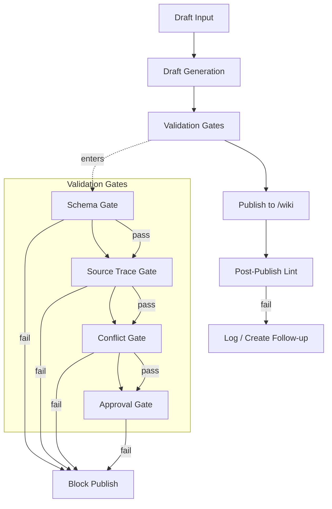
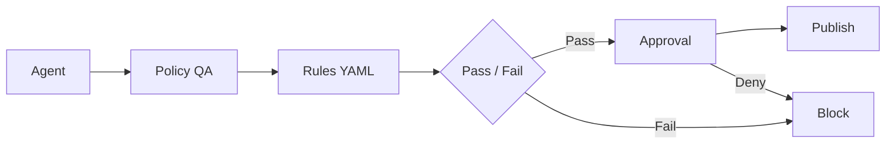

# KMS System Design

This file is system-generated from intent and iteration workflow. Do not edit directly.

# 7. Governance, Validation Rules, and Policy Enforcement

## 7.1 Governance Model Overview

Governance is the runtime enforcement layer that determines whether knowledge may progress from draft state to finalized publication. It is not documentation, guidance, or a review preference. It is executable policy applied before content can reach `/wiki`.

Governance in KMS means:

- rules are executable constraints, not prose recommendations
- validation is mandatory before publish
- agents cannot bypass governance
- the Knowledge Manager Interface (KMI) is the human governance surface
- the metadata DB may store governance state, but it does not replace `/wiki` as the source of truth

Governance = enforceable constraints over the knowledge lifecycle.

No content reaches `/wiki` without passing governance checks. Any path that attempts to publish without evaluation, approval, or traceability is invalid by design and must be blocked.

## 7.2 Rule Categories

Governance rules are grouped by enforcement intent so each control can be evaluated deterministically at runtime.

| Rule Category | Purpose | Enforced By | Failure Impact |
|---|---|---|---|
| Schema Rules | Ensure pages, metadata, and structured fields conform to required shapes | Schema validator, lint agent | Block publish |
| Content Rules | Enforce required sections, terminology, formatting, and allowed patterns | Policy QA Agent, lint agent | Block publish or escalate review |
| Source Trace Rules | Require each claim to map to source evidence or approved provenance | Policy QA Agent, orchestrator | Block publish |
| Relationship Rules | Validate links, parent-child structure, taxonomy placement, and reference integrity | Lint agent, orchestrator | Block publish or log warning |
| Conflict Rules | Detect contradictions, ambiguity, and competing canonical claims | Contradiction Reviewer, Policy QA Agent | Block publish or escalate review |
| Freshness Rules | Enforce recency thresholds and refresh requirements for time-sensitive knowledge | Policy QA Agent, orchestrator | Escalate review or block publish |
| Duplication Rules | Prevent duplicate canonical pages, duplicate metrics, or overlapping authoritative definitions | Policy QA Agent, orchestrator | Block publish |
| Approval Rules | Require human approval when policy or risk thresholds are crossed | KMI, approval workflow | Block publish until approved |

Rule categories are cumulative. A page must satisfy every applicable category before it can be finalized.

## 7.3 Rule Definition Model

Rules live in `/rules/*.yaml`. Each file defines executable policy that can be loaded by the runtime and applied during validation.

Required rule fields:

- `id`
- `description`
- `scope`
- `severity` (`error` / `warning`)
- `condition`
- `action` (`block_publish` / `escalate_review` / `log_only`)

Rule files must be machine-readable and stable. The rule engine should treat missing required fields as a configuration error and fail closed.

```yaml
id: rule.metric_requires_source_trace
description: Metric definitions must cite at least one approved source artifact before publication.
scope:
  page_types:
    - canonical-metric
severity: error
condition:
  all:
    - field: frontmatter.source_traces
      operator: exists
    - field: frontmatter.source_traces
      operator: min_items
      value: 1
action: block_publish
```

## 7.4 Validation Pipeline and Gates

Validation is staged so failures are caught as early as possible, but publish is still blocked if any required gate fails later in the flow.

Validation stages:

1. pre-draft validation
2. post-draft validation
3. pre-publish validation
4. post-publish lint

Mandatory gates:

- schema gate
- source trace gate
- conflict gate
- approval gate

Pre-draft validation checks input shape, required metadata, and obvious rule violations before draft generation proceeds. Post-draft validation evaluates the generated page set against policy rules and source trace requirements. Pre-publish validation is the final blocking checkpoint before `/wiki` write actions. Post-publish lint runs after publish to detect drift, broken references, and non-blocking maintenance issues, but it cannot authorize an invalid publish after the fact.



The gates are non-bypassable. If any required gate fails, publish is blocked or escalated according to the rule definition. No runtime component may short-circuit this sequence.

## 7.5 Approval and HITL Model

Human-in-the-loop approval is required when the system cannot safely finalize knowledge on its own, when policy says the change is high impact, or when a rule explicitly escalates review.

Explicit review triggers:

- low confidence
- unresolved contradiction
- new canonical metric
- new canonical data-asset
- major rewrite of existing page
- missing source trace
- override request after failed validation

| Trigger | Why Review Is Required | Allowed Outcomes |
|---|---|---|
| Low confidence | The system cannot justify finality with sufficient certainty | Approve, request revision, reject |
| Unresolved contradiction | Competing claims cannot be flattened into one truth | Approve with open question, request revision, reject |
| New canonical metric | A new authoritative metric changes downstream behavior and terminology | Approve, request revision, reject |
| New canonical data-asset | A new authoritative data asset changes lineage and ownership assumptions | Approve, request revision, reject |
| Major rewrite of existing page | Broad semantic change risks breaking established meaning | Approve, request revision, reject |
| Missing source trace | Claims cannot be proven against source evidence | Approve with remediation, request revision, reject |
| Override request after failed validation | A user is asking to bypass a blocking rule | Approve override, deny override, require escalation |

Approval is an explicit state transition. It does not imply that rules are disabled; it means the Knowledge Manager has accepted the risk and the system has recorded that decision.

## 7.6 Contradiction Detection and Handling

Contradictions are first-class governance objects. They are identified when source evidence, page claims, or canonical records disagree on a factual statement, definition, ownership boundary, metric logic, or lifecycle state.

Contradictions must never be silently flattened. The system must preserve both the conflict and the context that produced it.

Unresolved contradictions create or update `open-question` pages. Those pages become the durable place where conflicting evidence, analysis, and pending decisions are recorded until the issue is resolved.

Contradiction severity influences publish behavior:

- high severity contradiction blocks publish
- medium severity contradiction escalates review
- low severity contradiction may log only if policy explicitly allows it

```text
Source A (claims metric definition X)
            \
             \--> Contradiction Detector --> open-question page --> Knowledge Manager review
             /
Source B (claims metric definition Y)
```

Conflict handling rules:

- retain both source claims
- record the page or artifact ids involved
- classify severity
- assign next action
- prevent silent merge of incompatible statements

## 7.7 Audit and Traceability Model

Every governance decision must be auditable. The system must be able to explain why a page was blocked, approved, escalated, or published.

Required governance artifacts:

- rule evaluation log
- approval decision log
- contradiction report
- publish summary
- lineage trace from source to finalized wiki page

| Artifact | Purpose | Retention / Usage |
|---|---|---|
| Rule evaluation log | Records which rules were evaluated, their inputs, and outcomes | Retained for audit and debugging of policy enforcement |
| Approval decision log | Records human approvals, denials, overrides, reviewer identity, and timestamps | Used for governance traceability and compliance review |
| Contradiction report | Captures conflict details, severity, implicated sources, and disposition | Used to drive open-question workflow and follow-up work |
| Publish summary | Records what changed, what passed, what failed, and what was published | Used as the transaction record for finalized publication |
| Lineage trace from source to finalized wiki page | Connects each finalized page to the source evidence that justified it | Used to prove provenance and support later audits |

Governance logs are not optional diagnostics. They are mandatory control artifacts and must be generated whenever validation, approval, or publish decisions occur.

## 7.8 Enforcement Responsibility Model

Enforcement is distributed across bounded components, but responsibility is explicit. No component may claim authority outside its assigned control surface.

| Component | Enforcement Responsibility | Cannot Override |
|---|---|---|
| Policy QA Agent | Evaluates rule conditions, source trace completeness, and policy compliance | Human approval requirements and rule definitions |
| Contradiction Reviewer | Classifies conflicts, creates open-question pages, and routes unresolved issues | Rule severity or publish gate outcomes |
| Orchestrator Agent | Sequences validation stages and blocks publish when a gate fails | Mandatory gates, approval policy, or contradiction status |
| Publisher | Writes only validated content to `/wiki` and records publish metadata | Failed validation, missing approval, or blocked rules |
| Lint Agent | Performs post-publish lint and maintenance checks | Final publish authorization or governance policy |

The enforcement model is intentionally layered. Each component can stop progress within its responsibility, but none can bypass a higher-order governance rule.

## 7.9 Failure Handling and Policy Outcomes

Failure handling must be deterministic. Each failure type maps to an explicit system response and downstream effect.

| Failure Type | Severity | System Response | Downstream Effect |
|---|---|---|---|
| Schema failure | Error | Block publish and return validation diagnostics | Draft remains unpublished |
| Missing required sections | Error | Block publish and mark page incomplete | Requires remediation before retry |
| Missing source trace | Error | Block publish or escalate to review if policy allows override review | No finalized page until trace is added or approved |
| Broken links | Warning or error based on scope | Log issue, block if link is required for canonical navigation | Publish may proceed only if policy marks it non-blocking |
| Duplicate canonical page risk | Error | Block publish and route for deduplication decision | Prevents competing truth sources |
| Contradiction blocking publish | Error | Block publish and create or update open-question page | Knowledge remains unfinalized until resolved |
| Approval rejection | Error | Block publish and record decision | Change is not published and requires revision or abandonment |

Failure responses must not silently downgrade severity. If a rule is configured as `error`, the system must behave as if publication is blocked.

## 7.10 Rules vs Agents vs Skills

The system separates policy, execution, and reusable procedure.

- rules define what is allowed
- agents execute bounded responsibilities
- skills define reusable procedures

Rules are authoritative. Agents cannot redefine policy, reinterpret blocked rules as optional, or publish through an alternate path. Skills cannot bypass policy because skills only package procedures; they do not own authority. If a skill conflicts with a rule, the rule wins.

## 7.11 Example Rule Set

The runtime should support multiple rules in a single file or a small set of files, as long as every rule remains explicit, machine-readable, and independently enforceable.

```yaml
rules:
  - id: rule.page_requires_sections
    description: Canonical pages must include required sections before publication.
    scope:
      page_types:
        - canonical-process
        - canonical-metric
    severity: error
    condition:
      all:
        - field: page.sections
          operator: contains_all
          value:
            - overview
            - definition
            - source-trace
    action: block_publish

  - id: rule.metric_requires_source_trace
    description: Metric pages must reference source artifacts that justify the final definition.
    scope:
      page_types:
        - canonical-metric
    severity: error
    condition:
      all:
        - field: frontmatter.source_traces
          operator: exists
        - field: frontmatter.source_traces
          operator: min_items
          value: 1
    action: block_publish

  - id: rule.new_canonical_metric_requires_approval
    description: New canonical metrics require human approval before publication.
    scope:
      page_types:
        - canonical-metric
    severity: warning
    condition:
      any:
        - field: page.change_type
          operator: equals
          value: new_canonical_metric
    action: escalate_review
```

This rule set combines a schema/content rule, a source trace rule, and an approval-trigger rule. It is representative of the minimum enforceable pattern, not a special case.

## 7.12 Governance Architecture Diagram

Governance is enforced as a runtime control path, not a back-office checklist.



The diagram represents the required control chain. Any implementation that allows an agent to publish without passing through policy evaluation, rule loading, and approval handling is non-compliant.

## 7.13 Section Summary

Governance is enforced at runtime. Rules are explicit and machine-readable. Publish is gated. Contradictions are surfaced instead of flattened. Audit trail is mandatory. `/wiki` integrity is protected by policy, and the metadata DB supports governance without replacing `/wiki` as the source of truth.

Boundary conditions are absolute:

- no rule bypass allowed
- no publish without required validation
- no silent conflict resolution
- no agent may override governance policy
- `/wiki` remains protected from invalid publication
