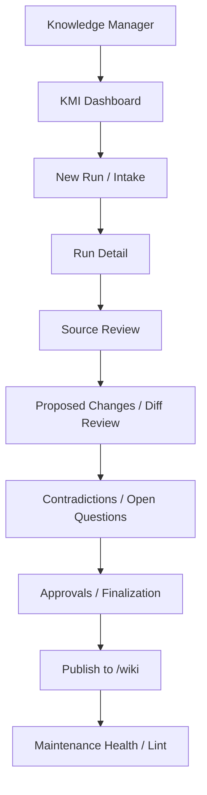
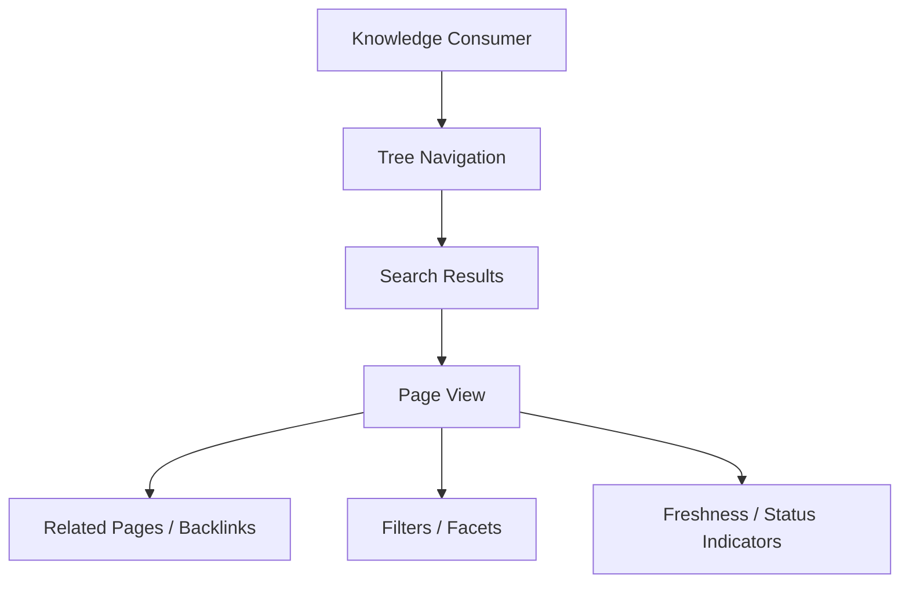

# KMS System Design

This file is system-generated from intent and iteration workflow. Do not edit directly.

# 8. Knowledge Manager Interface (KMI) and Infopedia UX Design

## 8.1 UX Architecture Overview

KMS exposes two distinct user-facing applications with separate authority boundaries and interaction models.

- KMI is the maintenance and governance surface for the Knowledge Manager
- Infopedia is the browse-only knowledge consumption surface for Knowledge Consumers
- KMI supports workflow execution, validation review, approval, and finalization
- Infopedia supports discovery, reading, navigation, and status-aware consumption

Two surfaces, two responsibilities: governed maintenance vs read-only knowledge navigation.

The same finalized `/wiki` knowledge may appear in both surfaces, but the interaction contract is different. KMI can change what becomes finalized truth through governed workflows. Infopedia can only present finalized knowledge and metadata derived from `/wiki` and supporting indexes.

## 8.2 KMI Design Principles

KMI is a workflow application, not a conversational assistant. Its design must make maintenance state visible and decisions explicit.

Core principles:

- workflow-driven, not chat-driven
- stage visibility over hidden automation
- diff-based review over opaque updates
- rule violations surfaced explicitly
- contradictions surfaced explicitly
- approval actions must be deliberate
- operational artifacts must be inspectable

KMI must not become:

- a generic chatbot
- a free-form markdown editor bypassing rules
- a consumer browse portal

The UI should reinforce the governed lifecycle. A user should always know what stage a run is in, what changed, what is blocked, what is waiting for review, and what is eligible for finalization.

## 8.3 Infopedia Design Principles

Infopedia is a read-only navigation layer optimized for fast discovery and stable consumption.

Core principles:

- fast, simple, read-only
- tree-first navigation
- hyperlink traversal
- search and filter support
- freshness and status visibility
- no maintenance authority

Infopedia must not become:

- a second source of truth
- an editing surface
- a raw-source browser

The application should make finalized knowledge easy to find, easy to read, and easy to traverse without exposing maintenance actions or raw draft state.

## 8.4 KMI Information Architecture

KMI should be organized around maintenance workflows and review stages rather than around generic document management.

| Screen | Primary Purpose | Main User Actions | Key Data Shown | Outputs or Decisions |
|---|---|---|---|---|
| Dashboard | Summarize current maintenance state | Open runs, inspect queues, jump to issues | Recent runs, pending reviews, contradictions, health issues | Triage decisions and next-action selection |
| New Run / Intake | Start a governed maintenance run | Enter source path, validate path, launch run | Path validation, source preview, run options | Run creation or rejection |
| Run Detail | Show orchestration and stage progress | Inspect stages, open artifacts, drill into failures | Stage timeline, counts, statuses, warnings | Diagnosis and stage-level decisions |
| Source Review | Review ingested sources and notes | Open source files, annotate, mark relevance | Source list, parse quality, source notes | Source acceptance or remediation |
| Proposed Changes / Impact Review | Understand affected knowledge pages | Inspect impacted pages, compare scope | Change summary, impacted pages, confidence | Accept, defer, or escalate changes |
| Diff Review | Review exact markdown modifications | Read diffs, compare before/after sections | Structured diffs, source trace markers, rule violations | Approve, reject, or request revision |
| Contradictions / Open Questions | Resolve conflicting claims | Inspect conflicts, link evidence, create open questions | Severity, conflicting sources, proposed resolution | Resolve, escalate, or keep open |
| Approvals / Finalization | Final gate before publish | Review blockers, approve or reject finalization | Validation summary, eligible items, blockers | Finalize or block publish |
| Maintenance Health / Lint | Track ongoing quality issues | Open stale items, fix links, assign refresh | Broken links, stale pages, duplicates, open questions | Maintenance action or remediation task |
| Rules / Policy Visibility | Make governance visible to users | Inspect rules and applicability | Rule inventory, severity, scope, failures | Policy-aware maintenance decisions |

Each screen supports a bounded decision. KMI should not blur review, approval, and finalization into a single opaque action.

## 8.5 KMI Dashboard

The dashboard is a control panel, not a landing page. It should answer what requires attention now and what is blocked.

Dashboard content:

- recent runs
- run statuses
- pending reviews
- contradictions requiring attention
- pages pending approval
- lint/health summary
- freshness issues
- latest finalized updates

| Dashboard Widget | Purpose | Primary Action |
|---|---|---|
| Recent runs | Show latest maintenance executions | Open run detail |
| Run statuses | Show blocked, in progress, complete, failed states | Resume investigation |
| Pending reviews | Surface items waiting on human review | Open diff or approval screen |
| Contradictions | Surface open conflicts and their severity | Open contradiction review |
| Pages pending approval | Show finalization queue | Approve, reject, defer |
| Lint / health summary | Summarize structural issues | Open maintenance health |
| Freshness issues | Highlight stale or overdue content | Queue refresh work |
| Latest finalized updates | Show what changed in `/wiki` | Inspect publish summary |

The dashboard should be filterable by run, page family, severity, and status so the Knowledge Manager can focus on unresolved governance work.

## 8.6 KMI Intake and Run Initiation UX

The new run screen starts the governed ingestion workflow.

Required inputs:

- local source path input
- optional domain hint
- optional run notes
- optional dry-run / strictness controls if consistent with policy and prior sections

The UI must validate the path before run creation and surface the result immediately.

Required feedback states:

- invalid path
- empty folder
- inaccessible path
- supported vs unsupported file summary

Numbered flow:

1. User enters a local source path.
2. UI validates path existence and access.
3. UI optionally resolves folder contents and preview metadata.
4. UI shows supported file types and unsupported file counts.
5. User adds optional domain hint and run notes.
6. User starts a dry-run or governed run, subject to policy.
7. Backend creates a run record and begins orchestration.
8. KMI transitions to run detail and stage tracking.

The intake screen must prevent accidental launches from bad paths and must not imply that unsupported content is acceptable without review.

## 8.7 KMI Run Detail and Stage Tracking

Run detail must make orchestration visible rather than opaque. The user should be able to see what the system did, what it is doing now, and what it failed to do.

Run detail behavior:

- show ordered stages
- show current stage and status
- show source counts
- show parse outcomes
- show source-note counts
- show impact summary
- show warnings and failures
- show artifact links

| Stage | Status Values | User Meaning |
|---|---|---|
| Intake | queued, running, complete, failed | Source discovery and run creation state |
| Parse | queued, running, complete, failed | Source files are being parsed and classified |
| Normalize | queued, running, complete, failed | Raw input is being standardized into structured artifacts |
| Validate | queued, running, complete, failed, blocked | Rules and gates are being applied |
| Review | waiting, in_review, approved, rejected, escalated | Human decision is required or in progress |
| Finalize | queued, running, complete, failed, blocked | Final wiki write is being prepared or executed |
| Lint | queued, running, complete, failed | Post-publish checks and maintenance are executing |

The run timeline should show the current stage prominently and preserve the ordered stage history so the user can reason about failures without opening backend logs.

## 8.8 KMI Proposed Changes and Diff Review UX

This is the primary review surface for the Knowledge Manager. It must support structured, evidence-backed evaluation of proposed knowledge changes.

Core elements:

- list of impacted pages
- action type (`create`, `update`, `no-op`, `review`)
- confidence indicators
- source trace indicators
- rule violations inline
- before/after markdown diff
- section-level change visibility
- ability to approve, reject, defer, or escalate where policy allows

Review should always show the relationship between source evidence, generated knowledge, and target wiki pages. The review model must make it clear whether a change is a small correction, a semantic rewrite, or a new canonical entry.

| Review Element | Why It Exists | User Decision Supported |
|---|---|---|
| Impacted pages | Show what knowledge will change | Confirm scope and avoid accidental collateral edits |
| Action type | Explain the system’s intended operation | Approve, reject, or defer by change class |
| Confidence indicators | Expose uncertainty before publish | Decide whether human review is required |
| Source trace indicators | Show provenance coverage | Decide whether evidence is sufficient |
| Inline rule violations | Make policy failures visible in context | Fix, reject, or escalate |
| Before/after markdown diff | Show exact content delta | Review semantic change before finalization |
| Section-level visibility | Localize the change to a page area | Approve section edits without rereading the full page |

The review screen must not rely on a generic diff alone. It needs structured overlays for trace, confidence, and rule status so the Knowledge Manager can make a governed decision quickly.

## 8.9 KMI Contradictions and Open Questions UX

The contradiction surface is the place where conflicts remain explicit until they are resolved or intentionally carried forward as open questions.

Required elements:

- contradiction list
- severity
- affected pages
- conflicting evidence summary
- linked source notes/pages
- proposed resolution path
- action to mark for review / convert to open-question / resolve where permitted

Unresolved contradiction handling must remain explicit. The UI should show whether a contradiction is blocking publish, requiring escalation, or being maintained as an open question pending additional evidence.

The review workflow should preserve the conflict record even when a temporary publication decision is made under policy. No screen should visually imply that a contradiction no longer exists until it is explicitly resolved.

## 8.10 KMI Approvals and Finalization UX

The approval surface is the final governed checkpoint before publication to `/wiki`.

Expected content:

- queue of staged revisions
- validation results summary
- approval blockers
- eligible auto-finalize indicators
- explicit approve/reject actions
- finalization result summary

The user must know exactly what is being finalized and why. There should be no silent publication, no hidden auto-commit, and no ambiguous approval state.

The finalization screen should show:

- which pages are included
- which rules passed
- which rules failed or were escalated
- whether contradictions remain open
- whether the publish action is blocked, eligible, or already executed

## 8.11 KMI Maintenance Health and Lint UX

Maintenance health screens track the long-tail quality of finalized knowledge and working artifacts.

Primary findings:

- stale pages
- orphan pages
- broken links
- missing source trace
- duplicate canonical pages
- unresolved open questions
- pages needing refresh

| Health Finding | Severity | Suggested Action |
|---|---|---|
| Stale pages | Warning or error based on freshness policy | Queue refresh and review source drift |
| Orphan pages | Warning | Re-link or remove from taxonomy |
| Broken links | Warning or error based on importance | Repair references or mark as intentionally deprecated |
| Missing source trace | Error | Add trace or block publish on refresh |
| Duplicate canonical pages | Error | Deduplicate and choose one authoritative page |
| Unresolved open questions | Warning or error based on impact | Escalate, resolve, or retain as managed conflict |
| Pages needing refresh | Warning | Trigger maintenance run or targeted update |

The health view should support triage, filtering, and assignment. It is a maintenance queue, not a passive report.

## 8.12 KMI Permissions and Action Boundaries

The Knowledge Manager has broad authority in KMI, but that authority is still bounded by governance.

Through KMI, the Knowledge Manager can:

- trigger runs
- inspect artifacts
- review diffs
- approve/reject
- resolve or escalate contradictions within policy
- finalize where permitted

KMI must still not allow:

- bypass of validation
- direct edit of finalized files outside workflow
- publish without required gates

KMI authority is explicit and operational, but it remains bounded by the governance model in Section 7. The interface should make permissions visible through disabled actions, blocked states, and review prompts rather than hiding unsupported controls.

## 8.13 Infopedia Information Architecture

Infopedia should organize finalized knowledge into a simple read path that helps users discover what exists and where to read it.

| Area | Purpose | Main User Actions | Key Data Shown |
|---|---|---|---|
| Tree Navigation | Provide hierarchical entry into finalized knowledge | Expand nodes, click pages, browse families | Domains, page families, page titles |
| Search Results | Help users locate pages quickly | Search, refine, open results | Titles, snippets, freshness, status |
| Page View | Render finalized markdown for reading | Read, scroll, follow links | Full page content, metadata, status |
| Related Pages / Backlinks | Show connected knowledge | Traverse related content | Parent/child links, backlinks, siblings |
| Filters / Facets | Narrow browse and search results | Filter by type, domain, freshness, status | Facet counts, matching pages |
| Freshness / Status Indicators | Show whether content is current | Inspect page state, decide trust level | Freshness, review state, update age |

Infopedia should keep the navigation model simple enough that users can answer “what knowledge exists?” and “what is the authoritative page?” without seeing workflow controls.

## 8.14 Infopedia Navigation and Browse Model

Tree navigation should be derived from finalized wiki content and supporting metadata, not maintained as a separate truth store.

Navigation behavior:

- organize by page family, domain, or another deterministic hierarchy
- support expandable nodes
- click through to page view
- support discovery of what knowledge exists

The browse model should preserve canonical hierarchy while allowing users to move laterally through links and backlinks.

```text
Infopedia
├─ Domain
│  ├─ Page family
│  │  ├─ Page
│  │  └─ Related page
│  └─ Page family
└─ Domain
   └─ Page family
```

```text
Tree navigation -> page family -> page view -> related pages -> backlinks -> other families
```

The tree is a view over finalized knowledge, not a parallel authoring structure. If the `/wiki` hierarchy changes, Infopedia reflects it through backend-derived navigation data.

## 8.15 Infopedia Search and Page View UX

Infopedia search should support full-text discovery over finalized knowledge and status-aware filtering where the metadata is available.

Supported browse behavior:

- full-text search over finalized knowledge
- filter by page type, domain, freshness, confidence, status if appropriate
- page rendering of markdown
- related links and backlinks
- display of source trace summary, confidence, and freshness

| Page View Element | Purpose | Derived From |
|---|---|---|
| Markdown body | Render authoritative knowledge for reading | Finalized `/wiki` content |
| Source trace summary | Explain provenance at a glance | Metadata and governance records |
| Confidence indicator | Show strength of the underlying knowledge | Validation and review results |
| Freshness indicator | Show update age or review recency | Run history and page metadata |
| Related links | Enable lateral navigation | Wiki links and metadata graph |
| Backlinks | Show where the page is referenced | Link index or metadata graph |

Page view should optimize readability without changing truth. The rendering layer may shape presentation, but it must not reinterpret the content or invent governance status.

## 8.16 KMI vs Infopedia UX Boundary

The boundary between KMI and Infopedia is structural, not cosmetic.

| Aspect | KMI | Infopedia |
|---|---|---|
| Primary purpose | Maintenance, review, approval, finalization | Browse, search, read |
| User role | Knowledge Manager | Knowledge Consumer |
| Authority | Governed write path | Read-only presentation path |
| Workflow awareness | High | Low |
| Action surface | Run, review, approve, reject, finalize | Open, search, filter, traverse |
| Source visibility | Raw and structured source evidence | Finalized knowledge and metadata summaries |
| Conflict handling | Explicit contradiction management | Read-only display of finalized state and status |
| Finalization capability | Yes, through governed workflow | No |

The same finalized `/wiki` knowledge may appear in both contexts, but authority differs. KMI is action-oriented and workflow-aware. Infopedia is consumption-oriented and read-only.

## 8.17 UX State Model and Status Indicators

The UI should surface the same core state vocabulary across both surfaces so users can reason about run progress and content trust.

Common statuses:

- run status
- page status
- review_required
- confidence
- freshness
- contradiction severity

These states should appear as badges, warnings, queues, and filters. The implementation should keep the semantics consistent across KMI and Infopedia even when the presentation differs.

- badges indicate discrete state
- warnings indicate degraded trust or incomplete work
- queues indicate items requiring action
- filters expose state subsets for triage and browse

Status values must be derived from backend data rather than inferred only from UI state.

## 8.18 UI-to-Backend Interaction Expectations

The UI should be thin over backend logic. It should present state, dispatch actions, and render results rather than re-implementing governance or workflow logic in the browser.

KMI needs:

- run status
- artifacts
- diff data
- validation results
- approval actions
- contradictions
- health findings

Infopedia needs:

- navigation tree
- page content
- related links
- search results
- metadata indicators

Policy decisions happen in backend services, not only frontend state. The frontend may initiate a review or approval action, but the backend must decide whether that action is allowed and whether the underlying publish path is valid.

## 8.19 UX Diagrams and Example Flows

### KMI maintenance workflow UX



### Infopedia browse flow



### KMI and Infopedia separation over `/wiki`

```text
              +-----------------------+
              |          KMI          |
              | maintenance, review   |
              | approval, finalize    |
              +-----------+-----------+
                          |
                          | governed write path
                          v
                    +------------+
                    |   /wiki    |
                    | finalized  |
                    | knowledge  |
                    +------------+
                          ^
                          | read-only surface
              +-----------+-----------+
              |       Infopedia       |
              | browse, search, read   |
              +-----------------------+
```

### Knowledge Manager journey

1. The Knowledge Manager opens KMI and reviews the dashboard.
2. A recent run shows one contradiction, one missing source trace, and two pages pending approval.
3. The Knowledge Manager opens the run detail to inspect stage progress and artifact links.
4. The user opens diff review, confirms the changes are scoped to one metric page, and inspects inline source traces.
5. The user opens contradiction review, resolves one issue, and leaves one open question pending further evidence.
6. The user moves to approvals, sees a blocking validation failure on the remaining page, and rejects finalization until the source trace is added.

### Knowledge Consumer journey

1. The Knowledge Consumer opens Infopedia and searches for a canonical metric page.
2. Search results show the page title, freshness indicator, and current status.
3. The user opens the page view and reads the finalized markdown.
4. The user follows a related page link to a connected process definition.
5. The user uses tree navigation to discover sibling pages in the same domain without seeing any maintenance controls.

## 8.20 Section Summary

KMI is the governed maintenance interface. Infopedia is the read-only navigation layer. The UX mirrors the authority boundaries of KMS, so review, contradictions, and approvals are visible in KMI while finalized knowledge remains easy to discover in Infopedia.

This separation preserves trust and usability:

- KMI handles workflow, validation, review, and finalization
- Infopedia handles browse, search, and reading
- finalized `/wiki` knowledge remains the shared content substrate
- raw source folders are not consumer-facing browse surfaces
- UI is not the source of truth; `/wiki` is
