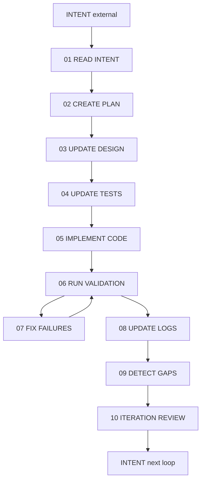
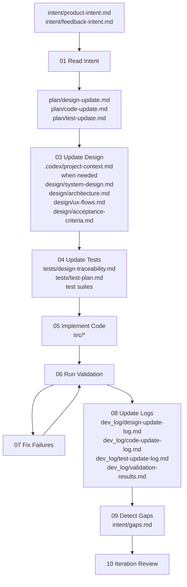
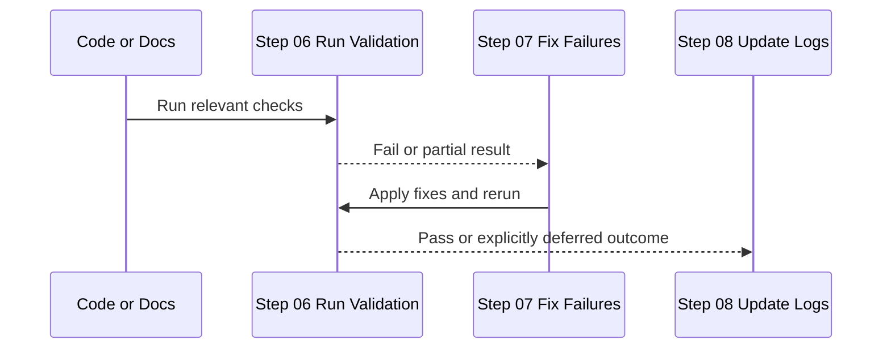

# Agentic Application Development Workflow

This folder documents the default closed-loop development flow for this repository. The workflow is strict: steps run in order, tests are prepared before code, and validation must run before logs and iteration closeout.

## Overview

| Rule | Meaning |
| --- | --- |
| Ordered flow | Each iteration follows the same 10-step sequence |
| Test-first within the repo loop | Update tests from acceptance criteria before implementing code |
| Validation gate | Code is not considered done until validation passes or failures are explicitly deferred |
| Loop point | Steps `06` and `07` repeat until the validation loop is resolved |
| Gap surfacing | New gaps found during validation or review feed `intent/gaps.md` |
| Next iteration trigger | A new loop starts when intent or feedback intent changes |

## Iteration Lifecycle

Each development iteration follows a strict 10-step sequence. Steps must be executed in order. Steps `06` and `07` may loop until all failures are resolved or explicitly deferred.

## Step Meaning

| Step | Name | Purpose | Typical output |
| --- | --- | --- | --- |
| `01` | Read Intent | Read and interpret current intent | Clear current scope and constraints |
| `02` | Create Plan | Translate intent into `REQ-*`, `DEV-*`, and `TEST-*` plan items | Updated `plan/*` |
| `03` | Update Design | Apply `REQ-*` items to the correct design files | Updated `design/*` and, when needed, `.codex/project-context.md` |
| `04` | Update Tests | Create or revise tests from acceptance criteria before code | Updated `tests/*` |
| `05` | Implement Code | Implement `DEV-*` items in `src/` aligned to design and tests | Updated `src/*` |
| `06` | Run Validation | Execute the relevant checks for the changed layer | Pass, fail, or partial validation result |
| `07` | Fix Failures | Address validation failures and rerun checks | Resolved issues or explicit deferrals |
| `08` | Update Logs | Record actual outcomes in `dev_log/` | Updated `dev_log/*` |
| `09` | Detect Gaps | Surface follow-on gaps into `intent/gaps.md` | Updated or confirmed gap record |
| `10` | Iteration Review | Confirm done and prepare the next loop | Closure decision and next-iteration readiness |

## Prompt Files

| Step | Prompt file |
| --- | --- |
| `01` | `dev_workflow/01-read-intent.md` |
| `02` | `dev_workflow/02-create-plan.md` |
| `03` | `dev_workflow/03-update-design.md` |
| `04` | `dev_workflow/04-update-tests.md` |
| `05` | `dev_workflow/05-implement-code.md` |
| `06` | `dev_workflow/06-run-validation.md` |
| `07` | `dev_workflow/07-fix-failures.md` |
| `08` | `dev_workflow/08-update-logs.md` |
| `09` | `dev_workflow/09-detect-gaps.md` |
| `10` | `dev_workflow/10-iteration-review.md` |

## Flow With File Mapping

## Step Reference

| Step | Phase | Purpose | Inputs | Outputs | Files modified |
| --- | --- | --- | --- | --- | --- |
| `01` | intake | Read and interpret current intent | `AGENTS.md`, `.codex/project-context.md`, `intent/*` | Current scope understanding | None |
| `02` | planning | Translate intent into explicit work items | `intent/*`, current repo state | `REQ-*`, `DEV-*`, `TEST-*` plan items | `plan/design-update.md`, `plan/code-update.md`, `plan/test-update.md` |
| `03` | design | Apply `REQ-*` items to the correct design files | `plan/*`, `.codex/project-context.md`, `design/*` | Updated design baseline | `.codex/project-context.md` when needed, `design/*` |
| `04` | test design | Create or update tests from acceptance criteria before code | `design/acceptance-criteria.md`, `tests/*`, `plan/test-update.md` | Updated proving strategy and tests | `tests/*` |
| `05` | implementation | Implement `DEV-*` items aligned to design and tests | `plan/code-update.md`, `design/*`, `tests/*` | Code changes ready for validation | `src/*` |
| `06` | validation | Run explicit checks for changed artifacts | Changed files, test plan, commands | Validation evidence | `dev_log/validation-results.md` after results are finalized |
| `07` | failure handling | Fix validation failures or defer them explicitly | Failing checks, defect classification | Resolved failures or explicit deferral | Usually `src/*`, `tests/*`, `design/*`, sometimes `plan/*` |
| `08` | logging | Record what actually changed | Final changed artifacts and validation outcomes | Permanent execution record | `dev_log/*` |
| `09` | gap detection | Surface newly exposed gaps | Validation findings, review findings, logs | Follow-on gap record | `intent/gaps.md` |
| `10` | closeout | Confirm completion and prepare next loop | Logs, validation evidence, current intent | Iteration closure | Usually no new file beyond any final log or gap updates |

## Validation Loop

## Execution Rules

| Rule | Operational effect |
| --- | --- |
| Read contract first | Start with `AGENTS.md` and `.codex/project-context.md` |
| Intent first | Do not start from code or tests without reading `intent/*` |
| Plan before downstream edits | Convert intent into `plan/*` before updating design, tests, or code |
| Design before code | Behavior changes must be reflected in design first |
| Tests before code | Acceptance-driven test updates happen before implementation |
| Validate before closeout | Every non-trivial change ends with explicit validation |
| Log reality, not intention | `dev_log/*` records what actually happened, not what was hoped for |
| Surface follow-on gaps | Validation and review findings belong in `intent/gaps.md` when they shape the next iteration |

## Start And Stop Conditions

| Condition | Meaning |
| --- | --- |
| Iteration start | Intent or feedback changes, or prior validation exposes a gap that becomes new intent input |
| Iteration in progress | Steps `01` through `10` are being executed in order |
| Validation loop active | Steps `06` and `07` are repeating |
| Iteration done | Validation outcome is recorded, logs are updated, and review confirms closure |
| Next loop begins | `intent/*` changes again or feedback introduces new work |

## Practical Notes

- Use `intent/feedback-intent.md` as the canonical human-edited feedback input.
- `.codex/project-context.md` should be updated before detailed design only when high-level workflow or behavior changes.
- Not every iteration requires code, but every iteration still follows the ordered loop and explicit validation discipline.
- If validation exposes a design problem rather than an implementation problem, fix the correct layer before continuing.
