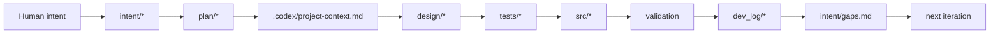
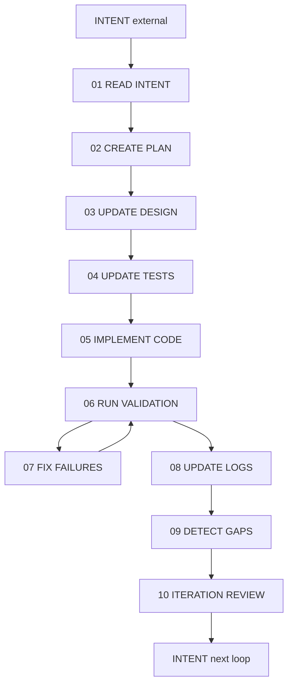

# Agentic Application Development Workflow

This folder defines how agentic application development is performed in this repository. The workflow is artifact-driven, not chat-driven: each step reads specific upstream artifacts, produces specific downstream artifacts, and must respect the repo contract before moving forward.

## What This Workflow Is

| Concept | Exact meaning in this repo |
| --- | --- |
| Agentic development | An agent advances the product by transforming repo artifacts in a controlled sequence, not by making free-form code edits from a prompt alone |
| Workflow | The ordered 10-step loop from intent intake through planning, design, test preparation, implementation, validation, logging, gap surfacing, and iteration review |
| Prompt file | A reusable step instruction in `dev_workflow/` that tells the agent what to read, what to produce, and what to avoid for one step |
| Iteration | One bounded pass through the workflow for a specific scope of work |
| Validation loop | The `06` to `07` cycle where validation failures are fixed and rerun until pass or explicit deferral |

## Core Operating Model

Agentic development here follows one principle above all others: the agent must move work through the repository's artifact chain in order.

The agent is not supposed to improvise outside this chain. It reads intent, reconciles that intent into plan, turns plan into design and validation expectations, implements only approved behavior, proves the result, records what actually happened, and feeds discovered gaps back into the next loop.

## Workflow Principles

| Principle | Exact rule | Prevents |
| --- | --- | --- |
| Contract first | Always read `AGENTS.md` and `.codex/project-context.md` before substantial work | Local edits that violate repo policy |
| Intent first | Always read `intent/*` before planning or implementation | Coding directly from a user prompt |
| Plan before downstream edits | Translate intent into `plan/*` before changing design, tests, or code | Hidden assumptions and scope drift |
| Design before code | If behavior changes, update design before implementation | Code inventing system behavior |
| Tests before code | Update tests from acceptance criteria before implementation | Post hoc test writing detached from design |
| Validation before closeout | Every meaningful change ends with explicit validation | Unproven completion claims |
| Logs record reality | `dev_log/*` records what actually changed and what was actually validated | Fake progress tracking |
| Gaps feed the next loop | New evidence-backed gaps go into `intent/gaps.md` | Repeating known issues without capture |

## Source Of Truth Order

When artifacts disagree, this is the order the agent must follow:

| Priority | Artifact layer | Role |
| --- | --- | --- |
| 1 | `intent/*` | Human intent and human feedback |
| 2 | `plan/*` | Active iteration interpretation of intent |
| 3 | `.codex/project-context.md` | High-level design and operating model |
| 4 | `design/*` | Detailed behavior, architecture, flows, and correctness |
| 5 | `tests/*` | Validation design and coverage plan |
| 6 | `src/*` | Implementation artifacts |

## Artifact Roles In The Workflow

| Artifact group | Who controls it | Purpose in the loop | Must never be used as |
| --- | --- | --- | --- |
| `intent/product-intent.md` | human | Product goals, scope, constraints, expected behavior | A place for silent implementation decisions |
| `intent/feedback-intent.md` | human | Manual review feedback and observed issues | A system-generated gaps file |
| `intent/gaps.md` | workflow/system | Evidence-backed system-detected gaps | A human preference backlog |
| `plan/*` | workflow/system | Current iteration breakdown into `REQ-*`, `DEV-*`, `TEST-*` work | Final implementation or hidden scratch notes |
| `.codex/project-context.md` | workflow/system | Compact high-level design and operating model | A replacement for `AGENTS.md` |
| `design/*` | workflow/system | Detailed system definition | A dumping ground for implementation detail |
| `tests/*` | workflow/system | Proof strategy and test assets | A substitute for design |
| `src/*` | workflow/system | Executable implementation | The place where new requirements are invented |
| `dev_log/*` | workflow/system | Permanent record of actual changes and validation | A plan, todo list, or wish list |

## Exact 10-Step Lifecycle

The default iteration is a strict 10-step sequence. Steps `06` and `07` loop until the validation status is pass or the remaining issue is explicitly deferred.

## Prompt Navigation

| Step | Prompt file | What it controls |
| --- | --- | --- |
| `01` | `dev_workflow/01-read-intent.md` | Intake and interpretation |
| `02` | `dev_workflow/02-create-plan.md` | Scope reconciliation and traceable work item creation |
| `03` | `dev_workflow/03-update-design.md` | High-level and detailed design updates |
| `04` | `dev_workflow/04-update-tests.md` | Acceptance-driven test preparation |
| `05` | `dev_workflow/05-implement-code.md` | Implementation aligned to plan, design, and tests |
| `06` | `dev_workflow/06-run-validation.md` | Execution of explicit proof |
| `07` | `dev_workflow/07-fix-failures.md` | Failure correction at the correct layer |
| `08` | `dev_workflow/08-update-logs.md` | Permanent logging of actual work and evidence |
| `09` | `dev_workflow/09-detect-gaps.md` | System-detected gap surfacing |
| `10` | `dev_workflow/10-iteration-review.md` | Closeout and next-loop readiness |

## Step-By-Step Execution Semantics

| Step | Reads from | May update | Must achieve | Must not do |
| --- | --- | --- | --- | --- |
| `01` Read Intent | `AGENTS.md`, `.codex/project-context.md`, `intent/*` | None | Clear scope, constraints, ambiguity, and feedback context | Start coding or plan from memory |
| `02` Create Plan | `intent/*`, current repo state, active logs | `plan/*` | Explicit `REQ-*`, `DEV-*`, `TEST-*` work | Hide ambiguity or compress away constraints |
| `03` Update Design | `plan/*`, `.codex/project-context.md`, `design/*` | `.codex/project-context.md` when needed, `design/*` | Design baseline for downstream work | Let code define behavior first |
| `04` Update Tests | `design/*`, acceptance criteria, traceability | `tests/*` | Proving strategy and validation assets before code | Write tests from implementation convenience |
| `05` Implement Code | `plan/*`, `design/*`, `tests/*`, stack notes | `src/*`, relevant docs in `src/` | Approved behavior implemented | Invent new requirements in code |
| `06` Run Validation | Changed artifacts, test plan, validation methods | No permanent logs yet | Real pass, fail, or partial evidence | Claim success without proof |
| `07` Fix Failures | Validation findings and implicated artifacts | The correct failing layer | Root cause fixed or explicitly deferred | Patch around a design or test problem with a code-only hack |
| `08` Update Logs | Final diffs and final validation result | `dev_log/*` | Permanent, factual execution record | Log intended work that did not happen |
| `09` Detect Gaps | `dev_log/*`, validation outcomes | `intent/gaps.md` | Evidence-backed next-loop gap capture | Rewrite human intent or feedback |
| `10` Iteration Review | Outputs from all prior steps | Usually none beyond any final workflow artifact updates | Explicit closure status and next-loop readiness | Start a new scope silently |

## How Agentic Application Development Actually Happens Here

The workflow is not "read prompt -> write code". It is "read upstream artifacts -> update the next allowed artifact -> continue only when the gate for that layer is satisfied".

### 1. Intake and interpretation

The agent begins by reading the repo contract and current intent sources. At this point the job is interpretation, not output. The agent determines:

- what the user actually wants
- what the current repo already says
- what constraints and non-goals exist
- what feedback or gaps already shape the iteration

### 2. Reconciliation into explicit work

The agent then converts that intent into explicit `REQ-*`, `DEV-*`, and `TEST-*` work in `plan/*`. This is where the workflow becomes operational. The plan is the bridge between human intent and system action.

### 3. Design definition before implementation

If the work changes behavior, structure, workflows, correctness rules, or operating model, the agent updates `.codex/project-context.md` when the high-level model changes and then updates the appropriate detailed design files. This is where agentic work stays governed rather than improvisational.

### 4. Validation design before code

The agent updates traceability, test plans, and relevant suites before implementing code. This makes the intended proof explicit and stops the workflow from collapsing into code-first behavior.

### 5. Implementation only after upstream artifacts are ready

Implementation in `src/*` happens only after intent, plan, design, and tests establish what should be built and how it will be proven.

### 6. Validation as a real gate

The workflow requires an explicit validation step. Validation is not a courtesy pass and not a final paragraph in a response. It is the operational gate that determines whether the iteration can advance.

### 7. Failure correction at the correct layer

If validation fails, the agent classifies the failure and fixes the correct layer. A design defect should not be hidden with a code workaround. A test defect should not be reframed as a product issue without evidence.

### 8. Permanent evidence after reality is known

Only after the iteration's real outcome is known does the workflow update `dev_log/*`. Logs are records of reality, not predictions.

### 9. Gap surfacing for the next iteration

If validation or review surfaces unresolved evidence-backed gaps, the workflow records them in `intent/gaps.md` so the next planning step starts with those facts instead of rediscovering them.

### 10. Review and closeout

The workflow finishes by checking whether the iteration is complete, partial, or blocked. It does not silently roll into the next scope.

## Detailed Guardrails

| Area | Guardrail | Exact effect |
| --- | --- | --- |
| Contract | Read `AGENTS.md` and `.codex/project-context.md` first | Workflow cannot start from local assumptions |
| Intent | Do not modify human intent files unless explicitly asked, except for `intent/gaps.md` in step `09` | Preserves human ownership of requirements and feedback |
| Scope | Prefer the smallest file set that completes the task | Prevents adjacent-file churn and opportunistic refactors |
| Planning | Carry ambiguity into `plan/*` instead of guessing | Makes uncertainty explicit before design or code |
| High-level workflow changes | If workflow, precedence, ownership, or operating rules change, update `AGENTS.md` and `.codex/project-context.md` first | Keeps the repo contract current |
| Design | Do not use implementation behavior as the de facto design source | Prevents drift between intended behavior and built behavior |
| Tests | Do not invent tests without design linkage | Keeps validation tied to acceptance, not convenience |
| Implementation | Do not invent behavior absent from intent, plan, context, design, or acceptance artifacts | Prevents silent scope expansion |
| Validation | Do not treat "looks correct" as validation | Requires commands or structured review evidence |
| Failure handling | Fix the correct layer based on root cause classification | Prevents recurring drift and bad local optimizations |
| Logging | Do not write logs before the real result is known | Keeps `dev_log/*` trustworthy |
| Gap handling | Use `intent/gaps.md` only for system-detected evidence-backed gaps | Separates system findings from human feedback |
| Closeout | Do not call the iteration done while validation or logs are incomplete | Preserves real definition of done |

## Validation And Evidence Model

| Changed layer | Expected proof | Typical evidence destination |
| --- | --- | --- |
| Workflow docs or contract docs | Manual review, structural checks, `git diff --check` | `dev_log/validation-results.md` |
| Design | Manual review against intent, traceability, acceptance, and architecture | `dev_log/validation-results.md` |
| Tests | Targeted test execution, checklist review, or artifact review | `dev_log/validation-results.md` |
| Code | Targeted unit, integration, e2e, regression, or smoke validation | `dev_log/validation-results.md` |

Validation must state:

- activity type
- commands or method
- result: `pass`, `fail`, or `partial`
- findings
- failure classification if relevant
- required follow-up

## Failure Classification Model

Use exactly these categories when the validation loop or review identifies an issue:

| Classification | Meaning |
| --- | --- |
| `design defect` | The design is wrong, incomplete, or conflicting |
| `implementation defect` | The code does not follow the intended design |
| `test defect` | The validation layer is weak, wrong, or missing |
| `eval gap` | Evidence is insufficient to prove behavior |
| `environment issue` | Tooling, runtime, infra, or dependency problems block progress |
| `backlog enhancement` | Useful but out-of-scope follow-on work |

## Decision Gates

| If this happens | The workflow must do this next |
| --- | --- |
| Intent changes the operating model or repo rules | Update `AGENTS.md` and `.codex/project-context.md` before downstream artifacts |
| Behavior changes | Update design before code |
| Acceptance or workflows change | Update tests before code |
| Validation fails | Enter step `07`, classify root cause, fix the correct layer, then rerun step `06` |
| Validation passes | Update logs, then detect gaps, then review the iteration |
| Evidence reveals unresolved systemic follow-up work | Record it in `intent/gaps.md` |
| Work is out of scope | Keep it out of the iteration or mark it as deferred/backlog in the correct artifact |

## Workflow Anti-Patterns

These are explicit violations of the workflow:

| Anti-pattern | Why it is wrong |
| --- | --- |
| Coding directly from the user prompt | Skips intent interpretation, planning, design, and test preparation |
| Using code behavior to decide requirements | Reverses the source-of-truth order |
| Writing tests only after code exists | Breaks the acceptance-driven test-first discipline |
| Logging planned work before execution | Corrupts the permanent record |
| Editing human intent to resolve ambiguity | Rewrites requirements instead of surfacing questions |
| Treating validation as optional for doc changes | Leaves workflow and contract drift unproven |
| Treating `intent/gaps.md` as a personal note file | Breaks the system-generated gap model |
| Closing the iteration without explicit review | Hides residual risks, deferrals, or blockers |

## Start And Stop Conditions

| Condition | Meaning |
| --- | --- |
| Iteration start | Human intent or feedback changes, or a validated gap becomes new workflow input |
| Step handoff | A step completes only when its exit condition is met and its downstream artifact is ready |
| Validation loop active | Steps `06` and `07` are repeating |
| Iteration complete | Validation outcome is recorded, logs are current, and review confirms closure |
| Next loop begins | Only after new intent, new feedback, or a surfaced gap requires another pass |

## Practical Operator Notes

- Use the numbered prompt file for the active step instead of improvising a local process.
- Read upstream artifacts again whenever the prompt changes workflow, precedence, ownership, or operating rules.
- Not every iteration requires code, but every meaningful iteration still requires plan discipline, explicit validation, and factual logging.
- If a workflow prompt and the repo contract disagree, the repo contract wins.
- Another agent should be able to continue from the artifacts alone without needing chat history to reconstruct what happened.

## Definition Of Done For A Workflow Pass

An iteration is done only when all of the following are true:

1. Relevant intent was read and interpreted.
2. In-scope work was made explicit in `plan/*`.
3. High-level context and detailed design were updated where required.
4. Tests or validation assets were updated before implementation when behavior changed.
5. Implementation matches the approved design for the scoped work.
6. Explicit validation was performed and the outcome is known.
7. Real design, code, test, and validation outcomes were recorded in `dev_log/*` as applicable.
8. System-detected follow-on gaps were surfaced into `intent/gaps.md` when needed.
9. The iteration was reviewed and closed as complete, partial, or blocked.
