# KMS System Design

# 1. Vision, Scope, and Operating Model

## 1.1 System Definition

KMS stands for Knowledge Management System. It is an enterprise-grade knowledge maintenance and publishing system that transforms raw source material into curated, structured, finalized markdown knowledge that can be consumed by humans and AI systems.

KMS is not a document store, not a generic search engine, and not a chat interface. It is a governed knowledge control plane with an explicit maintenance workflow, a single finalized knowledge substrate, and a separate read-only navigation layer.

### KMS in one statement

- KMS is the governed system that turns immutable raw sources into finalized markdown knowledge in `/wiki`, under Knowledge Manager control, for consumption by people and AI systems.

KMS exists to produce durable knowledge, preserve decision quality, and keep curated understanding synchronized with changing business context. Its unit of output is finalized markdown knowledge, not raw text, ad hoc answers, or ephemeral chat state.

## 1.2 Problem Statement

Analytics and reporting teams depend on business definitions, process rules, lineage context, metric logic, historical decisions, and operational exceptions. In most organizations, that knowledge is fragmented across source documents, issue threads, slide decks, local notes, tribal memory, and partially maintained repositories. The result is predictable:

- raw source materials are scattered and inconsistent
- knowledge decays as business rules, processes, and definitions change
- teams repeatedly recreate the same context for every analysis or report
- Copilot-style workflows become weak when they are fed unstable or uncurated context
- business definitions, process rules, and prior decisions are not available in a reusable form
- humans can browse source material, but AI systems need stable, governed, structured knowledge to be useful

KMS solves a knowledge curation and maintenance problem, not merely a retrieval problem. Its purpose is to control how knowledge becomes finalized, how it is refreshed, and how it is exposed for downstream consumption. Retrieval alone does not create trusted institutional memory. KMS does.

## 1.3 Business Purpose and Strategic Role

KMS is foundational infrastructure for reimagined analytics and reporting processes. It gives knowledge users a governed knowledge base that can be reused across analysis, reporting, validation, and process execution without requiring the organization to rebuild context every time.

Strategically, KMS serves four roles:

- it preserves institutional memory in durable markdown form
- it standardizes how knowledge is maintained and finalized
- it supports governed AI enablement for knowledge-intensive work
- it provides reusable context for future systems that depend on durable, trusted knowledge

The system is designed to accelerate knowledge users without removing managerial control over what becomes truth. Knowledge can be proposed, reviewed, refined, approved, and published, but final authority remains with the Knowledge Manager. That control is essential because the value of KMS depends on trust, consistency, and traceable finalization.

KMS is also intended to support GitHub Copilot-style reimagined processes by supplying curated markdown that can be used as stable context. The same finalized knowledge substrate is intended to support future agentic AI systems, including Business Analytics Agentic AI and Reporting Agentic AI, where the AI must operate against governed knowledge rather than unstructured source noise.

## 1.4 Core Layers

KMS is organized into three core layers plus an immutable upstream source area.

### Knowledge Manager Interface (KMI)

KMI is the control surface for knowledge maintenance and governance.

- Purpose: orchestrate knowledge refresh, review, validation, approval, and finalization
- Primary user: Knowledge Manager
- Responsibilities: accept local source paths, trigger runs, inspect proposed changes, evaluate contradictions, apply rules, and decide what becomes finalized knowledge
- Must never: serve as a consumer browse layer, allow uncontrolled truth changes, or expose finalized knowledge editing as an ungoverned direct path

KMI is the only sanctioned write path for finalized knowledge. It is the maintenance engine, the governance surface, and the place where truth is controlled.

### Wiki Layer

The Wiki Layer is the finalized knowledge substrate stored under `/wiki`.

- Purpose: hold the authoritative markdown knowledge set that represents finalized truth
- Primary user: downstream AI systems and human readers who need the governed knowledge content itself
- Responsibilities: persist curated markdown pages, keep knowledge human-readable, provide a stable source of truth for consumption
- Must never: function as a raw document dump, accept uncontrolled edits outside the governed maintenance flow, or become a transient working area for draft-only content

The Wiki Layer is the single source of truth for finalized knowledge. It is optimized for AI consumption, but it must remain readable and maintainable by humans.

### Infopedia

Infopedia is the read-only navigation layer on top of finalized wiki markdown files.

- Purpose: provide human-friendly exploration of finalized knowledge
- Primary user: knowledge consumers
- Responsibilities: tree-based navigation, hyperlink traversal, search, and browse experience similar to Wikipedia-style knowledge exploration
- Must never: serve as a maintenance surface, modify finalized truth, or bypass governed knowledge finalization

Infopedia is for reading and navigating finalized knowledge, not for producing or approving it.

### Immutable Raw Source Inputs

Raw source files remain in a local source folder and are treated as immutable upstream inputs.

- Purpose: supply source material for knowledge maintenance runs
- Primary user: KMI during maintenance operations
- Responsibilities: provide source evidence and context for knowledge updates
- Must never: be edited in place as part of final knowledge publication, or be treated as finalized knowledge

The immutability of raw source inputs is intentional. It preserves auditability and keeps the maintenance workflow anchored to a stable source boundary.

## 1.5 Operating Model

KMS operates as a governed maintenance pipeline with separated concerns between source intake, knowledge finalization, and knowledge consumption.

The operating model is straightforward:

1. Source materials land in a local source path as immutable inputs.
2. The Knowledge Manager triggers a run in KMI.
3. KMI analyzes the sources, applies rules and validations, and proposes knowledge updates.
4. When required, the Knowledge Manager reviews proposed updates, checks contradictions, and makes final decisions.
5. Finalized markdown knowledge is refreshed in `/wiki`.
6. Infopedia reflects the finalized wiki content for browse-only navigation.
7. Downstream AI systems and human users consume the finalized knowledge.

This model establishes clear authority boundaries:

- maintenance authority is centralized in KMI
- finalized knowledge is centralized in `/wiki`
- human browsing is separated into Infopedia
- source inputs remain immutable

That separation is fundamental. KMS should not blur maintenance with consumption, and it should not allow consumption layers to become hidden write paths. The system must make truth explicit, controlled, and refreshable.

## 1.6 Scope

KMS is in scope for the following capabilities at a high level:

- local-folder-driven source intake trigger
- governed maintenance of markdown knowledge
- structured finalized wiki pages under `/wiki`
- human-readable and AI-usable markdown knowledge
- browse and navigation layer for knowledge consumers
- support for Copilot-based reimagined workflows
- design extensibility for future agentic AI use
- validation, approval, confidence, freshness, and source trace concepts

The scope is knowledge curation and controlled publication. KMS is responsible for producing trusted finalized knowledge and making it consumable in a predictable way.

## 1.7 Non-Goals / Out of Scope

KMS is explicitly not the following:

- not a chatbot product
- not a generic enterprise search engine
- not a vector database replacing curated knowledge
- not a raw document dump
- not a source extraction or connector platform
- not a direct editing tool for consumers in Infopedia
- not an unguided autonomous system that changes truth without control

These exclusions are deliberate. KMS is built around governed finalization, not around unrestricted interaction or unsupervised content mutation. Search, chat, extraction, and autonomy may appear in surrounding ecosystems, but they are not the core identity of KMS.

## 1.8 Target Users and Consumption Model

KMS serves three distinct consumer groups with different responsibilities and privileges.

### Knowledge Manager

The Knowledge Manager curates, reviews, governs, and finalizes knowledge. This role owns the maintenance workflow in KMI and makes the final decision on what becomes published truth in `/wiki`.

### Knowledge Consumers

Knowledge consumers browse, search, read, and understand finalized knowledge through Infopedia and related read surfaces. They rely on the published knowledge, but they do not modify it directly.

### Downstream AI Systems

Downstream AI systems consume finalized markdown knowledge as a structured knowledge substrate. They use KMS content as governed context rather than as raw untrusted input.

KMS must support two AI consumption patterns:

1. prompt-driven, Copilot-style consumption where curated markdown is used as stable context for answering, drafting, or assisting
2. agentic, workflow-driven consumption where AI systems use finalized knowledge to plan, validate, and ground execution

Both patterns depend on the same principle: the finalized knowledge in `/wiki` is the primary artifact. KMS should support passive AI consumption and active AI orchestration, but the governing logic and truth ownership remain centralized.

## 1.9 Design Principles

### Curated knowledge over raw retrieval

KMS is optimized for finalized knowledge, not for exposing a pile of source fragments. Retrieval is useful only when it serves curation and consumption of trusted knowledge.

### Determinism over improvisation

Knowledge published by KMS should be stable, repeatable, and governed. The system should minimize ambiguity in what is considered final.

### One source of truth

The finalized markdown set in `/wiki` is the authoritative knowledge layer. Other layers can assist with maintenance or browsing, but they do not compete with the final store of truth.

### Separation of maintenance and consumption

KMI maintains and finalizes knowledge. Infopedia and downstream consumers read it. This separation prevents accidental writes from consumer surfaces and keeps governance clear.

### Governance-first

Every final knowledge change must be reviewable, controlled, and aligned to policy. Governance is not a secondary feature; it is the operating model.

### Structured markdown over free-form sprawl

Knowledge should be expressed in disciplined markdown so it is readable by humans and consistent for AI systems. Free-form accumulation of notes is not an acceptable final state.

### Bounded intelligence

KMS should support AI assistance without delegating truth authority to AI. AI can propose, summarize, compare, and ground work, but finalization remains controlled.

### Human control over finalization

The Knowledge Manager decides what becomes finalized knowledge. Human control is essential where business definitions, reporting logic, and process rules carry operational impact.

### Extensibility toward agentic AI

KMS should remain usable as the knowledge foundation for future agentic systems. The knowledge model should be durable enough to support planning, validation, and execution grounding without redesigning the truth layer.

## 1.10 Section Summary

KMS is a governed Knowledge Management System that turns immutable raw sources into finalized markdown knowledge under Knowledge Manager control. The system is built around three separated layers: KMI for maintenance and governance, `/wiki` for finalized knowledge, and Infopedia for read-only navigation.

This structure matters because analytics and reporting work depends on durable institutional memory, not on repeated reconstruction from fragmented source material. KMS creates that memory in a controlled form that humans can browse and AI systems can consume.

The same finalized knowledge substrate is intended to support both Copilot-style reimagined workflows and future agentic AI systems. KMS therefore functions as a knowledge control plane, a maintenance-first system, and a reusable intelligence substrate for governed human and AI consumption.

# 2. User Roles, Personas, and Core Workflows

## 2.1 Role Model Overview

KMS supports three primary actor classes:

1. Knowledge Managers
2. Knowledge Consumers
3. Downstream AI Systems

These roles are not interchangeable. They have different permissions, different responsibilities, and different relationships to truth.

### Role separation summary

- Knowledge Managers own knowledge maintenance authority and finalization decisions.
- Knowledge Consumers read and navigate finalized knowledge but do not change it.
- Downstream AI Systems consume finalized knowledge as governed context but do not govern truth.

This separation is central to KMS. Maintenance, consumption, and runtime AI usage are distinct operating modes and must remain distinct in the system design.

## 2.2 Knowledge Manager Persona

The Knowledge Manager is the authoritative maintainer of knowledge in KMS. This persona exists because knowledge cannot be treated as self-authoring or self-finalizing in an enterprise setting where definitions, reporting logic, process rules, and historical decisions matter.

The Knowledge Manager is not merely a UI user. This role owns the maintenance and finalization workflow end to end.

### Responsibilities

- provide local source paths to KMI
- initiate maintenance runs in KMI
- review source-driven knowledge proposals
- examine contradictions, gaps, and uncertainty
- approve proposed updates when they are fit for publication
- reject proposed updates when they are incorrect, incomplete, or premature
- escalate unresolved issues when the source state or business rule is ambiguous
- decide what becomes finalized markdown knowledge in `/wiki`
- maintain governance discipline across updates and refresh cycles
- protect knowledge quality, freshness, structure, and source trace

### Authorized decisions

The Knowledge Manager is authorized to decide:

- whether a source set should be processed
- whether a proposed change is accepted, revised, or rejected
- whether a contradiction requires escalation or can be resolved
- whether knowledge is ready to be published as finalized truth
- whether a knowledge refresh should wait until the source state is sufficiently complete

### Interfaces used

- KMI for initiating runs, reviewing proposals, and controlling finalization
- `/wiki` indirectly through governed publication outcomes, not through uncontrolled direct editing

### Outputs governed

- finalized markdown knowledge
- approval or rejection decisions
- resolution of contradictions and open questions
- refreshed authoritative wiki content

### What the Knowledge Manager must not do

- directly edit finalized truth through Infopedia
- bypass policy, validation, or approval logic
- treat raw source as final knowledge
- allow uncontrolled autonomous publication without governance
- use consumer-facing navigation surfaces as maintenance tools

The Knowledge Manager owns the truth maintenance process, not just the interface used to trigger it.

## 2.3 Knowledge Consumer Persona

Knowledge Consumers are users of knowledge, not maintainers of truth. They rely on finalized knowledge to understand business rules, reporting logic, prior decisions, and curated context without participating in the publication workflow.

Typical Knowledge Consumers include analysts, reporting teams, business users, reviewers, and other knowledge users who need stable domain understanding.

### What they use Infopedia for

- browse the knowledge tree
- search finalized knowledge
- open linked pages
- read structured, source-backed markdown
- understand what knowledge exists
- follow related concepts and navigation paths
- use finalized markdown as input into other work

### What they should be able to do

- discover finalized knowledge efficiently
- read the authoritative version of a topic
- navigate related knowledge without reading raw source material
- use published knowledge in analytics, reporting, and review workflows

### What they must never be allowed to do directly

- modify final knowledge through Infopedia
- bypass Knowledge Manager authority
- treat raw source folders as browse-first knowledge surfaces
- finalize or publish knowledge directly
- overwrite governed truth outside KMI-mediated workflows

Knowledge Consumers benefit from KMS by gaining access to curated, stable, human-readable knowledge. They do not participate in maintenance decisions.

## 2.4 Downstream AI Systems Persona

Downstream AI Systems are a formal consumer class in KMS. The system is designed not only for human readers but also for AI systems that consume finalized wiki markdown as governed context.

Downstream AI Systems must rely on finalized knowledge, not raw source noise, because their outputs are only as reliable as the knowledge substrate they receive.

### A. Prompt-driven / Copilot-style consumption

Examples:

- GitHub Copilot-assisted reimagined processes
- prompt-driven analytics
- prompt-driven reporting
- AI assistance using curated markdown files as context

In this model, KMS acts as a passive but governed knowledge source. The AI system reads finalized markdown to ground prompts, drafting, explanation, summarization, or analysis.

### B. Agentic / workflow-driven consumption

Examples:

- Business Analytics Agentic AI
- Reporting Agentic AI
- future domain-specific agents

In this model, KMS is an active operational knowledge dependency. The agent uses finalized knowledge for:

- planning input
- validation grounding
- explanation context
- structured domain memory

### AI system constraints

- downstream AI systems consume finalized knowledge
- they do not own wiki maintenance
- they do not define truth
- they should rely primarily on curated `/wiki` knowledge, not raw sources
- they must treat KMS knowledge as governed context, not as mutable truth

KMS supports both passive AI consumption and active AI orchestration, but neither mode is allowed to bypass Knowledge Manager governance.

## 2.5 Role-to-Layer Mapping

The relationship between roles and layers is intentionally asymmetric.

### Knowledge Manager

- KMI: primary operating surface for maintenance, review, validation, and finalization
- Wiki Layer: indirect publication target through governed workflow
- Infopedia: not a maintenance surface
- Raw source folders: upstream inputs provided for maintenance runs

### Knowledge Consumer

- KMI: not used for maintenance authority
- Wiki Layer: indirect dependency through finalized content
- Infopedia: primary browse and read surface
- Raw source folders: not a consumer destination

### Downstream AI Systems

- KMI: not a governing interface
- Wiki Layer: primary knowledge substrate for consumption
- Infopedia: optional human-oriented companion surface, not the AI truth store
- Raw source folders: not the preferred runtime knowledge source

### Layer ownership clarity

- Knowledge Manager primarily operates through KMI
- Knowledge Consumers primarily operate through Infopedia
- AI systems primarily consume `/wiki`
- raw source folders are upstream maintenance inputs, not consumer-facing destinations
- `/wiki` is authoritative, but it is not directly managed by consumers
- Infopedia is derived from finalized wiki content, not a separate truth store

This mapping prevents role drift. It keeps maintenance, consumption, and runtime usage in separate lanes.

## 2.6 Core Workflow Categories

KMS has five core workflow categories.

### 1. Knowledge maintenance workflow

- Purpose: transform immutable source material into proposed knowledge updates
- Primary actor(s): Knowledge Manager, KMI
- Inputs: local source path, existing `/wiki` content, governance rules
- Outputs: proposed updates, contradiction signals, refresh candidates
- Where it occurs: KMI, with publication outcome to `/wiki`

### 2. Knowledge review and approval workflow

- Purpose: determine whether proposed knowledge should become finalized truth
- Primary actor(s): Knowledge Manager
- Inputs: proposed updates, validation results, uncertainty flags, source trace
- Outputs: approved, rejected, or escalated decisions
- Where it occurs: KMI

### 3. Knowledge consumption workflow

- Purpose: let humans discover and read finalized knowledge
- Primary actor(s): Knowledge Consumers
- Inputs: finalized wiki content
- Outputs: understanding, navigation, and reuse in human work
- Where it occurs: Infopedia

### 4. AI consumption workflow

- Purpose: let AI systems ground prompts or workflows in finalized knowledge
- Primary actor(s): Downstream AI Systems
- Inputs: finalized `/wiki` markdown
- Outputs: answers, drafts, plans, validations, or execution support
- Where it occurs: downstream AI systems consuming KMS content

### 5. Ongoing governance and hygiene workflow

- Purpose: keep knowledge current, coherent, and trustworthy over time
- Primary actor(s): Knowledge Manager, governance rules, KMI
- Inputs: freshness signals, contradictions, source updates, aging knowledge
- Outputs: refreshed knowledge, review actions, unresolved issues, retained truth
- Where it occurs: primarily KMI and `/wiki`

These workflow categories keep maintenance distinct from consumption and make governance an ongoing activity rather than a one-time publication event.

## 2.7 End-to-End Knowledge Maintenance Workflow

The core KMS lifecycle moves from raw source to finalized knowledge through a controlled maintenance path.

1. Source materials exist in a local folder path as immutable inputs.
2. The Knowledge Manager enters or provides that source path in KMI.
3. A maintenance run is initiated from KMI.
4. KMI discovers the source materials and analyzes them against existing knowledge.
5. The system generates proposed knowledge changes, refresh candidates, and contradiction signals.
6. Low-confidence areas, gaps, and rule issues are surfaced for review.
7. The Knowledge Manager reviews the proposed changes when review is required.
8. The Knowledge Manager approves, rejects, revises, or escalates the proposed updates.
9. Approved changes refresh the finalized markdown knowledge in `/wiki`.
10. Infopedia reflects the updated finalized knowledge for browse-only consumption.
11. Downstream consumers and AI systems use the new finalized state.

This workflow establishes a strict boundary:

- raw source does not become truth automatically
- proposed changes are not equivalent to finalized knowledge
- KMI is the control checkpoint
- finalized `/wiki` content is the publication outcome

The system may automate analysis and proposal generation, but finalization remains governed.

## 2.8 Knowledge Review and Approval Workflow

Review is the mechanism that converts proposed knowledge into controlled truth. Not every run should require human review, but every run must remain reviewable and governable.

### Lifecycle states

- proposed: a candidate knowledge change has been generated
- staged: the change is prepared for decision and validation
- review required: human judgment is needed before publication
- approved: the Knowledge Manager has accepted the change
- rejected: the Knowledge Manager has declined the change
- finalized: the change is published into `/wiki`
- open question: a contradiction or missing dependency remains unresolved

### Review principles

- human review is required when the system encounters contradiction, uncertainty, policy conflict, or low confidence
- approval matters because it is the publication boundary between proposal and truth
- contradictions must be surfaced, not silently overwritten
- unresolved issues must remain visible until resolved or explicitly deferred
- governance preserves trust by making finalization deliberate

### Review behavior

1. KMI presents the proposed knowledge state and supporting evidence.
2. The Knowledge Manager evaluates the proposal against source trace, policy, and current finalized content.
3. The Knowledge Manager decides whether the proposal can be finalized, needs revision, or must be rejected.
4. If a contradiction cannot be resolved safely, the issue remains open rather than being hidden.
5. Only approved updates advance to finalized `/wiki` content.

This workflow keeps the system self-managed without making it ungoverned. Automation can prepare decisions, but governance controls publication.

## 2.9 Knowledge Consumption Workflow

Knowledge Consumers use KMS after knowledge is finalized. Their workflow is intentionally separate from maintenance.

1. The consumer opens Infopedia.
2. The consumer browses the tree or searches for a topic.
3. The consumer opens the relevant finalized page.
4. The consumer follows related links or adjacent pages as needed.
5. The consumer reads the structured knowledge and uses it in their work.

This workflow helps users understand what knowledge exists, not just what source material exists.

Infopedia is designed to surface finalized knowledge in a navigable form so consumers do not need to inspect raw source artifacts to orient themselves.

## 2.10 AI Consumption Workflow

Downstream AI Systems consume finalized knowledge in two primary ways.

### 1. Prompt-driven / Copilot-style usage

1. A user or application issues a prompt in a Copilot-style workflow.
2. The AI system uses curated `/wiki` markdown as governed context.
3. The AI system produces an answer, draft, summary, or analysis grounded in finalized knowledge.

In this pattern, KMS acts as a stable knowledge source that improves consistency and reduces reliance on scattered raw inputs.

### 2. Agentic usage

1. An agent receives a task, plan, or workflow objective.
2. The agent consumes finalized `/wiki` markdown as structured domain memory.
3. The agent uses the knowledge to plan, validate, explain, or execute within bounds.

In this pattern, finalized markdown matters because agent reliability depends on durable, governed knowledge rather than opportunistic retrieval from raw material.

### What KMS provides to AI consumption

- curated knowledge instead of raw fragmentation
- stable truth instead of changing source noise
- human-reviewed context instead of ungoverned content
- structured markdown that can support both prompt and workflow use cases

KMS does not make the AI authoritative. It makes the knowledge substrate authoritative.

## 2.11 Separation of Authority and Responsibility

KMS depends on clear authority boundaries.

- Only KMI-mediated workflows can change finalized knowledge.
- Consumers cannot mutate truth through Infopedia.
- AI consumers cannot redefine truth.
- Raw inputs are not the same as finalized knowledge.
- `/wiki` is the authoritative substrate.

This boundary applies across both human and AI usage modes.

### Authority separation

- maintenance authority: Knowledge Manager through KMI
- publication authority: governed finalization into `/wiki`
- browsing authority: Knowledge Consumers through Infopedia
- runtime AI consumption: Downstream AI Systems using finalized markdown

### Responsibility separation

- the Knowledge Manager owns governance and finalization
- the Knowledge Consumer owns reading and interpretation
- the AI system owns runtime use of knowledge, not truth definition

The purpose of these boundaries is to prevent accidental truth mutation, preserve trust, and keep operational responsibility aligned with role type.

## 2.12 Section Summary

KMS separates maintainers, consumers, and AI systems into distinct roles with distinct privileges. The Knowledge Manager owns maintenance and finalization through KMI, Knowledge Consumers read finalized knowledge through Infopedia, and Downstream AI Systems consume finalized `/wiki` content as governed context.

The workflows are intentionally different: maintenance transforms source into proposed knowledge, review converts proposal into approved truth, consumption reads finalized knowledge, and AI uses finalized knowledge for prompt-driven or agentic work. This separation is necessary for trust, governance, and long-term maintainability.

# 3. System Architecture and Layered Design

## 3.1 Architectural Overview

KMS is composed of five architectural layers:

- upstream raw source layer
- maintenance and orchestration layer
- finalized knowledge layer
- read-only navigation layer
- metadata and runtime services layer

The three product layers defined earlier remain the primary user-facing structure:

- Knowledge Manager Interface (KMI)
- Wiki Layer
- Infopedia

The broader architecture adds the backend services and storage layers required to operate those product layers reliably. The architectural principle is fixed:

- raw source is immutable input
- KMI is the governed maintenance surface
- `/wiki` is the finalized knowledge substrate
- Infopedia is a read-only projection and navigation surface
- metadata and orchestration services coordinate lifecycle, not replace the wiki as source of truth

### Architecture in one statement

- KMS turns immutable raw sources into governed finalized markdown in `/wiki` through KMI-mediated maintenance services, then projects that finalized knowledge into Infopedia for read-only consumption and downstream AI use.

## 3.2 Layered Architecture Model

KMS should be understood as an explicit stack of layers with clear dependency direction.

### Layer A - Raw Source Input Layer

- Purpose: hold immutable upstream source artifacts for maintenance processing
- Key contents/components: local filesystem source path, exports, documents, reports, notes, extracts
- Depends on: nothing inside KMS; it is upstream input
- Exposes to adjacent layers: source material for discovery, parsing, and analysis
- Must never: be treated as finalized knowledge or edited in place as truth

This layer is the boundary between external reality and KMS maintenance. It supplies evidence, not publication.

### Layer B - Knowledge Maintenance Layer

- Purpose: analyze sources, generate proposals, validate changes, and coordinate governed publication
- Key contents/components: KMI frontend, maintenance backend, orchestration logic, agents/skills/rules execution, source analysis, proposal generation, review and approval coordination
- Depends on: raw source input layer, metadata/runtime services, existing `/wiki` content
- Exposes to adjacent layers: proposed updates, validation outcomes, publication decisions, run status
- Must never: bypass governance, silently publish truth, or become the authoritative knowledge store

This layer is where maintenance authority is exercised. It prepares knowledge for publication, but it does not replace the published artifact.

### Layer C - Finalized Knowledge Layer

- Purpose: store the canonical finalized knowledge set
- Key contents/components: markdown files under `/wiki`, structured page taxonomy, canonical finalized knowledge
- Depends on: governed publication from the maintenance layer
- Exposes to adjacent layers: authoritative markdown content for Infopedia, downstream AI systems, and other consumers
- Must never: accept uncontrolled writes, become a draft workspace, or be replaced by metadata records

This layer is the source of truth for KMS.

### Layer D - Knowledge Navigation Layer

- Purpose: provide browse and discovery access to finalized knowledge
- Key contents/components: Infopedia, tree navigation, search, browse UI, hyperlink traversal, page rendering
- Depends on: finalized `/wiki` content and supporting metadata/indexing
- Exposes to adjacent layers: read-only views of finalized knowledge and navigation context
- Must never: mutate finalized knowledge, maintain separate truth, or act as an authoring surface

This layer is a projection over finalized wiki content, not an independent content authority.

### Layer E - Metadata and Runtime Services Layer

- Purpose: support orchestration, governance, indexing, and operational visibility
- Key contents/components: run records, approvals, revisions, contradictions, QA reports, indexing metadata, runtime services for UI and workflow behavior
- Depends on: maintenance events, publication outcomes, and finalized knowledge references
- Exposes to adjacent layers: workflow state, operational history, navigation aids, validation results, and observability signals
- Must never: replace `/wiki` as the knowledge substrate or become a second truth store

This layer is operational infrastructure. It exists so the system can coordinate, explain, and recover, but it is not the final knowledge artifact.

## 3.3 Major System Components

The architecture requires concrete components that future implementation can map into applications, services, and storage.

### Component matrix

| Component | Responsibility | Inputs | Outputs | Authority | Read/write | Layer |
|---|---|---|---|---|---|---|
| KMI application | Govern maintenance, review, contradiction handling, approval, and publication | source path, run status, validation output, contradictions, proposals, metadata state | run initiation, review actions, approval decisions, governed publication requests | supporting control surface, not truth store | read operational state and write workflow decisions and approval actions | Knowledge Maintenance Layer |
| Infopedia application | Render and navigate finalized knowledge in a browse-first experience | finalized `/wiki` content, indexing metadata, page structure, search metadata | read-only page views, navigation paths, search results, linked page traversal | supporting projection layer, not authoritative | read-only with respect to finalized knowledge | Knowledge Navigation Layer |
| API service | Provide the application-facing service boundary for KMI and Infopedia | UI requests, authentication context, run commands, browse requests | workflow responses, status, page data, search results, metadata lookups | supporting | read/write to operational metadata and workflow state, read to knowledge and index sources as needed | Metadata and Runtime Services Layer |
| Run orchestration service | Coordinate the lifecycle of a maintenance run from input to publication decision | source path, existing wiki content, policy rules, orchestration directives | run state transitions, task dispatch, step completion status, failure handling signals | supporting | writes operational run state, reads source and wiki content | Knowledge Maintenance Layer |
| Source discovery and parsing service | Discover source artifacts and normalize them into processable representations | raw source folder contents, source path configuration | discovered files, parsed text, normalized source records, extraction artifacts | supporting | reads raw source, may write transient artifacts to support storage | Knowledge Maintenance Layer |
| Source analysis service | Analyze normalized source material against current knowledge and rules | parsed source content, current `/wiki` pages, rules and validation context | proposed knowledge deltas, contradiction signals, confidence indicators, refresh recommendations | supporting | reads sources and knowledge, writes proposals and analysis outputs to operational storage | Knowledge Maintenance Layer |
| Wiki drafting / refresh service | Produce or update finalized markdown candidates for publication | approved proposals, structured page model, source trace, refresh directives | candidate markdown files, page refresh artifacts, publication-ready outputs | supporting writer, not the truth store itself | writes to wiki publication pipeline, reads existing wiki content and proposals | Knowledge Maintenance Layer |
| Policy validation service | Enforce structural, freshness, traceability, and governance rules | proposals, source trace, page structure, policy rules | validation pass/fail, rule violations, review requirements | supporting | reads proposals and rules, writes validation outcomes | Metadata and Runtime Services Layer |
| Contradiction handling service | Detect, classify, and retain unresolved conflicts in a visible state | source conflicts, overlap with existing knowledge, policy constraints | contradiction records, resolution candidates, unresolved issue states | supporting | reads sources and wiki content, writes contradiction records | Metadata and Runtime Services Layer |
| Approval and finalization service | Apply Knowledge Manager decisions and publish approved knowledge | approval actions, reviewed proposals, validated publication candidates | finalized markdown in `/wiki`, finalized publication records, revision markers | supporting write path into the canonical knowledge layer | writes finalized markdown and publication metadata | Knowledge Maintenance Layer and Finalized Knowledge Layer boundary |
| Search and index service | Build and serve searchable structures for KMI and Infopedia | finalized wiki content, page metadata, operational records | search indexes, browse indexes, retrieval metadata | supporting | reads `/wiki` and metadata, writes index structures | Metadata and Runtime Services Layer |
| Infopedia projection / refresh service | Transform finalized wiki content into a browse-ready projection | finalized markdown pages, page relationships, search metadata | refreshed browse views, navigation structures, presentation metadata | supporting | reads `/wiki`, writes derived navigation or cache state | Knowledge Navigation Layer and Metadata and Runtime Services Layer boundary |
| Local raw source folder | Store immutable upstream source inputs | external exports, documents, notes, extracts | readable source files for maintenance processing | supporting input, not authoritative | read-only to KMS workflows | Raw Source Input Layer |
| Local or mounted wiki folder | Persist finalized markdown knowledge | approved publication outputs | authoritative finalized pages | authoritative | write by publication services only, read by consumers and AI systems | Finalized Knowledge Layer |
| Metadata database | Persist operational run state, approvals, contradictions, revisions, and QA records | workflow events and service outputs | queryable operational state and history | supporting, not authoritative for knowledge truth | read/write | Metadata and Runtime Services Layer |
| Optional search index | Support search and browse experiences over finalized knowledge and operational metadata | finalized wiki content and metadata | searchable structures and query responses | supporting | write derived index, read finalized content and metadata | Metadata and Runtime Services Layer |
| Optional artifact storage for extracted text or run outputs | Retain transient or derived artifacts from maintenance and analysis | parsed text, analysis outputs, generated candidates | recoverable artifacts for audit, troubleshooting, or rerun support | supporting | read/write as operational artifact storage | Metadata and Runtime Services Layer |

### Frontend components

#### Knowledge Manager Interface (KMI) application

- Responsibility: provide the governed control surface for maintenance, review, contradiction handling, approval, and publication
- High-level inputs: source path, run status, validation output, contradictions, proposals, metadata state
- High-level outputs: run initiation, review actions, approval decisions, governed publication requests
- Authoritative or supporting: supporting control surface, not the truth store
- Read/write: read operational state and write workflow decisions and approval actions
- Layer: Knowledge Maintenance Layer

#### Infopedia application

- Responsibility: render and navigate finalized knowledge in a browse-first experience
- High-level inputs: finalized `/wiki` content, indexing metadata, page structure, search metadata
- High-level outputs: read-only page views, navigation paths, search results, linked page traversal
- Authoritative or supporting: supporting projection layer, not authoritative
- Read/write: read-only with respect to finalized knowledge
- Layer: Knowledge Navigation Layer

### Backend components

#### API service

- Responsibility: provide the application-facing service boundary for KMI and Infopedia
- High-level inputs: UI requests, authentication context, run commands, browse requests
- High-level outputs: workflow responses, status, page data, search results, metadata lookups
- Authoritative or supporting: supporting
- Read/write: read/write to operational metadata and workflow state, read to knowledge and index sources as needed
- Layer: Metadata and Runtime Services Layer

#### Run orchestration service

- Responsibility: coordinate the lifecycle of a maintenance run from input to publication decision
- High-level inputs: source path, existing wiki content, policy rules, orchestration directives
- High-level outputs: run state transitions, task dispatch, step completion status, failure handling signals
- Authoritative or supporting: supporting
- Read/write: writes operational run state, reads source and wiki content
- Layer: Knowledge Maintenance Layer

#### Source discovery and parsing service

- Responsibility: discover source artifacts and normalize them into processable representations
- High-level inputs: raw source folder contents, source path configuration
- High-level outputs: discovered files, parsed text, normalized source records, extraction artifacts
- Authoritative or supporting: supporting
- Read/write: reads raw source, may write transient artifacts to support storage
- Layer: Knowledge Maintenance Layer

#### Source analysis service

- Responsibility: analyze normalized source material against current knowledge and rules
- High-level inputs: parsed source content, current `/wiki` pages, rules and validation context
- High-level outputs: proposed knowledge deltas, contradiction signals, confidence indicators, refresh recommendations
- Authoritative or supporting: supporting
- Read/write: reads sources and knowledge, writes proposals and analysis outputs to operational storage
- Layer: Knowledge Maintenance Layer

#### Wiki drafting / refresh service

- Responsibility: produce or update finalized markdown candidates for publication
- High-level inputs: approved proposals, structured page model, source trace, refresh directives
- High-level outputs: candidate markdown files, page refresh artifacts, publication-ready outputs
- Authoritative or supporting: supporting writer, not the truth store itself
- Read/write: writes to wiki publication pipeline, reads existing wiki content and proposals
- Layer: Knowledge Maintenance Layer

#### Policy validation service

- Responsibility: enforce structural, freshness, traceability, and governance rules
- High-level inputs: proposals, source trace, page structure, policy rules
- High-level outputs: validation pass/fail, rule violations, review requirements
- Authoritative or supporting: supporting
- Read/write: reads proposals and rules, writes validation outcomes
- Layer: Metadata and Runtime Services Layer

#### Contradiction handling service

- Responsibility: detect, classify, and retain unresolved conflicts in a visible state
- High-level inputs: source conflicts, overlap with existing knowledge, policy constraints
- High-level outputs: contradiction records, resolution candidates, unresolved issue states
- Authoritative or supporting: supporting
- Read/write: reads sources and wiki content, writes contradiction records
- Layer: Metadata and Runtime Services Layer

#### Approval and finalization service

- Responsibility: apply Knowledge Manager decisions and publish approved knowledge
- High-level inputs: approval actions, reviewed proposals, validated publication candidates
- High-level outputs: finalized markdown in `/wiki`, finalized publication records, revision markers
- Authoritative or supporting: supporting write path into the canonical knowledge layer
- Read/write: writes finalized markdown and publication metadata
- Layer: Knowledge Maintenance Layer and Finalized Knowledge Layer boundary

#### Search and index service

- Responsibility: build and serve searchable structures for KMI and Infopedia
- High-level inputs: finalized wiki content, page metadata, operational records
- High-level outputs: search indexes, browse indexes, retrieval metadata
- Authoritative or supporting: supporting
- Read/write: reads `/wiki` and metadata, writes index structures
- Layer: Metadata and Runtime Services Layer

#### Infopedia projection / refresh service

- Responsibility: transform finalized wiki content into a browse-ready projection
- High-level inputs: finalized markdown pages, page relationships, search metadata
- High-level outputs: refreshed browse views, navigation structures, presentation metadata
- Authoritative or supporting: supporting
- Read/write: reads `/wiki`, writes derived navigation or cache state
- Layer: Knowledge Navigation Layer and Metadata and Runtime Services Layer boundary

### Storage / persistence components

#### Local raw source folder

- Responsibility: store immutable upstream source inputs
- High-level inputs: external exports, documents, notes, extracts
- High-level outputs: readable source files for maintenance processing
- Authoritative or supporting: supporting input, not authoritative
- Read/write: read-only to KMS workflows
- Layer: Raw Source Input Layer

#### Local or mounted wiki folder

- Responsibility: persist finalized markdown knowledge
- High-level inputs: approved publication outputs
- High-level outputs: authoritative finalized pages
- Authoritative or supporting: authoritative
- Read/write: write by publication services only, read by consumers and AI systems
- Layer: Finalized Knowledge Layer

#### Metadata database

- Responsibility: persist operational run state, approvals, contradictions, revisions, and QA records
- High-level inputs: workflow events and service outputs
- High-level outputs: queryable operational state and history
- Authoritative or supporting: supporting, not authoritative for knowledge truth
- Read/write: read/write
- Layer: Metadata and Runtime Services Layer

#### Optional search index

- Responsibility: support search and browse experiences over finalized knowledge and operational metadata
- High-level inputs: finalized wiki content and metadata
- High-level outputs: searchable structures and query responses
- Authoritative or supporting: supporting
- Read/write: write derived index, read finalized content and metadata
- Layer: Metadata and Runtime Services Layer

#### Optional artifact storage for extracted text or run outputs

- Responsibility: retain transient or derived artifacts from maintenance and analysis
- High-level inputs: parsed text, analysis outputs, generated candidates
- High-level outputs: recoverable artifacts for audit, troubleshooting, or rerun support
- Authoritative or supporting: supporting
- Read/write: read/write as operational artifact storage
- Layer: Metadata and Runtime Services Layer

## 3.4 Source of Truth and Authority Boundaries

KMS must preserve a strict authority hierarchy.

- Raw source files are not the knowledge source of truth.
- Finalized markdown in `/wiki` is the source of truth.
- Metadata DB is operational support, not authoritative knowledge.
- Infopedia is a projection over finalized knowledge, not a second truth store.
- KMI is a control and workflow surface, not the final knowledge store itself.

This matters because trust in KMS depends on a single canonical publication artifact. If the system allows truth to be split across raw source, metadata state, UI state, or browse projections, then human users and AI systems will receive inconsistent answers and no clear publication boundary will exist.

The authority model improves:

- trust, because there is one published knowledge layer
- auditability, because truth changes are tied to governed runs
- deterministic reuse, because downstream consumers read the same artifact
- AI consumption reliability, because AI is grounded in canonical markdown
- human browse consistency, because Infopedia reflects the same finalized content for everyone

## 3.5 Read/Write Responsibility Model

The architecture must define read/write responsibilities explicitly.

### Responsibility matrix

- Raw source layer
  - Reads: KMI maintenance services
  - Writes: none during KMS operation
  - Role: immutable upstream input

- KMI
  - Reads: source artifacts, wiki content, metadata, validation results
  - Writes: workflow decisions, approvals, run actions, review outcomes
  - Role: governed maintenance control surface

- Wiki writer / finalization service
  - Reads: approved proposals, source trace, existing wiki content
  - Writes: finalized markdown in `/wiki`
  - Role: authoritative publication writer

- Infopedia
  - Reads: finalized wiki content, browse metadata, search metadata
  - Writes: none to finalized knowledge
  - Role: read-only browse surface

- Metadata DB services
  - Reads: workflow events, content identifiers, validation state, publication state
  - Writes: run records, approvals, contradiction records, revisions, QA reports
  - Role: operational support store

- Downstream AI consumers
  - Reads: finalized wiki content and supporting browse metadata where needed
  - Writes: none to KMS knowledge stores
  - Role: runtime consumers of governed knowledge

This model keeps publication authority isolated from consumption authority.

## 3.6 End-to-End Data Flow

The system flow starts with immutable source material, passes through governed maintenance, and ends in finalized publication and consumption.

In prose:

The Knowledge Manager selects a local source path and initiates a run through KMI. Backend services discover and normalize the source material, analyze it against existing knowledge, and generate proposals, validation results, and contradiction signals. The Knowledge Manager reviews the proposals when human judgment is required. Approved changes are written into `/wiki` as finalized markdown. Infopedia and related indexes are then refreshed from the finalized content. Human users and downstream AI systems consume the updated canonical knowledge.

### Numbered sequence

1. Source path selection
2. Source discovery
3. Parsing and normalization
4. Maintenance workflow orchestration
5. Proposal generation
6. Validation and contradiction checks
7. Review and finalization
8. Write to `/wiki`
9. Refresh Infopedia projection and index
10. Human and AI consumption of finalized knowledge

The important architectural rule is that proposal generation does not equal publication. The knowledge only becomes final after the governed write path updates `/wiki`.

## 3.7 KMI Architecture Role

KMI is the primary operational control surface in the architecture. It is not a UI shell wrapped around a file editor.

Architecturally, KMI sits above the maintenance services and interacts with them to:

- start runs
- review system output
- surface rule violations
- resolve contradictions
- approve publication
- observe maintenance health and status

KMI is the human governance point in the architecture. It coordinates decisions, but it does not itself replace the backend services that analyze, validate, and publish knowledge.

### KMI must not become

- a chat interface
- a consumer browse tool
- a hidden direct file editor that bypasses rules
- an alternate truth store

The purpose of KMI is to govern maintenance, not to collapse governance into an unstructured editor.

## 3.8 Wiki Layer Architecture Role

The Wiki Layer under `/wiki` is the canonical knowledge artifact produced by KMS.

It is:

- the finalized knowledge substrate
- structured markdown
- the canonical knowledge output
- a durable knowledge interface for both humans and AI systems

The Wiki Layer must support:

- structured page taxonomy
- source trace
- linkability
- human readability
- AI usability

It is not just storage. It is the publication surface for governed knowledge. Every downstream consumer should treat `/wiki` as the authoritative artifact that represents what KMS has finalized.

## 3.9 Infopedia Architecture Role

Infopedia is the read-only architectural layer for navigation and discovery.

It:

- reads finalized wiki content
- provides browse and search
- presents hierarchical and tree-based navigation
- supports hyperlink traversal and page discovery
- may use indexing metadata for speed and organization
- remains read-only with respect to finalized knowledge

Infopedia must not:

- become an alternate authoring surface
- create a second inconsistent content store
- bypass `/wiki` as the canonical source

Infopedia is useful because it converts finalized markdown into a browse-first experience, but it remains a projection over the canonical content, not a competing truth layer.

## 3.10 Metadata and Runtime Services

Metadata and runtime services exist to support the operating lifecycle of KMS.

They support:

- run orchestration
- revision history
- approvals
- contradiction records
- QA findings
- indexing and search metadata
- health and observability

These services are essential infrastructure because they make the system observable, recoverable, and governable. They do not replace `/wiki` as the knowledge source of truth.

The metadata database is necessary even though markdown is the final knowledge substrate because the system needs to retain operational state that is separate from canonical knowledge content. Examples include approval timestamps, run outcomes, contradiction status, validation results, and publication history. Those records support governance; they do not define truth.

## 3.11 Search and Indexing Position in the Architecture

Search and indexing are supporting capabilities that sit beside, not above, the canonical knowledge layer.

KMS needs search and index structures for two reasons:

- Infopedia needs searchable and navigable knowledge
- KMI needs operational search and filtering over runs, pages, contradictions, and outputs

Indexing may be derived from finalized wiki content and metadata. It should never become a replacement for canonical markdown. Vector retrieval, if ever added, is secondary support only and must not replace curated knowledge architecture.

The architectural rule is simple: search helps users and services find canonical knowledge; it does not define the knowledge itself.

## 3.12 Failure Boundaries and Recovery Model

KMS must fail explicitly and preserve canonical knowledge integrity.

### Source path inaccessible

- Required behavior: fail the run explicitly, preserve a run record, and avoid partial publication
- Recovery expectation: rerun after the source path is corrected

### File parsing failure

- Required behavior: isolate the failing artifact, record the parse issue, and prevent malformed content from entering final publication
- Recovery expectation: fix the source or parser, then rerun

### Invalid or malformed source artifact

- Required behavior: flag the artifact as invalid, preserve evidence, and prevent silent normalization into truth
- Recovery expectation: correct the source or exclude it through governed review

### Contradiction blocks publication

- Required behavior: hold the workflow in a visible unresolved state and avoid overwriting finalized truth
- Recovery expectation: human review or source clarification before finalization

### Policy validation failure

- Required behavior: stop publication for the affected knowledge unit, record the violation, and retain the reason
- Recovery expectation: revise the proposal or update the governed rule set

### Wiki write failure

- Required behavior: fail publication explicitly, preserve the prior finalized state, and record the failure
- Recovery expectation: rerun publication after the storage issue is resolved

### Metadata persistence failure

- Required behavior: preserve finalized wiki integrity first, then fail or degrade operational recording explicitly rather than corrupting truth
- Recovery expectation: repair metadata persistence and reconcile run history

### Infopedia projection refresh failure

- Required behavior: preserve finalized `/wiki` content and mark the projection as stale until refreshed
- Recovery expectation: rerun the projection refresh without altering canonical knowledge

The recovery model is governed by one priority: prevent partial truth publication. Supporting systems may fail independently, but finalized knowledge must remain intact or fail closed.

## 3.13 Architecture Diagram

```text
                    +-----------------------------------+
                    |   Knowledge Manager / Reviewer   |
                    +------------------+----------------+
                                       |
                                       v
                           +-----------------------+
                           |   KMI Application     |
                           +-----------+-----------+
                                       |
                 +---------------------+---------------------+
                 |                                           |
                 v                                           v
+-------------------------------+               +-------------------------------+
|  Backend Maintenance Services  |               | Metadata / Runtime Services   |
|-------------------------------|               |-------------------------------|
| - run orchestration            |               | - run records                 |
| - source discovery/parsing     |               | - approvals                   |
| - source analysis              |               | - contradictions              |
| - policy validation            |               | - revisions                   |
| - contradiction handling       |               | - QA reports                  |
| - wiki drafting/finalization   |               | - search metadata             |
| - search/index services        |               | - health/observability        |
+---------------+---------------+               +---------------+---------------+
                |                                               |
                | reads raw source                               | reads/writes operational state
                v                                               v
       +----------------------+                       +-----------------------+
       | Raw Source Folder    |                       |   Metadata Database   |
       | (immutable input)    |                       | (supporting store)    |
       +----------+-----------+                       +-----------+-----------+
                  |                                               |
                  | approved publication writes                  |
                  v                                               |
       +----------------------+                                   |
       |       /wiki          |<----------------------------------+
       | (finalized knowledge) |
       +----------+-----------+
                  |
                  v
       +----------------------+
       |      Infopedia       |
       | (read-only browse)   |
       +----------+-----------+
                  |
                  v
       +----------------------+
       | Downstream AI Systems|
       | (consumers only)     |
       +----------------------+
```

```text
Raw source -> KMI run -> analysis/proposal -> review -> finalize -> /wiki -> Infopedia -> humans / AI
```

The diagrams show a single publication path into `/wiki` and a separate read path out through Infopedia.

## 3.14 Architectural Extension Points

KMS should remain extensible without changing the core authority model.

Potential extension points include:

- adding new source parsers
- adding new page types
- adding vector-assisted retrieval as optional support
- adding analytics-specific rule packs
- adding downstream AI integrations
- adding richer observability

Extension is allowed only if the architectural boundaries remain intact:

- `/wiki` remains the source of truth
- maintenance stays governed through KMI
- Infopedia stays read-only
- support layers do not erode canonical authority

The design should tolerate growth in source types, knowledge types, and consumption patterns without allowing architectural drift.

## 3.15 Section Summary

KMS is a layered governed architecture with a fixed boundary between upstream input, maintenance, finalized knowledge, and read-only navigation. Raw source feeds governed maintenance in KMI, finalized knowledge lives in `/wiki`, Infopedia projects that knowledge for consumption, and metadata/runtime services support the lifecycle without replacing the canonical substrate.

This structure is what makes KMS suitable for durable human knowledge use and downstream AI consumption. The system stays governable because it keeps input, maintenance, publication, and navigation separate.

# 4. Knowledge Model, Wiki Taxonomy, and Markdown Schema

## 4.1 Knowledge Model Overview

KMS stores finalized knowledge as structured markdown pages in `/wiki`. These pages are not arbitrary notes. They are governed knowledge objects with a controlled page type, frontmatter, structured sections, source trace, relationships, and operational metadata for freshness and confidence.

The Wiki Layer is intentionally dual-purpose:

- human-readable, so knowledge consumers can browse and understand it
- machine-structured, so KMI, validation logic, Infopedia, and downstream AI systems can consume it reliably

### Knowledge model in one statement

- KMS represents finalized knowledge as typed markdown pages in `/wiki` with deterministic placement, required structure, traceable sources, and operational metadata that supports governance and AI use.

The knowledge model prevents `/wiki` from degenerating into free-form prose. Every page must belong to a controlled taxonomy and must encode enough structure to support maintenance, rendering, linking, and AI grounding.

## 4.2 Knowledge Object Categories

KMS must represent distinct knowledge object categories because not all knowledge plays the same role in governance or consumption.

- Domain knowledge: defines the business area, scope, and conceptual boundaries
- Entity knowledge: defines business objects, actors, tables, datasets, or operational subjects
- Process knowledge: defines workflows, handoffs, and operational steps
- Concept knowledge: defines terms, methods, and shared abstractions
- Decision knowledge: captures explicit historical choices, rationale, and consequences
- Metric knowledge: defines approved measures and business logic
- Data asset knowledge: defines datasets, tables, views, files, and their meaning
- Analysis pattern knowledge: captures repeatable analytical approaches and question patterns
- Validation rule knowledge: defines checks that preserve quality, trust, and consistency
- Source-derived knowledge notes: capture interpreted signals from source material without claiming final truth
- Unresolved/open-question knowledge: preserve contradictions, ambiguity, or pending decisions

These categories are separate because they serve different maintenance and consumption needs. A metric is not the same thing as a process. A source-derived note is not the same thing as a finalized decision. An open question is not the same thing as a concept definition.

Taxonomy is required to support:

- governance, because different knowledge objects require different validation and review behavior
- retrieval, because page types allow precise discovery
- navigation, because Infopedia can organize knowledge by controlled family
- validation, because rules can enforce type-specific structure
- AI consumption, because downstream systems need typed context rather than undifferentiated prose

## 4.3 Canonical Page Types

The following canonical page types exist in `/wiki` and are the only default knowledge page families.

### 1. `domain`

- Purpose: define a governed business domain and its scope
- Represents: the top-level area of knowledge, such as revenue reporting or customer onboarding analytics
- Created when: a knowledge boundary must be established for a major business area
- Typically contributed by: Knowledge Manager, domain stakeholders, source-note synthesis
- Consumed by: humans, KMI rules, Infopedia navigation, AI context builders
- Why it matters: it anchors taxonomy and organizes lower-level pages

### 2. `entity`

- Purpose: define a business object, operational subject, or analytical entity
- Represents: customers, accounts, products, orders, campaigns, datasets, or operational constructs
- Created when: a reusable object needs stable meaning and relationships
- Typically contributed by: Knowledge Manager, source-note synthesis, analytics subject matter experts
- Consumed by: humans, process pages, metric pages, AI systems
- Why it matters: entities create the semantic backbone for cross-linking knowledge

### 3. `process`

- Purpose: define a workflow or operational sequence
- Represents: how work moves, how decisions happen, and how systems or teams interact
- Created when: repeated workflow knowledge needs to be standardized
- Typically contributed by: Knowledge Manager, operational owners, source-note synthesis
- Consumed by: humans, validation rules, analysis patterns, AI systems
- Why it matters: processes explain operational behavior and dependencies

### 4. `concept`

- Purpose: define a term, idea, or analytical abstraction
- Represents: controlled vocabulary and shared understanding
- Created when: a term must be formally defined or disambiguated
- Typically contributed by: Knowledge Manager, analysts, source-note synthesis
- Consumed by: humans, metric pages, process pages, AI systems
- Why it matters: concepts reduce ambiguity and stabilize language

### 5. `decision`

- Purpose: record a governed choice and its rationale
- Represents: a finalized decision, an approved exception, or an accepted rule interpretation
- Created when: a material choice must be preserved for future reference
- Typically contributed by: Knowledge Manager after review and approval
- Consumed by: humans, validation logic, AI systems, audit-style review
- Why it matters: decisions preserve institutional memory and prevent re-litigation

### 6. `metric`

- Purpose: define an approved business measure
- Represents: how a metric is calculated, interpreted, segmented, and governed
- Created when: a metric becomes an authoritative business concept used in reporting or analytics
- Typically contributed by: Knowledge Manager, reporting teams, source-note synthesis
- Consumed by: humans, dashboards, analysis workflows, AI systems
- Why it matters: metrics are central to reimagined analytics and reporting processes

### 7. `data-asset`

- Purpose: define a dataset, table, view, file, or similar analytical asset
- Represents: the operational meaning and usage of a data source
- Created when: a data asset is used in governed analytics or reporting work
- Typically contributed by: Knowledge Manager, data owners, analytics engineering inputs, source-note synthesis
- Consumed by: humans, metric pages, process pages, validation rules, AI systems
- Why it matters: data assets are the operational substrate of analytics knowledge

### 8. `analysis-pattern`

- Purpose: capture a repeatable analytic approach or method
- Represents: standard questions, workflows, and interpretation patterns
- Created when: a recurring analytical task should be codified
- Typically contributed by: Knowledge Manager, analysts, reporting teams
- Consumed by: humans, Copilot-style workflows, agentic analytics systems
- Why it matters: patterns make analytical work reusable and consistent

### 9. `validation-rule`

- Purpose: define a rule that protects knowledge quality or reporting correctness
- Represents: structural checks, metric checks, source trace requirements, or governance constraints
- Created when: a rule needs to be enforced by KMI or related services
- Typically contributed by: Knowledge Manager, policy authors, governance logic
- Consumed by: KMI, validation services, humans, AI systems that need rule context
- Why it matters: validation rules preserve trust and prevent drift

### 10. `source-note`

- Purpose: capture interpreted signals from raw source material
- Represents: a governed intermediate knowledge artifact, not final truth
- Created when: source material is discovered and needs structured interpretation
- Typically contributed by: KMI maintenance workflows, source analysis services
- Consumed by: Knowledge Manager, impacted page generation, AI grounding for maintenance
- Why it matters: source notes preserve evidence and reduce direct coupling to raw source

### 11. `open-question`

- Purpose: preserve unresolved contradictions or pending decisions
- Represents: ambiguity, conflict, or a question that has not yet been safely finalized
- Created when: source material or governance state does not support finalization
- Typically contributed by: KMI, contradiction handling, Knowledge Manager review
- Consumed by: Knowledge Manager, governance workflows, review queues
- Why it matters: unresolved issues must remain visible instead of being flattened into false certainty

These page types are controlled schema. They are not suggestions and they are not arbitrary labels.

## 4.4 Knowledge Taxonomy and Folder Structure

The `/wiki` folder structure is deterministic and derived from page type.

```text
/wiki/
  index.md
  log.md
  domains/
  entities/
  processes/
  concepts/
  decisions/
  metrics/
  data-assets/
  analysis-patterns/
  validation-rules/
  source-notes/
  open-questions/
```

### Role of special and type folders

- `index.md`: canonical navigation and catalog root
- `log.md`: chronological knowledge maintenance and publication history artifact
- type-specific folders: hold finalized pages of the corresponding class

### Folder placement rules

- folder placement is deterministic
- page storage location must be derivable from page type
- storage location must not be arbitrary
- a page type always maps to exactly one canonical folder

### ASCII tree

```text
/wiki
├── index.md
├── log.md
├── domains/
├── entities/
├── processes/
├── concepts/
├── decisions/
├── metrics/
├── data-assets/
├── analysis-patterns/
├── validation-rules/
├── source-notes/
└── open-questions/
```

The folder taxonomy supports both human browsing and deterministic tooling.

## 4.5 Page Identity, Naming, and Slugging Model

Page identity is defined by the combination of page title, slug, type, and canonical file path.

### Rules

- slugs must be lowercase
- slugs must be hyphen-separated
- slugs must be deterministic
- slugs should be derived from the normalized page title or canonical business identifier
- canonical uniqueness must be enforced within the taxonomy and naming rules
- identity must remain stable enough for internal links and AI references
- slug drift must be minimized
- duplicate canonical pages must be avoided

### Naming examples

- `metric`: `net-revenue-retention`
- `data-asset`: `sales-orders-fact`
- `process`: `monthly-close-certification`
- `analysis-pattern`: `cohort-retention-analysis`
- `validation-rule`: `metric-source-reconciliation`

### Identity model

- title: human-readable canonical label
- slug: stable file-name-safe identifier
- type: canonical page family
- file path: deterministic location under the matching folder

Identity must not depend on incidental wording in the body content. The page title may evolve carefully, but the canonical slug and path should remain stable unless a controlled rename is required.

## 4.6 Common Page Frontmatter Schema

Every finalized wiki page must carry required frontmatter so KMI, Infopedia, validation, and AI systems can understand it without parsing body prose alone.

### Required fields

| Field | Meaning | Mandatory | Primary use |
|---|---|---:|---|
| `title` | Canonical human-readable page title | Yes | Rendering, navigation, search, links |
| `slug` | Deterministic page identifier | Yes | File naming, uniqueness, links |
| `type` | Canonical page type | Yes | Validation, routing, templates |
| `domain` | Owning domain or domain reference | Yes | Taxonomy, navigation, AI context |
| `status` | Lifecycle state such as `finalized` or `review_required` | Yes | Governance, surfacing, filtering |
| `source_refs` | Traceable source references | Yes | Auditability, maintenance, AI grounding |
| `last_updated` | Last governed refresh timestamp | Yes | Freshness, review prompts |
| `confidence` | Current confidence level in the page's truth quality | Yes | Escalation, surfacing, trust |
| `review_required` | Whether KMI should route this page for attention | Yes | Maintenance queues, governance |
| `related` | Related page references | Yes | Navigation, AI expansion, linking |
| `tags` | Controlled classification tags | Yes | Search, indexing, retrieval |
| `owners` | Stewards accountable for the page | Yes | Accountability, governance follow-up |

### Field semantics

- `title`: used by humans and rendering; should match the page's canonical meaning
- `slug`: used for deterministic identity and internal links
- `type`: controls allowed sections, folder placement, and validation rules
- `domain`: ties the page to a business area and supports browse hierarchy
- `status`: indicates lifecycle state such as `draft`, `review_required`, `finalized`, or `archived`
- `source_refs`: lists source-note references, raw source paths, or both where appropriate
- `last_updated`: supports freshness and maintenance prioritization
- `confidence`: signals whether the knowledge is stable, provisional, or uncertain
- `review_required`: surfaces pages that need human attention in KMI
- `related`: provides explicit adjacency and semantic linking
- `tags`: supports filtering and broad classification without replacing type
- `owners`: establishes stewardship and escalation accountability

### YAML frontmatter example

```yaml
---
title: Net Revenue Retention
slug: net-revenue-retention
type: metric
domain: customer-revenue-analytics
status: finalized
source_refs:
  - source-note/customer-revenue-analytics/net-revenue-retention-source-note
  - raw:/sources/reports/q4-revenue-ops-review.md
last_updated: 2026-04-05
confidence: high
review_required: false
related:
  - data-asset/customer-revenue-analytics/sales-orders-fact
  - process/customer-revenue-analytics/monthly-revenue-close
tags:
  - revenue
  - retention
  - subscription
owners:
  - knowledge-manager:revenue-ops
---
```

### Schema-like snippet

```text
FrontmatterSchema:
  title: string (required)
  slug: string (required, lowercase, hyphen-separated)
  type: enum(domain, entity, process, concept, decision, metric, data-asset, analysis-pattern, validation-rule, source-note, open-question) (required)
  domain: string (required)
  status: enum(draft, review_required, finalized, archived) (required)
  source_refs: array[string] (required, minItems: 1)
  last_updated: date or datetime string (required)
  confidence: enum(low, medium, high, provisional) (required)
  review_required: boolean (required)
  related: array[string] (required)
  tags: array[string] (required)
  owners: array[string] (required, minItems: 1)
```

KMI uses this frontmatter to route validation and review. Infopedia uses it to organize browse behavior. AI systems use it to identify the page type, trust level, and relationship context before reading the body.

## 4.7 Common Required Body Sections

Every page must contain a minimum shared body structure.

- Summary: concise, high-value overview of what the page represents
- Current Understanding: the currently accepted synthesized knowledge
- Source Trace: traceable evidence lineage supporting the page

### Why these sections are mandatory

- Summary makes pages usable for fast navigation and AI summarization
- Current Understanding separates accepted truth from raw evidence and narrative drift
- Source Trace preserves lineage and supports maintenance, audit, and grounding

Pages missing these sections are invalid because they do not satisfy the minimum structure required for governed knowledge.

### Minimum template

```markdown
# <Title>

## Summary

## Current Understanding

## Source Trace
```

The body may include type-specific sections in addition to the required shared sections.

## 4.8 Page-Type-Specific Required Sections

Each canonical page type has required sections that encode the meaning of that knowledge object.

### `domain`

- Summary
- Scope
- Key Concepts
- Key Entities
- Key Processes
- Metrics
- Open Questions
- Source Trace

This structure ensures the domain page acts as a controlled catalog anchor rather than a loose topic page.

### `entity`

- Summary
- Role / Purpose
- Relationships
- Data / Systems Touchpoints
- Known Caveats
- Source Trace

This structure keeps entity pages grounded in operational meaning and dependencies.

### `process`

- Summary
- Workflow
- Inputs
- Outputs
- Exceptions
- Dependencies
- Source Trace

This structure makes workflow logic explicit and reusable by humans and AI.

### `concept`

- Summary
- Definition
- Why It Matters
- Related Concepts
- Caveats
- Source Trace

This structure reduces ambiguity and stabilizes terminology.

### `decision`

- Summary
- Decision
- Context
- Alternatives Considered
- Consequences
- Source Trace

This structure preserves institutional memory and the rationale behind truth changes.

### `metric`

- Summary
- Business Definition
- Formula
- Grain / Scope
- Valid Segmentations
- Approved Sources
- Common Pitfalls
- Related Metrics
- Source Trace

This structure makes metrics precise enough for reporting, validation, and AI use.

### `data-asset`

- Summary
- Purpose
- Source System
- Grain
- Key Fields
- Join Keys
- Refresh Cadence
- Known Issues
- Downstream Usage
- Source Trace

This structure defines the operational meaning of a data source and how it should be used.

### `analysis-pattern`

- Summary
- When To Use
- Standard Questions
- Required Metrics
- Common Dimensions
- Typical Workflow
- Required Validations
- Interpretation Traps
- Source Trace

This structure supports repeatable analytical work and Copilot-style guidance.

### `validation-rule`

- Summary
- Rule Statement
- Applies To
- Why It Exists
- Validation Logic
- Failure Scenarios
- Escalation Guidance
- Source Trace

This structure makes rules executable in principle and understandable to humans.

### `source-note`

- Summary
- Source Details
- Extracted Signals
- Candidate Entities
- Candidate Metrics
- Candidate Processes
- Candidate Impacts
- Source Trace

This structure preserves interpreted evidence without claiming final truth.

### `open-question`

- Summary
- Question
- Conflicting Evidence
- Why Unresolved
- Required Review
- Source Trace

This structure keeps unresolved knowledge visible and governed.

### Worked skeletons

#### `metric` skeleton

```markdown
---
title: Net Revenue Retention
slug: net-revenue-retention
type: metric
domain: customer-revenue-analytics
status: review_required
source_refs:
  - source-note/customer-revenue-analytics/net-revenue-retention-source-note
last_updated: 2026-04-05
confidence: medium
review_required: true
related:
  - data-asset/customer-revenue-analytics/sales-orders-fact
  - process/customer-revenue-analytics/monthly-revenue-close
tags: [revenue, retention, subscription]
owners: [knowledge-manager:revenue-ops]
---

## Summary

## Current Understanding

## Business Definition

## Formula

## Grain / Scope

## Valid Segmentations

## Approved Sources

## Common Pitfalls

## Related Metrics

## Source Trace
```

#### `data-asset` skeleton

```markdown
---
title: Sales Orders Fact
slug: sales-orders-fact
type: data-asset
domain: customer-revenue-analytics
status: finalized
source_refs:
  - source-note/customer-revenue-analytics/sales-orders-fact-source-note
  - raw:/sources/data-dictionary/sales-orders-fact.csv
last_updated: 2026-04-05
confidence: high
review_required: false
related:
  - metric/customer-revenue-analytics/net-revenue-retention
  - process/customer-revenue-analytics/monthly-revenue-close
tags: [warehouse, fact-table, revenue]
owners: [knowledge-manager:data-platform]
---

## Summary

## Current Understanding

## Purpose

## Source System

## Grain

## Key Fields

## Join Keys

## Refresh Cadence

## Known Issues

## Downstream Usage

## Source Trace
```

## 4.9 Source Trace and Evidence Model

Every finalized claim must be traceable to one or more sources. Source trace is part of the knowledge object, not an optional attachment.

The conceptual chain is:

```text
raw source -> source-note -> impacted pages -> finalized wiki page references
```

### Why source trace matters

- source trace is required for trust
- source trace is required for maintenance
- source trace is required for AI grounding

Source trace must be preserved in frontmatter and/or page body. Finalized pages should not lose lineage to underlying raw material, and contradictions or low-confidence areas must not be flattened into false certainty.

### Example `source_refs`

```yaml
source_refs:
  - source-note/customer-revenue-analytics/net-revenue-retention-source-note
  - raw:/sources/reports/q4-revenue-ops-review.md
  - raw:/sources/meeting-notes/revenue-reviews/2026-03-28.md
```

### Source Trace section snippet

```markdown
## Source Trace

- Primary interpretation artifact: [Net Revenue Retention Source Note](/wiki/source-notes/customer-revenue-analytics/net-revenue-retention-source-note.md)
- Supporting raw source: `/sources/reports/q4-revenue-ops-review.md`
- Supporting raw source: `/sources/meeting-notes/revenue-reviews/2026-03-28.md`
- Related governed pages: [Sales Orders Fact](/wiki/data-assets/customer-revenue-analytics/sales-orders-fact.md), [Monthly Revenue Close](/wiki/processes/customer-revenue-analytics/monthly-revenue-close.md)
```

### ASCII lineage diagram

```text
Raw source files
      |
      v
Source-note page
      |
      v
Impacted domain/entity/process/metric pages
      |
      v
Finalized `/wiki` knowledge
      |
      v
Infopedia and downstream AI systems
```

## 4.10 Confidence, Freshness, Ownership, and Review Metadata

These metadata fields are operationally meaningful. They drive maintenance, surfacing, and trust decisions.

### `confidence`

- Meaning: the current stability and trust level of the page's knowledge
- Why it exists: to distinguish stable truth from provisional or low-certainty knowledge
- Controls conceptually: escalation behavior, review priority, AI trust weighting

### `last_updated` / freshness

- Meaning: when the page was last governed and refreshed
- Why it exists: to surface stale knowledge and trigger maintenance cycles
- Controls conceptually: freshness filtering, review prioritization, stale-page warnings

### `review_required`

- Meaning: whether the page should be surfaced for human attention in KMI
- Why it exists: to ensure unresolved or aged knowledge is not ignored
- Controls conceptually: maintenance queues, governance workflows, publication gating

### `owners`

- Meaning: the steward or stewards accountable for the page
- Why it exists: to give governance and follow-up a clear owner
- Controls conceptually: escalation routing, stewardship, accountability

### `status`

- Meaning: the lifecycle state of the page
- Why it exists: to distinguish draft, review-required, finalized, and archived knowledge
- Controls conceptually: publication eligibility, browse visibility, maintenance behavior

These fields are not decorative. They are used by KMI, validation logic, Infopedia surfacing, and downstream AI trust behavior.

## 4.11 Relationship and Linking Model

Pages must not be isolated. Cross-linking is part of the knowledge model.

### Relationship model

- related links: explicit adjacency between relevant pages
- backlinks: navigation back to parent or dependent pages
- typed semantic relationships: when possible, relationships should indicate why pages are related
- internal wiki links: canonical links between finalized wiki pages
- rendered hyperlinks: the browse view representation of those links

### Minimum linking behavior

- domain pages should link to their constituent concepts, entities, processes, and metrics
- process pages should link to entities, concepts, metrics, and validation rules where relevant
- metric pages should link to data assets and related processes
- data-asset pages should link to metrics and downstream usage contexts

### Why linking matters

- discoverability improves because users can traverse the knowledge graph
- navigation improves because Infopedia can render meaningful adjacency
- AI context assembly improves because related pages provide bounded context
- knowledge maintenance improves because dependency chains are visible

### Relationship diagram

```text
Domain
  ├── Concept
  ├── Entity
  ├── Process
  └── Metric
         ├── Data Asset
         └── Validation Rule

Decision pages often link back to Process, Metric, or Concept pages.
Source-note pages feed the linked finalized pages but remain distinct artifacts.
```

### Markdown link example

```markdown
See [Sales Orders Fact](/wiki/data-assets/customer-revenue-analytics/sales-orders-fact.md) for the source asset and [Monthly Revenue Close](/wiki/processes/customer-revenue-analytics/monthly-revenue-close.md) for the governing process.
```

## 4.12 Special Pages: index.md and log.md

### `index.md`

`index.md` is the root catalog of finalized wiki knowledge.

- it organizes page families
- it supports both human and AI traversal
- it serves as the canonical entry point for the Wiki Layer
- it should be updated consistently as the wiki evolves

### `log.md`

`log.md` records significant maintenance and publication events.

- it supports auditability
- it supports chronological understanding of knowledge changes
- it is not a replacement for DB-level operational records
- it is a knowledge-facing summary artifact

### Example outline snippets

#### `index.md`

```markdown
# KMS Knowledge Index

## Domains

## Entities

## Processes

## Concepts

## Decisions

## Metrics

## Data Assets

## Analysis Patterns

## Validation Rules

## Source Notes

## Open Questions
```

#### `log.md`

```markdown
# Knowledge Log

## 2026-04-05
- Published Net Revenue Retention metric page
- Resolved source contradiction for Sales Orders Fact grain
- Marked customer-revenue-analytics open question for review

## 2026-04-03
- Refreshed monthly revenue close process page
- Updated revenue validation rule set
```

## 4.13 Analytics and Reporting Knowledge Design Requirements

KMS exists to support reimagined analytics and reporting workflows, so the Wiki Layer must encode operational knowledge, not just narrative summaries.

It must explicitly support:

- metrics
- data assets
- analysis patterns
- validation rules
- decisions
- process steps
- business concepts

This is what makes KMS useful for GitHub Copilot-style workflows: the model can find structured metric definitions, supported data assets, and governed patterns instead of inferring business truth from arbitrary prose.

The same structure is what makes KMS viable for future Business Analytics Agentic AI and Reporting Agentic AI systems. Those systems need typed knowledge objects that can be traversed, validated, and assembled into grounded context.

Generic document-style wiki content is insufficient because it does not force the distinctions that analytics and reporting require. KMS must encode operational knowledge as a controlled taxonomy.

## 4.14 Validation Expectations for Wiki Pages

A wiki page is valid only when it satisfies the knowledge model rules.

### Validity checklist

- valid frontmatter exists
- page type is canonical and recognized
- required common sections are present
- required type-specific sections are present
- links are valid and point to canonical pages
- source trace is non-empty
- file placement is deterministic and matches page type
- slug, path, and title are aligned
- metadata fields are populated and coherent

Invalid pages must be caught before publication or surfaced for review depending on the governing workflow.

## 4.15 Example Canonical Page

The following example shows a fully formed canonical `metric` page.

```markdown
---
title: Net Revenue Retention
slug: net-revenue-retention
type: metric
domain: customer-revenue-analytics
status: finalized
source_refs:
  - source-note/customer-revenue-analytics/net-revenue-retention-source-note
  - raw:/sources/reports/q4-revenue-ops-review.md
  - raw:/sources/meeting-notes/revenue-reviews/2026-03-28.md
last_updated: 2026-04-05
confidence: high
review_required: false
related:
  - data-asset/customer-revenue-analytics/sales-orders-fact
  - process/customer-revenue-analytics/monthly-revenue-close
  - validation-rule/customer-revenue-analytics/net-revenue-retention-source-reconciliation
tags:
  - revenue
  - retention
  - subscription
owners:
  - knowledge-manager:revenue-ops
---

# Net Revenue Retention

## Summary

Net Revenue Retention measures how much recurring revenue is retained and expanded within an existing customer cohort over a defined period, net of contractions and churn.

## Current Understanding

Net Revenue Retention is the standard retention metric used for customer revenue analytics in KMS. It is treated as a governed business measure and must be interpreted against the monthly revenue close process and the approved sales orders fact source.

## Business Definition

Net Revenue Retention is the percentage of recurring revenue retained from an existing cohort after accounting for expansions, contractions, and churn during the measurement window.

## Formula

```text
NRR = (Starting Recurring Revenue + Expansion - Contraction - Churn) / Starting Recurring Revenue
```

## Grain / Scope

- Grain: customer cohort by month
- Scope: recurring revenue only
- Exclusions: one-time fees, non-recurring adjustments unless explicitly approved

## Valid Segmentations

- customer segment
- product line
- region
- acquisition channel

## Approved Sources

- [Sales Orders Fact](/wiki/data-assets/customer-revenue-analytics/sales-orders-fact.md)
- [Monthly Revenue Close](/wiki/processes/customer-revenue-analytics/monthly-revenue-close.md)

## Common Pitfalls

- mixing booked revenue with recognized recurring revenue
- using inconsistent cohort definitions
- comparing segments without the same measurement window

## Related Metrics

- Gross Revenue Retention
- Expansion Revenue
- Churn Rate

## Source Trace

- Primary interpretation artifact: [Net Revenue Retention Source Note](/wiki/source-notes/customer-revenue-analytics/net-revenue-retention-source-note.md)
- Supporting raw source: `/sources/reports/q4-revenue-ops-review.md`
- Supporting raw source: `/sources/meeting-notes/revenue-reviews/2026-03-28.md`
- Validation reference: [Net Revenue Retention Source Reconciliation](/wiki/validation-rules/customer-revenue-analytics/net-revenue-retention-source-reconciliation.md)
```

## 4.16 Knowledge Model Diagrams

### ASCII taxonomy diagram

```text
/wiki
├── index.md
├── log.md
├── domains/
│   └── customer-revenue-analytics.md
├── entities/
│   └── customer.md
├── processes/
│   └── monthly-revenue-close.md
├── concepts/
│   └── recurring-revenue.md
├── decisions/
│   └── net-revenue-retention-definition.md
├── metrics/
│   └── net-revenue-retention.md
├── data-assets/
│   └── sales-orders-fact.md
├── analysis-patterns/
│   └── cohort-retention-analysis.md
├── validation-rules/
│   └── metric-source-reconciliation.md
├── source-notes/
│   └── net-revenue-retention-source-note.md
└── open-questions/
    └── revenue-cohort-definition.md
```

### ASCII relationship diagram

```text
Domain
  |
  +--> Concept
  |
  +--> Entity
  |
  +--> Process
          |
          +--> Validation Rule
          |
          +--> Metric
                    |
                    +--> Data Asset
                    |
                    +--> Decision

Source-note pages feed all finalized pages above, but are not the same as finalized truth.
```

### Mermaid taxonomy graph

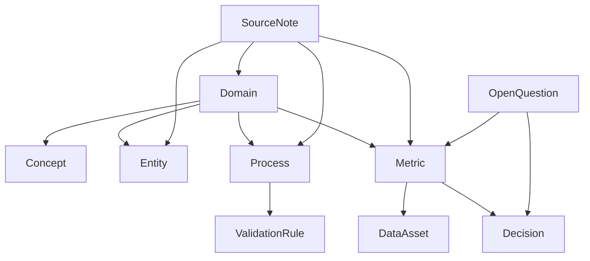

### Mermaid source lineage graph

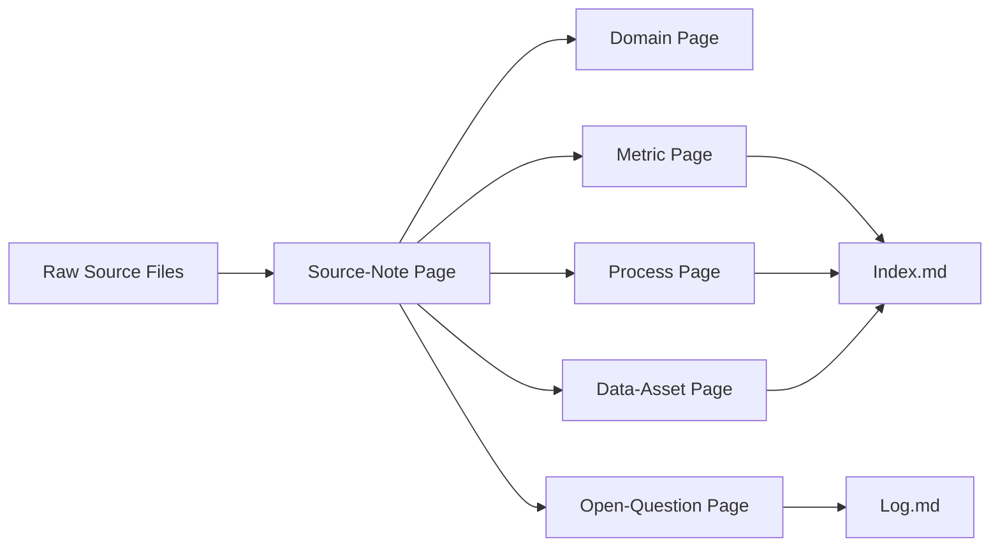

## 4.17 Section Summary

KMS treats `/wiki` as structured, governed, canonical knowledge rather than free-form markdown. Page types are explicit and controlled, folder placement is deterministic, and required frontmatter and body sections make pages usable by humans, KMI, Infopedia, and downstream AI systems.

The taxonomy is designed for analytics and reporting knowledge, which means KMS must encode metrics, data assets, analysis patterns, validation rules, decisions, and unresolved questions as first-class knowledge objects. That structure is what makes the Wiki Layer durable, enforceable, and suitable for Copilot-style and future agentic AI usage.

# 5. Source Intake, Ingestion Pipeline, and Refresh Workflow

## 5.1 Source Intake Overview

Source intake in KMS is the governed entry point where a Knowledge Manager provides a local folder path and KMS converts the files in that folder into structured maintenance inputs. The local source folder is the upstream landing zone for extracted and source artifacts that have already been made available by an external process.

KMS does not fetch from external systems directly. Source intake begins only after source material exists in a local path. From that point forward, KMS performs discovery, registration, parsing, extraction, and refresh preparation as part of the maintenance pipeline.

### Source intake in one statement

- Source intake is the first governed maintenance stage in KMS, transforming a local source folder path into auditable, structured inputs for downstream knowledge refresh.

Source intake is not file upload and not file listing. It is the controlled start of a run that may later refresh finalized wiki knowledge.

## 5.2 Source Intake Scope and Boundaries

KMS accepts a local filesystem path as intake input. Upstream connectors, scheduled jobs, export jobs, or human processes may populate that folder, but KMS does not own that acquisition process.

The intake boundary is explicit:

- in scope: ingesting local source material into KMS maintenance workflows
- in scope: parsing, classifying, summarizing, and preparing refresh inputs
- in scope: generating source notes and impact candidates
- in scope: downstream wiki refresh preparation
- out of scope: source acquisition from Jira, dashboards, databases, or other systems
- out of scope: external connector orchestration
- out of scope: source-of-record system replication

Source files are immutable inputs. KMS may read, parse, and summarize them, but it must never modify them as part of source intake.

## 5.3 Source Types and Expected Inputs

KMS should expect a controlled variety of source artifact classes already landed in the local source path.

| Source class | Typical examples | Likely extracted signals | Likely wiki impact |
|---|---|---|---|
| Document exports | PDF, DOCX, exported wiki pages | definitions, decisions, process descriptions | domain, concept, decision, process pages |
| Reports | monthly performance reports, governance readouts | metric definitions, anomalies, trend statements | metric pages, decision pages |
| Dashboard exports | CSV/PDF exports from BI tools | metric values, filters, segment assumptions | metric pages, validation-rule pages |
| Database extracts | CSV extracts, parquet-like exports, query result files | data asset semantics, grain, join keys, freshness | data-asset pages, validation-rule pages |
| Spreadsheets | XLSX, tabular workbooks, remediation trackers | calculations, reconciliations, action items | metric pages, data-asset pages, open-question pages |
| CSVs | fact extracts, dictionary files, source listings | row-level summaries, column semantics, counts | data-asset pages, metric pages |
| Markdown / text notes | run notes, analyst notes, working summaries | interpretation, candidate concepts, unresolved questions | source-note pages, open-question pages |
| Presentation files | PPTX exports, slide decks | decision rationale, executive framing, process summaries | decision pages, process pages, concept pages |
| JSON exports | structured APIs, configuration dumps | structured entities, metric metadata, system relationships | entity pages, data-asset pages, validation-rule pages |
| HTML exports | exported dashboards, published docs, page captures | formatted narrative, embedded tables, linked references | concept pages, metric pages, source-note pages |
| Meeting notes / structured documents | minutes, review notes, steering docs | decisions, contradictions, ownership, follow-up items | decision pages, open-question pages |

These are source classes, not parser commitments. The design identifies what kinds of knowledge signals KMS must be able to recognize, not every implementation library that may later be used to read them.

## 5.4 Source Folder Model

The local source folder is a recursive root that may contain nested folders, grouped artifacts, and heterogeneous file classes. Folder structure may provide useful hints such as domain, source system, or meeting group, but folder placement alone must not determine truth.

KMS should preserve relative path context for traceability while treating the root path as the intake boundary.

### Raw source folder example

```text
/sources/customer-revenue-analytics/
├── jira/
│   ├── revenue-retention-defect-export.csv
│   └── metric-clarification-ticket-2026-03-28.md
├── dashboards/
│   ├── nrr-q4-export.csv
│   └── revenue-close-summary.pdf
├── databases/
│   ├── sales-orders-fact.csv
│   └── cohort-revenue-extract.csv
├── documents/
│   ├── revenue-definition-brief.docx
│   └── metric-governance-note.md
├── meetings/
│   ├── revenue-review-2026-03-28.md
│   └── open-questions-log.md
└── assets/
    ├── slide-deck-export.pptx
    └── executive-summary.html
```

The path structure is useful for discovery and lineage, but it is not authoritative knowledge structure. KMS must preserve path identity even when the content is normalized into source notes and wiki impacts.

## 5.5 Source Intake Entry Point Through KMI

The Knowledge Manager initiates source intake in KMI by supplying a local path and optional run hints.

### Intake inputs

- `source_root_path`
- `initiated_by`
- `timestamp`
- optional `domain_hint`
- optional run notes
- optional run mode or strictness hints

Before intake begins, KMI should surface:

- path validation result
- source accessibility status
- optional source count preview if feasible
- optional folder preview if feasible
- warning if the path is empty, unreadable, or suspiciously sparse

The successful validation of the input path creates a new run context. The run context is the authoritative container for all discovery, parsing, and extraction artifacts that follow.

## 5.6 Intake Pipeline Stages

The intake pipeline is a controlled sequence of stages that transform source files into structured maintenance outputs.

| Stage | Purpose | Inputs | Outputs | Failure behavior |
|---|---|---|---|---|
| 1. Path validation | Confirm the path exists and is usable | source_root_path | validation result, run eligibility | fail run if inaccessible or invalid |
| 2. Source discovery | Recursively enumerate files and folders | validated path | discovered file list, path map | fail or partially continue based on severity |
| 3. Source registration | Create operational records for each source artifact | discovered files | source registry entries | record partial failures, preserve audit trail |
| 4. File type detection and classification | Identify supported and unsupported inputs | registered files | file class, support status, parser route | mark unsupported, continue where safe |
| 5. Deduplication / identity resolution | Detect repeats and stable identity | file metadata, checksum, path | uniqueness decisions, duplicate flags | prevent silent double-processing |
| 6. Parsing and normalization | Convert files into processable content | classified files | normalized text, structure, diagnostics | record parse failures explicitly |
| 7. Structured extraction | Detect candidate knowledge signals | normalized content | extracted signal objects | continue per file or mark run degraded |
| 8. Source note generation | Produce governed intermediate source artifacts | extracted signals | source-note drafts or outputs | preserve notes even if downstream handoff blocks |
| 9. Source-to-wiki impact preparation | Determine likely wiki impact candidates | source notes, signals, existing wiki references | impact manifest | block downstream if core evidence is missing |
| 10. Run summary and handoff | Package the run for later maintenance stages | all prior artifacts | intake summary, handoff manifest | fail closed if summary cannot be persisted |

### Numbered workflow

1. Validate the provided path.
2. Discover files recursively.
3. Register each discovered source artifact.
4. Detect file types and assign parsing routes.
5. Resolve identity and deduplicate where needed.
6. Parse and normalize supported inputs.
7. Extract structured signals from normalized content.
8. Generate source-note artifacts.
9. Prepare likely wiki impacts and candidates.
10. Persist the run summary and hand off to downstream maintenance logic.

### Mermaid flow diagram

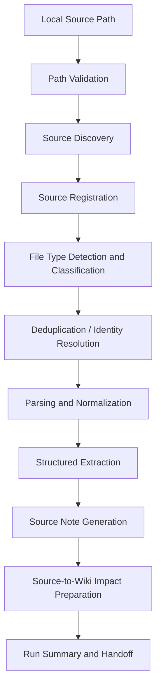

## 5.7 Source Discovery and Registration

Discovery is a recursive scan of the provided path. Registration creates operational records for each source artifact so KMS can reason about what was seen, when it was seen, and how it was processed.

Discovery and registration should capture:

- absolute path and relative path
- file size
- extension and, where possible, MIME type
- discovery timestamp
- run association
- initial support status
- checksum or hash

Source registration creates operational records, not finalized knowledge. It is the audit layer for intake.

### Source registry record example

```json
{
  "run_id": "run-2026-04-05-customer-revenue-analytics-01",
  "source_root_path": "/sources/customer-revenue-analytics",
  "file_id": "src-00042",
  "absolute_path": "/sources/customer-revenue-analytics/databases/sales-orders-fact.csv",
  "relative_path": "databases/sales-orders-fact.csv",
  "file_name": "sales-orders-fact.csv",
  "file_size_bytes": 483921,
  "extension": ".csv",
  "mime_type": "text/csv",
  "checksum_sha256": "f1a3d2b4c6e7f8a9b0c1d2e3f4a5b6c7d8e9f00112233445566778899aabbccdd",
  "discovered_at": "2026-04-05T09:12:44Z",
  "support_status": "supported",
  "classification": "database-extract",
  "parser_route": "tabular-parser",
  "run_state": "registered"
}
```

## 5.8 File Identity, Deduplication, and Idempotency

KMS must avoid duplicate or unstable processing. File identity should be based on the combination of path, checksum, and relevant file metadata so repeated runs over unchanged inputs can be recognized.

### Deduplication logic summary

- unchanged file at same path: reuse prior identity and avoid unnecessary reprocessing where safe
- changed file at same path: treat as revised input and reprocess deterministically
- duplicate file at different path with same content: flag as duplicate and preserve both path records
- unsupported file: register and preserve, but do not parse as supported content

### Decision table

| Condition | Detection basis | Expected action | Audit requirement |
|---|---|---|---|
| Unchanged | same path + same checksum | skip or reuse prior normalized output when safe | record reuse decision |
| Changed | same path + different checksum | reprocess deterministically | record before/after identity |
| Duplicate | different path + same checksum | flag duplicate, retain both source records | preserve both path references |
| Unsupported | file class not recognized | register, mark unsupported, exclude from parse route | preserve unsupported list |

Idempotency applies both at run level and at file-processing level. Rerunning the same path must be safe. Deleted source files should not automatically delete finalized wiki knowledge; removal or retirement of truth requires later governed logic.

## 5.9 Parsing and Normalization

Parsing converts supported file types into normalized internal representations suitable for downstream analysis. Normalization should produce extracted text, structural metadata, table-like content where relevant, parser diagnostics, and parse confidence or parse status.

Parsing is not final knowledge synthesis. It is an intermediate maintenance step.

| Input type | Normalized output | Key metadata | Caveats |
|---|---|---|---|
| PDF / DOCX / HTML | text + structure map | page count, headings, embedded links | formatting loss, OCR risk |
| CSV / spreadsheet | table-like rows/columns | row count, column names, cell types | schema ambiguity, hidden formulas |
| Markdown / text | text + section map | heading hierarchy, link targets | free-form structure can be noisy |
| JSON | object tree + flattened fields | keys, nesting depth, array hints | version drift, inconsistent schemas |
| PPTX / slide exports | slide text + speaker notes | slide count, visual section hints | narrative compression, image loss |

Parser failures must be preserved as explicit run outcomes. Normalized content is intermediate maintenance input, not a truth declaration.

## 5.10 Structured Extraction and Signal Detection

Structured extraction converts normalized content into machine-usable signals. It must detect candidate entities, concepts, processes, metrics, data assets, decisions, candidate dates or time references, contradictions or ambiguities, likely domain classification, and notable business signals.

Structured extraction does not equal final truth. It is the creation of evidence-bearing signals for source notes and impact analysis.

### Example extracted signal object

```json
{
  "signal_id": "sig-2026-04-05-001",
  "source_file_id": "src-00042",
  "signal_type": "candidate-metric",
  "label": "Net Revenue Retention",
  "confidence": "medium",
  "evidence_snippet": "NRR improved to 118% for the enterprise segment in Q4.",
  "candidate_domain": "customer-revenue-analytics",
  "candidate_page_types": ["metric", "decision", "data-asset"],
  "contradiction_flag": false,
  "notes": "Requires source reconciliation against monthly close report."
}
```

These signals help source-note generation, later validation, and AI-usable lineage assembly.

## 5.11 Source Note Generation

Source-note pages are governed intermediate artifacts derived from source materials. They summarize source signals without equating the raw source directly to finalized truth.

Source notes should capture:

- source details
- summary
- extracted signals
- candidate entities
- candidate metrics
- candidate processes
- candidate impacts
- source trace

One source file may lead to one or more source-note artifacts depending on the amount of extracted content and the design of the intake workflow.

### Source-note lifecycle

1. A source file is registered and parsed.
2. Structured extraction produces signals.
3. A source-note draft is generated or updated.
4. The source note becomes the bridge artifact for later maintenance logic.
5. The source note remains traceable to raw input and to impacted wiki pages.

### Source-note skeleton

```markdown
---
title: Net Revenue Retention Source Note
slug: net-revenue-retention-source-note
type: source-note
domain: customer-revenue-analytics
status: finalized
source_refs:
  - raw:/sources/customer-revenue-analytics/reports/q4-revenue-ops-review.md
last_updated: 2026-04-05
confidence: medium
review_required: true
related:
  - metric/customer-revenue-analytics/net-revenue-retention
  - data-asset/customer-revenue-analytics/sales-orders-fact
tags: [source-note, revenue, retention]
owners: [knowledge-manager:revenue-ops]
---

# Net Revenue Retention Source Note

## Summary

## Source Details

## Extracted Signals

## Candidate Entities

## Candidate Metrics

## Candidate Processes

## Candidate Impacts

## Source Trace
```

## 5.12 Source-to-Wiki Impact Preparation

Intake does not directly rewrite `/wiki`. Instead, it prepares structured inputs for downstream maintenance logic.

The impact manifest should include:

- likely impacted wiki pages
- create, update, or no-op candidates
- candidate page types
- duplicate page risks
- contradiction risks
- source confidence hints

Impact preparation is not publication. Publication only occurs later after validation, review, and approval logic.

### Handoff diagram

```text
raw source -> normalized content -> source notes -> impact preparation -> later wiki draft/validation/finalization
```

## 5.13 Refresh Workflow Semantics

Refresh means governed reevaluation of maintained knowledge based on newly ingested or changed source material. KMS does not refresh upstream systems.

### Semantics comparison

- source sync: moving data from a source system into a destination system; out of scope
- KMS refresh: reevaluating source-derived signals and deciding whether maintained wiki knowledge should change

- raw source update: a new or changed file in the local intake folder
- finalized wiki refresh: a governed update to maintained knowledge after checks and review

Refresh must be governed, traceable, and non-destructive by default. New input does not automatically elevate trust without downstream validation and review.

## 5.14 Run States and Intake Lifecycle

The intake run should move through explicit states so the system can be observed and resumed safely.

| State | Meaning | Entry condition | Exit condition |
|---|---|---|---|
| created | run context exists | path provided and accepted for validation | validation begins |
| validating_path | path is being checked | run created | path validated or rejected |
| discovering_sources | scanning for files | valid path | files discovered or discovery fails |
| registering_sources | recording discovered files | file list available | registry written |
| parsing | files are being normalized | registered sources exist | parse outputs or parse failure |
| extracting | signals are being detected | normalized content exists | extracted signals written |
| generating_source_notes | source-note artifacts are produced | extraction complete | source-note outputs written |
| preparing_impact | wiki impact candidates are assembled | source notes exist | impact manifest written |
| completed | run finished successfully | all required artifacts persisted | run closed |
| completed_with_warnings | run succeeded with non-fatal issues | partial support, unsupported files, or low confidence | run closed |
| failed | run could not complete | fatal stage failure | rerun or repair path |
| blocked | downstream handoff is intentionally held | unresolved contradiction or policy stop | human resolution |

### Mermaid state diagram

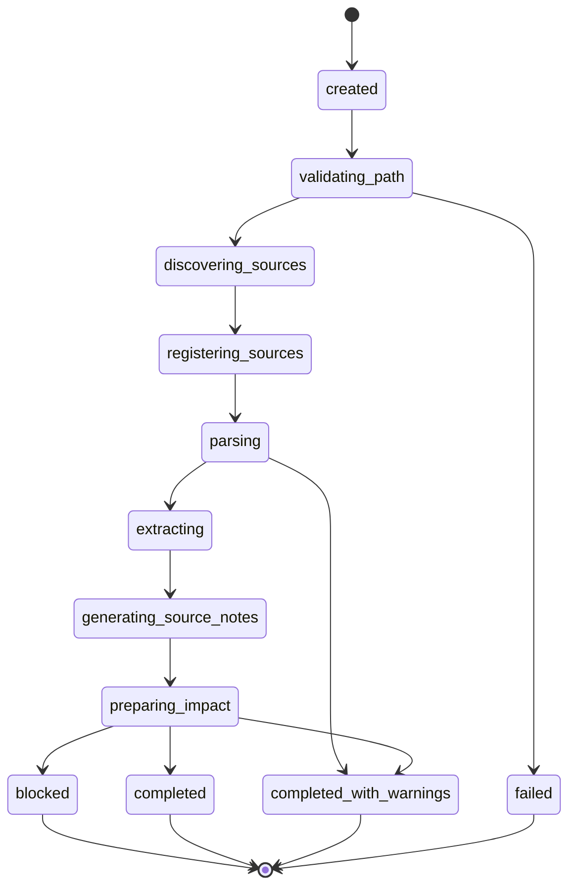

## 5.15 Intake Artifacts and Outputs

The intake pipeline must produce durable artifacts that support auditability, reviewability, debugging, and rerun support.

| Artifact | Produced by stage | Purpose | Downstream consumer |
|---|---|---|---|
| Source registry | registration | record what was found and how it was classified | KMI, orchestration, audit |
| Parse report | parsing | show normalization outcomes and diagnostics | KMI, troubleshooting |
| Unsupported files list | classification | preserve excluded inputs | Knowledge Manager, audit |
| Extracted signal records | extraction | provide machine-usable signals | source-note generation, impact prep |
| Source-note drafts / outputs | source-note generation | bridge source to knowledge maintenance | maintenance workflow, KMI |
| Impact preparation manifest | impact preparation | identify likely wiki impacts | downstream wiki refresh logic |
| Intake summary | handoff | summarize run outcome and coverage | KMI, metadata DB, audit |
| Warning / error report | any failed or degraded stage | preserve issues and recovery hints | Knowledge Manager, support tooling |

These artifacts are required because KMS must be deterministic, reviewable, and rerunnable.

## 5.16 Error Handling and Recovery Expectations

Failure handling must be explicit. KMS should fail closed where needed and preserve audit evidence in all cases.

| Failure type | Scope | Expected behavior | Downstream effect |
|---|---|---|---|
| Invalid path | run-level | fail explicitly before discovery | no artifacts beyond validation record |
| Inaccessible path | run-level | fail explicitly and record reason | no downstream handoff |
| Empty folder | run-level or warning-level | complete with warning or block based on policy | no meaningful intake outputs |
| Unsupported file types | file-level | register and skip parsing safely | source notes may omit unsupported content |
| Corrupt file | file-level | preserve error record and continue where safe | partial extraction only if safe |
| Parser failure | file-level | preserve diagnostics and mark file failed | affected file excluded from downstream handoff |
| Partial extraction failure | file-level or run-level | continue where safe; block if core signals missing | degraded impact manifest |
| Inconsistent metadata | run-level or file-level | flag for review and block if policy-critical | run may become blocked |
| Downstream handoff failure | run-level | preserve intake outputs, block later maintenance stages | no publication impact from intake alone |

### Decision table

| Condition | Expected action | Audit requirement |
|---|---|---|
| Safe to continue | continue with warnings | record warning and scope |
| Fatal to the run | fail run | preserve error detail and state |
| Unsafe for downstream handoff | block handoff | keep intake artifacts visible and unresolved |

Intake failures must never corrupt finalized wiki knowledge.

## 5.17 Intake Governance Expectations

Source intake is governed, not merely technical preprocessing.

- raw sources are immutable
- source intake is auditable
- parsing does not equal acceptance of truth
- source notes preserve interpretation boundaries
- contradictions must be surfaced, not flattened
- intake artifacts must be reviewable
- unsupported or failed files must not disappear silently
- no direct wiki mutation may occur from intake alone

The intake stage produces governed evidence and structured maintenance inputs. It does not publish truth.

## 5.18 Source Intake Architecture and Flow Diagrams

### ASCII architecture diagram

```text
Local Source Path
      |
      v
KMI Intake Entry
      |
      v
Validation -> Discovery -> Registration -> Parsing -> Extraction
      |                                           |
      |                                           v
      |                                   Source Notes
      |                                           |
      +-------------------------> Impact Preparation
                                              |
                                              v
                                   Downstream Wiki Maintenance
```

### ASCII lineage diagram

```text
Source files
   |
   v
Registry records
   |
   v
Parsed / normalized content
   |
   v
Extracted signals
   |
   v
Source-note artifacts
   |
   v
Impact manifest
```

### Mermaid intake flow diagram

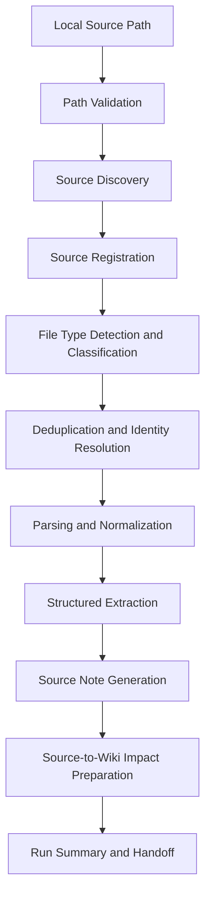

## 5.19 Example End-to-End Intake Scenario

A Knowledge Manager starts a run against `/sources/customer-revenue-analytics/`.

The folder contains:

- a dashboard export for Net Revenue Retention
- a remediation spreadsheet for monthly revenue close
- a process change note from the revenue operations team
- a data dictionary CSV for the sales orders fact extract

The run proceeds as follows:

1. KMI validates the path and creates a run context.
2. Discovery finds files under `dashboards/`, `documents/`, `meetings/`, and `databases/`.
3. Registration records each file with path, checksum, size, and support status.
4. Classification marks the CSV and markdown notes as supported, and flags one image-heavy slide export as lower-confidence for extraction.
5. Parsing normalizes the report PDF into text, the spreadsheet into rows and columns, and the markdown notes into structured sections.
6. Extraction detects a candidate metric definition for Net Revenue Retention, a candidate data asset for `sales-orders-fact`, and an open question about cohort eligibility.
7. Source notes are generated for the metric candidate and the data asset candidate.
8. Impact preparation identifies likely wiki updates for `metric/customer-revenue-analytics/net-revenue-retention`, `data-asset/customer-revenue-analytics/sales-orders-fact`, and `open-question/customer-revenue-analytics/cohort-eligibility`.
9. The intake summary marks the run as completed with warnings because one file had weak signal quality.
10. Later maintenance stages can validate, review, and decide whether `/wiki` should change.

This scenario shows the intended behavior: the intake stage prepares governed evidence and candidate impacts, but it does not publish final truth.

## 5.20 Section Summary

Source intake is the first governed maintenance stage in KMS. The system starts from a local source path, discovers and normalizes immutable source files, generates structured signals and source notes, and prepares downstream wiki impact candidates without mutating finalized knowledge.

Refresh in KMS means governed reevaluation of maintained knowledge, not source-system synchronization. The design produces deterministic, auditable, rerunnable ingestion artifacts that support later validation, review, and publication workflows.

# 6. Agents, Skills, Orchestration, and Control Logic

## 6.1 Agentic Model Overview

KMS uses a multi-agent maintenance system inside a governed control plane. Agents are bounded workers with narrow responsibilities. They do not own truth end to end, and they do not operate as free-form autonomous entities.

The agentic model combines:

- an orchestrator-managed workflow
- reusable skills as procedural modules
- deterministic control points for validation and publish gates
- LLM-assisted reasoning where useful, but never sovereign
- governed publication through KMI and policy checks

Downstream AI Systems are consumers of finalized knowledge and are outside this maintenance agent set. Infopedia is a read layer, not an agent write target for knowledge truth.

### Agentic model in one statement

- KMS uses bounded maintenance agents, reusable skills, and deterministic orchestration to transform source inputs into governed knowledge outputs without allowing any agent to own truth alone.

## 6.2 Design Principles for Agents

### Bounded responsibility

Each agent has a narrow operating scope. The purpose is to reduce ambiguity, keep failure domains small, and make escalation rules explicit.

### Deterministic workflow over improvisation

The orchestrator determines the sequence of stages and gates. Agents do not invent new lifecycle steps or reorder publish controls.

### No agent owns end-to-end truth alone

Truth is assembled through a controlled workflow. No single agent may discover, interpret, validate, and publish knowledge without oversight.

### Publish only after validation

Candidate knowledge must pass schema, source trace, contradiction, and policy gates before publication is permitted.

### Structured outputs only

Agents must produce machine-readable artifacts, not opaque narrative responses. Structured outputs support reuse, auditability, and deterministic handoff.

### Intermediate artifacts are mandatory

Each important stage must leave an artifact behind. Artifacts are required for review, recovery, and later reprocessing.

### Unresolved contradictions must escalate

Contradictions are not silently averaged or hidden. They are surfaced, retained, and routed to review.

### Raw sources are immutable

No agent may edit `/raw` or any source input area. Agents may read source material and derive outputs from it, but source files remain unchanged.

## 6.3 Canonical Agent Set

KMS defines a canonical agent set. These agents are intentionally specialized and must remain distinct unless a later design explicitly redefines a boundary.

### 1. Orchestrator Agent

- Purpose: control workflow sequencing, state transitions, and mandatory gate enforcement
- Primary inputs: run request, run state, stage outputs, policy outcomes
- Primary outputs: stage dispatch, run state updates, handoff directives, blocked/completed statuses
- Allowed write scope: workflow state and control metadata only
- Forbidden actions: editing `/wiki` truth directly, bypassing gates, skipping QA, owning final truth
- Stop/escalation criteria: missing mandatory artifact, blocked gate, unrecoverable stage failure

### 2. Source Intake Agent

- Purpose: validate source path, discover files, register files, classify inputs, and prepare intake artifacts
- Primary inputs: local source path, run metadata, discovery context
- Primary outputs: source registry, parse-ready file list, classification results, intake summary
- Allowed write scope: source registry and intake artifacts only
- Forbidden actions: modifying source files, publishing wiki knowledge, bypassing unsupported-file handling
- Stop/escalation criteria: invalid path, inaccessible path, empty or malformed intake, unsupported critical input

### 3. Source Analyst Agent

- Purpose: extract structured signals from normalized source content
- Primary inputs: parsed content, source registry, source notes, existing taxonomy hints
- Primary outputs: extracted signals, candidate entities, candidate concepts, candidate metrics, ambiguity flags
- Allowed write scope: extracted signal artifacts and analysis outputs
- Forbidden actions: finalizing wiki pages, resolving contradictions without escalation, changing truth state
- Stop/escalation criteria: low-confidence extraction, parse gaps, conflicting signals, missing source trace

### 4. Wiki Impact Analyst

- Purpose: map source signals to likely wiki impacts and candidate page changes
- Primary inputs: extracted signals, source notes, existing `/wiki` inventory, taxonomy rules
- Primary outputs: impact map, create/update/no-op candidates, duplicate-risk flags
- Allowed write scope: impact manifests and staged revision candidates
- Forbidden actions: direct publication, silent overwrite, bypassing uniqueness rules
- Stop/escalation criteria: ambiguous page target, duplicate canonical risk, missing page type match

### 5. Wiki Curator

- Purpose: prepare staged wiki revisions, update draft content, and assemble publication candidates
- Primary inputs: impact map, source notes, existing page content, markdown schema rules
- Primary outputs: staged page revisions, draft markdown, revision set
- Allowed write scope: staged content and draft artifacts only, never final `/wiki`
- Forbidden actions: final publication, rule bypass, deletion of truth without approval
- Stop/escalation criteria: schema mismatch, missing source trace, unresolved content conflict

### 6. Policy QA Agent

- Purpose: validate candidate content against policy, schema, taxonomy, and required quality rules
- Primary inputs: staged revisions, rules YAML, templates, source trace, page metadata
- Primary outputs: QA report, pass/fail status, violation list, remediation guidance
- Allowed write scope: QA artifacts and validation state
- Forbidden actions: publishing content, rewriting truth to pass validation, ignoring hard failures
- Stop/escalation criteria: rule failure, invalid metadata, unsupported page structure, broken links

### 7. Contradiction Reviewer

- Purpose: review unresolved contradictions, competing source interpretations, and low-confidence claims
- Primary inputs: contradiction report, source notes, staged revisions, current `/wiki` content
- Primary outputs: contradiction resolution recommendation, escalation memo, open-question artifacts
- Allowed write scope: contradiction artifacts and review notes
- Forbidden actions: silently resolving conflicts without evidence, publishing final truth alone
- Stop/escalation criteria: unresolved ambiguity, conflicting canonical definitions, policy conflict

### 8. Publisher

- Purpose: write approved, validated markdown into `/wiki` and record publication outcomes
- Primary inputs: approved staged revisions, QA pass status, source trace, final publish directive
- Primary outputs: finalized markdown pages, publish summary, publication records, revision markers
- Allowed write scope: finalized `/wiki` and publication metadata only
- Forbidden actions: publishing without gates, editing raw sources, inventing new truth outside approval
- Stop/escalation criteria: failed gate, missing approval, storage write failure, path mismatch

### 9. Lint Agent

- Purpose: perform post-publish structural and link linting over `/wiki` and related navigation artifacts
- Primary inputs: finalized pages, link graph, taxonomy, index state
- Primary outputs: lint report, broken-link list, structural warnings, remediation suggestions
- Allowed write scope: lint artifacts and non-authoritative maintenance notes
- Forbidden actions: mutating published truth, masking defects, retrying publish logic on its own
- Stop/escalation criteria: broken canonical link, invalid frontmatter, missing required section

## 6.4 Agent Responsibility Matrix

| Agent | Main responsibility | Reads from | Writes to | Can finalize? | Escalation trigger |
|---|---|---|---|---|---|
| Orchestrator Agent | Workflow sequencing and gate enforcement | run state, stage outputs, policy outcomes | workflow state, handoff directives | no | blocked gate, missing artifact |
| Source Intake Agent | Intake discovery and registration | local source path, file system metadata | source registry, intake artifacts | no | invalid path, inaccessible path |
| Source Analyst Agent | Signal extraction | parsed content, source notes | extracted signals, analysis outputs | no | low confidence, conflicting signals |
| Wiki Impact Analyst | Map source to wiki impacts | extracted signals, current wiki inventory | impact map, staged candidates | no | duplicate canonical risk |
| Wiki Curator | Prepare staged wiki revisions | impact map, existing page content | staged page revisions | no | schema mismatch, missing trace |
| Policy QA Agent | Validate against rules and schema | staged revisions, rules, metadata | QA report, validation status | no | rule failure, invalid structure |
| Contradiction Reviewer | Resolve or escalate contradictions | contradiction report, source notes | contradiction artifacts, review notes | no | unresolved ambiguity |
| Publisher | Publish approved markdown | approved revisions, QA pass | `/wiki`, publish summary | yes | failed gate, missing approval |
| Lint Agent | Post-publish structural linting | finalized pages, link graph | lint report | no | broken link, invalid frontmatter |

## 6.5 Orchestrator Role and Workflow Control

The Orchestrator Agent is the workflow governor. It is not a truth owner and not a content author. Its job is to sequence stages, invoke skills and agents in required order, track run state, collect artifacts, and enforce mandatory checkpoints.

The Orchestrator Agent must not bypass QA, must not bypass approval policy, and must not publish directly outside the Publisher path.

### Orchestration sequence

1. Receive a run request from KMI.
2. Create or resume run state.
3. Invoke source-intake logic and wait for source registry artifacts.
4. Dispatch source analysis and collect extracted signals.
5. Dispatch wiki impact analysis and collect impact candidates.
6. Dispatch wiki curator to stage revisions.
7. Dispatch policy QA and collect pass/fail results.
8. Route contradictions to the Contradiction Reviewer when needed.
9. Require Knowledge Manager approval when the workflow is not auto-finalize eligible.
10. Invoke Publisher only after all gates pass.
11. Trigger post-publish lint and index refresh.
12. Record the final run summary and terminal state.

### ASCII orchestration diagram

```text
KMI
  |
  v
Orchestrator
  |
  +--> Source Intake Agent
  |
  +--> Source Analyst Agent
  |
  +--> Wiki Impact Analyst
  |
  +--> Wiki Curator
  |
  +--> Policy QA Agent
  |
  +--> Contradiction Reviewer (if needed)
  |
  +--> Publisher
  |
  +--> Lint Agent
```

## 6.6 Skill System Model

Skills are reusable procedural modules packaged as `SKILL.md` patterns. A skill is not a free-floating prompt. It is a governed bundle of instructions and supporting material that an agent or orchestrator can invoke consistently.

Skills may include:

- instructions
- templates
- schemas
- rubrics
- examples
- helper scripts

Skills make procedural logic reusable while keeping the orchestration model deterministic and auditable.

## 6.7 Required Skills Inventory

KMS should define a minimum reusable skill set aligned to the agent model.

| Skill | Purpose | When used | Required inputs | Outputs | Hard rules |
|---|---|---|---|---|---|
| source-intake | validate, discover, register source files | start of intake run | source path, run metadata | registry, classification, intake summary | never mutate source files |
| source-summarization | summarize normalized source content | after parsing | normalized text, file metadata | source summaries, candidate signals | output must remain source-backed |
| wiki-impact-analysis | map signals to wiki changes | after extraction | extracted signals, wiki inventory | impact map, page candidates | no direct publication |
| wiki-refresh | stage or refresh wiki candidates | after impact analysis | impact map, source trace, current pages | staged revisions, refresh set | preserve canonical truth boundaries |
| contradiction-resolution | surface and triage conflicts | when ambiguity exists | contradiction report, source notes | resolution memo, open questions | do not silently override conflicts |
| vault-lint | validate structure, links, and schema | after staging or publish | markdown, taxonomy, links | lint report, broken-link list | cannot fix truth by rewriting it |
| infopedia-index-refresh | refresh navigation and search projections | after publish | finalized wiki content, metadata | index updates, browse projection refresh | read-only relative to truth |

### Compact skill inventory

- source-intake: intake and registration
- source-summarization: source-backed summarization
- wiki-impact-analysis: candidate page mapping
- wiki-refresh: staged refresh preparation
- contradiction-resolution: conflict triage
- vault-lint: structural and link validation
- infopedia-index-refresh: browse projection refresh

## 6.8 AGENTS.md and Control Files

KMS should separate governance from procedural implementation.

- `agents/AGENTS.md`: global contract for all agents, their boundaries, and shared governance expectations
- agent definition files: role-level instructions for a specific agent
- `SKILL.md` files: procedural units reused by multiple agents or workflows
- `rules/*.yaml`: machine-enforceable policy and validation rules
- templates: output structure and content shape for pages, artifacts, and summaries

### Separation of concerns

- AGENTS.md = constitution
- SKILL.md = operating procedures
- rules/*.yaml = enforceable policy
- templates = output structure

## 6.9 Structured Artifacts Produced by Agents

Agents must produce structured intermediate artifacts. These artifacts are mandatory because they support auditability, recoverability, human review, and deterministic handoff.

| Artifact | Produced by | Consumed by | Purpose |
|---|---|---|---|
| source registry | Source Intake Agent | Orchestrator, Source Analyst | record discovered files and identity |
| source-note outputs | Source Analyst / Wiki Curator | Wiki Impact Analyst, KMI | bridge raw material to governed maintenance |
| impact map | Wiki Impact Analyst | Wiki Curator, KMI | identify likely page changes |
| staged page revisions | Wiki Curator | Policy QA Agent, Publisher | prepare candidate markdown |
| QA report | Policy QA Agent | Orchestrator, KMI | validate against rules and schema |
| contradiction report | Contradiction Reviewer | Orchestrator, KMI | surface conflicts and open questions |
| approval summary | KMI / Orchestrator | Publisher | record final human decision |
| publish summary | Publisher | KMI, metadata services | record publication outcome |
| lint report | Lint Agent | Orchestrator, KMI | identify post-publish defects |

## 6.10 Deterministic vs LLM-Driven Responsibilities

### Deterministic tasks

- path validation
- file discovery
- checksum and deduplication
- schema validation
- link validation
- status transitions
- file writes

### LLM-assisted tasks

- summarization
- candidate entity and concept detection
- impact suggestions
- contradiction framing
- markdown draft synthesis

LLM-driven outputs are advisory until validated. They may inform the workflow, but they do not become truth until they pass the required gates.

## 6.11 Agent Interaction and Handoff Model

The required agent chain is:

Source Intake Agent -> Source Analyst Agent -> Wiki Impact Analyst -> Wiki Curator -> Policy QA Agent -> Contradiction Reviewer (if needed) -> Publisher -> Lint Agent

### Conditional branches

- no-op path: if no meaningful changes are detected, the run ends with a no-op summary and no publish action
- blocked publish: if a gate fails, the workflow halts before Publisher
- review required: if confidence is low or policy demands review, KMI must approve before publish
- auto-finalize eligible: if policy permits and all gates pass, the Publisher can proceed without additional manual review

### Mermaid orchestration flow

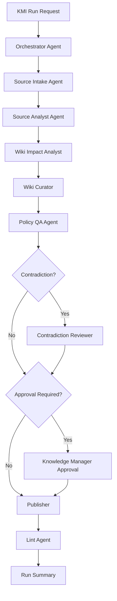

## 6.12 Control Logic and Publish Gates

KMS must enforce hard control points before publication.

### Schema gate

- Checks: frontmatter validity, required sections, page type conformance
- Owner: Policy QA Agent
- Failure behavior: block publication and produce remediation guidance

### Source trace gate

- Checks: presence and coherence of source_refs and lineage
- Owner: Policy QA Agent with support from Source Analyst and Wiki Curator
- Failure behavior: block publication or route for review

### Contradiction gate

- Checks: unresolved conflicts, incompatible claims, ambiguous decisions
- Owner: Contradiction Reviewer
- Failure behavior: block publication or require Knowledge Manager escalation

### Approval gate

- Checks: whether Knowledge Manager approval is required and present
- Owner: KMI / Knowledge Manager
- Failure behavior: block publication until approved or explicitly deferred

### Publish gate

- Checks: all prior gates passed and publication target is valid
- Owner: Publisher
- Failure behavior: prevent write to `/wiki`

No agent may unilaterally override these gates without policy support. The control plane must remain authoritative over publication.

### Mermaid control gate diagram

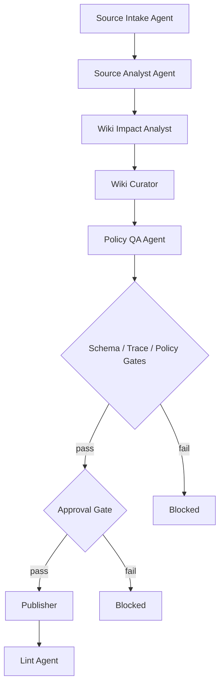

## 6.13 Escalation and Human-in-the-Loop Model

The Knowledge Manager must be involved when the workflow cannot safely close on its own.

### Escalation triggers

- unresolved contradiction
- low-confidence extraction
- major rewrite
- new canonical metric or data-asset
- missing source trace
- rule failure
- duplicate canonical page risk

Self-managed does not mean ungoverned. Automation is conditional, and human review protects truth quality when policy, confidence, or novelty require it.

## 6.14 Failure Handling Across Agents

Agent failures must be isolated. A failure in one agent should not corrupt unrelated artifacts, and partial outputs must remain visible for recovery where safe.

| Failure condition | Likely agent | Expected behavior | Run impact | Recovery path |
|---|---|---|---|---|
| invalid source path | Source Intake Agent | fail fast and emit validation error | run blocked | correct path and rerun |
| parse failure on one file | Source Intake Agent / Source Analyst Agent | preserve file-level error and continue where safe | run degraded or partial | fix file or parser and rerun |
| low-confidence extraction | Source Analyst Agent | mark signals provisional and escalate if necessary | review required | Knowledge Manager review |
| duplicate canonical page risk | Wiki Impact Analyst | stop candidate merge and flag collision | blocked | resolve naming or merge policy |
| schema validation failure | Policy QA Agent | block publish and emit remediation | publish blocked | fix staged content and rerun QA |
| unresolved contradiction | Contradiction Reviewer | retain open-question artifact and halt publish | blocked | human resolution or policy decision |
| publication write failure | Publisher | preserve prior truth, fail closed, record error | publish failed | retry after storage issue resolved |
| lint failure after publish | Lint Agent | report defect, do not rewrite truth automatically | post-publish warning or blocked follow-up | remediation workflow |

## 6.15 Agent and Skill File Structure

```text
repo-root/
├── agents/
│   ├── AGENTS.md
│   ├── agents/
│   │   ├── orchestrator.md
│   │   ├── source-intake.md
│   │   ├── source-analyst.md
│   │   ├── wiki-impact-analyst.md
│   │   ├── wiki-curator.md
│   │   ├── policy-qa.md
│   │   ├── contradiction-reviewer.md
│   │   ├── publisher.md
│   │   └── lint-agent.md
│   └── skills/
│       ├── source-intake/
│       │   └── SKILL.md
│       ├── source-summarization/
│       │   └── SKILL.md
│       ├── wiki-impact-analysis/
│       │   └── SKILL.md
│       ├── wiki-refresh/
│       │   └── SKILL.md
│       ├── contradiction-resolution/
│       │   └── SKILL.md
│       ├── vault-lint/
│       │   └── SKILL.md
│       └── infopedia-index-refresh/
│           └── SKILL.md
├── rules/
│   ├── frontmatter.yaml
│   ├── links.yaml
│   ├── taxonomy.yaml
│   └── publication.yaml
└── templates/
    ├── metric.md
    ├── data-asset.md
    ├── source-note.md
    └── open-question.md
```

## 6.16 Example Agent Spec Snippet

```markdown
# policy-qa.md

## Mission
Validate staged wiki content against schema, taxonomy, source trace, and publication rules.

## Inputs
- staged markdown pages
- rules YAML
- source trace records
- page metadata

## Outputs
- QA report
- pass/fail status
- violation list
- remediation guidance

## Hard Rules
- do not modify finalized `/wiki` content
- do not waive hard policy failures
- do not invent missing source trace
- do not approve content that fails schema validation

## Stop Conditions
- unresolved validation failure
- broken canonical link
- missing required page sections
```

## 6.17 Example SKILL.md Snippet

```markdown
# wiki-refresh

## Description
Refresh staged wiki candidates from approved impact maps and governed source notes.

## When to use
- after impact analysis
- after source notes exist
- before QA and publication

## Inputs
- impact map
- source-note artifacts
- existing page content
- taxonomy and schema rules

## Outputs
- staged markdown revisions
- refresh summary
- change markers

## Workflow
1. Load approved impact candidates.
2. Read source-note evidence.
3. Update or create staged markdown.
4. Preserve source trace and related links.
5. Emit structured revision artifacts.

## Hard Rules
- never write directly to `/wiki`
- never remove source trace
- never bypass review-required conditions
```

## 6.18 Diagrams

### Agent handoff ASCII diagram

```text
KMI
  |
  v
Orchestrator
  |
  v
Source Intake -> Source Analyst -> Wiki Impact Analyst -> Wiki Curator
                                                        |
                                                        v
                                               Policy QA Agent
                                                        |
                                         +--------------+--------------+
                                         |                             |
                                         v                             v
                                Contradiction Reviewer           Publisher
                                         |                             |
                                         +--------------+--------------+
                                                        v
                                                   Lint Agent
```

### Orchestration Mermaid diagram

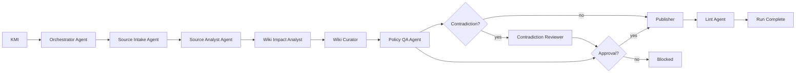

### Control-gate Mermaid diagram

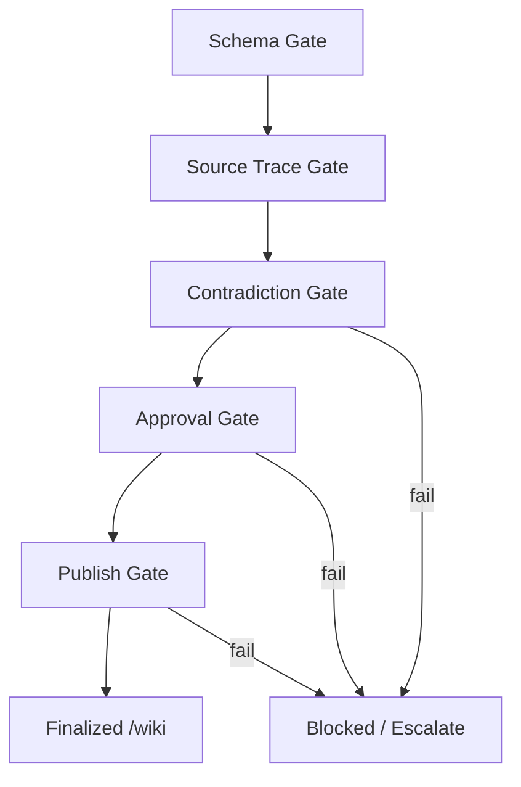

## 6.19 Section Summary

KMS uses bounded agents, not open autonomy. Skills package reusable workflow logic, orchestration remains deterministic, and control gates protect truth before publication. The model supports self-management while preserving auditability, human governance, and the canonical authority of `/wiki`.

# 7. Governance, Validation Rules, and Policy Enforcement

## 7.1 Governance Model Overview

Governance is the runtime enforcement layer that determines whether knowledge may progress from draft state to finalized publication. It is not documentation, guidance, or a review preference. It is executable policy applied before content can reach `/wiki`.

Governance in KMS means:

- rules are executable constraints, not prose recommendations
- validation is mandatory before publish
- agents cannot bypass governance
- the Knowledge Manager Interface (KMI) is the human governance surface
- the metadata DB may store governance state, but it does not replace `/wiki` as the source of truth

Governance = enforceable constraints over the knowledge lifecycle.

No content reaches `/wiki` without passing governance checks. Any path that attempts to publish without evaluation, approval, or traceability is invalid by design and must be blocked.

## 7.2 Rule Categories

Governance rules are grouped by enforcement intent so each control can be evaluated deterministically at runtime.

| Rule Category | Purpose | Enforced By | Failure Impact |
|---|---|---|---|
| Schema Rules | Ensure pages, metadata, and structured fields conform to required shapes | Schema validator, lint agent | Block publish |
| Content Rules | Enforce required sections, terminology, formatting, and allowed patterns | Policy QA Agent, lint agent | Block publish or escalate review |
| Source Trace Rules | Require each claim to map to source evidence or approved provenance | Policy QA Agent, orchestrator | Block publish |
| Relationship Rules | Validate links, parent-child structure, taxonomy placement, and reference integrity | Lint agent, orchestrator | Block publish or log warning |
| Conflict Rules | Detect contradictions, ambiguity, and competing canonical claims | Contradiction Reviewer, Policy QA Agent | Block publish or escalate review |
| Freshness Rules | Enforce recency thresholds and refresh requirements for time-sensitive knowledge | Policy QA Agent, orchestrator | Escalate review or block publish |
| Duplication Rules | Prevent duplicate canonical pages, duplicate metrics, or overlapping authoritative definitions | Policy QA Agent, orchestrator | Block publish |
| Approval Rules | Require human approval when policy or risk thresholds are crossed | KMI, approval workflow | Block publish until approved |

Rule categories are cumulative. A page must satisfy every applicable category before it can be finalized.

## 7.3 Rule Definition Model

Rules live in `/rules/*.yaml`. Each file defines executable policy that can be loaded by the runtime and applied during validation.

Required rule fields:

- `id`
- `description`
- `scope`
- `severity` (`error` / `warning`)
- `condition`
- `action` (`block_publish` / `escalate_review` / `log_only`)

Rule files must be machine-readable and stable. The rule engine should treat missing required fields as a configuration error and fail closed.

```yaml
id: rule.metric_requires_source_trace
description: Metric definitions must cite at least one approved source artifact before publication.
scope:
  page_types:
    - canonical-metric
severity: error
condition:
  all:
    - field: frontmatter.source_traces
      operator: exists
    - field: frontmatter.source_traces
      operator: min_items
      value: 1
action: block_publish
```

## 7.4 Validation Pipeline and Gates

Validation is staged so failures are caught as early as possible, but publish is still blocked if any required gate fails later in the flow.

Validation stages:

1. pre-draft validation
2. post-draft validation
3. pre-publish validation
4. post-publish lint

Mandatory gates:

- schema gate
- source trace gate
- conflict gate
- approval gate

Pre-draft validation checks input shape, required metadata, and obvious rule violations before draft generation proceeds. Post-draft validation evaluates the generated page set against policy rules and source trace requirements. Pre-publish validation is the final blocking checkpoint before `/wiki` write actions. Post-publish lint runs after publish to detect drift, broken references, and non-blocking maintenance issues, but it cannot authorize an invalid publish after the fact.

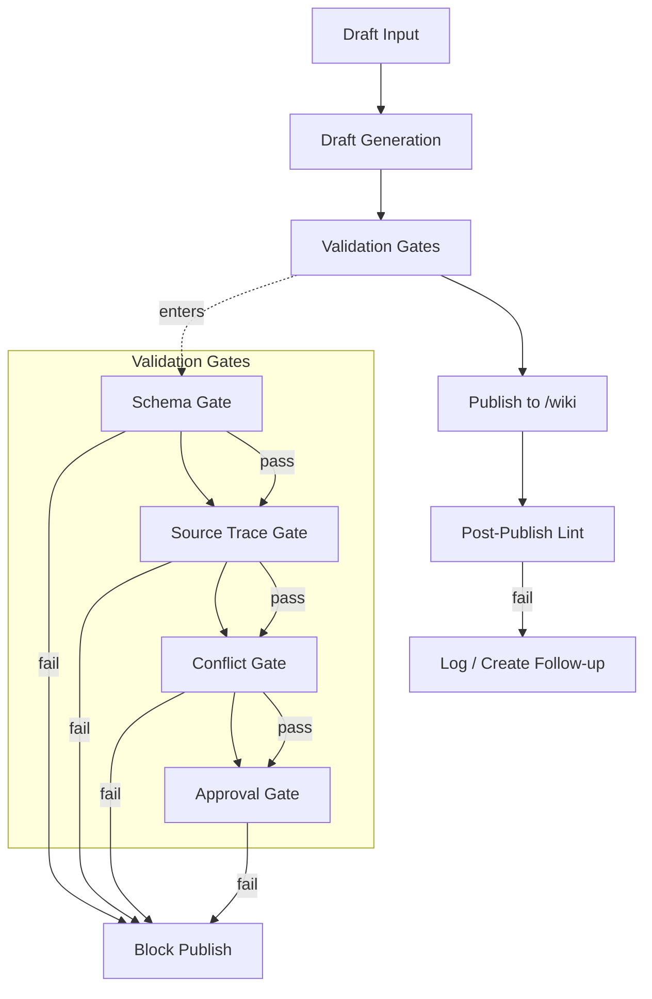

The gates are non-bypassable. If any required gate fails, publish is blocked or escalated according to the rule definition. No runtime component may short-circuit this sequence.

## 7.5 Approval and HITL Model

Human-in-the-loop approval is required when the system cannot safely finalize knowledge on its own, when policy says the change is high impact, or when a rule explicitly escalates review.

Explicit review triggers:

- low confidence
- unresolved contradiction
- new canonical metric
- new canonical data-asset
- major rewrite of existing page
- missing source trace
- override request after failed validation

| Trigger | Why Review Is Required | Allowed Outcomes |
|---|---|---|
| Low confidence | The system cannot justify finality with sufficient certainty | Approve, request revision, reject |
| Unresolved contradiction | Competing claims cannot be flattened into one truth | Approve with open question, request revision, reject |
| New canonical metric | A new authoritative metric changes downstream behavior and terminology | Approve, request revision, reject |
| New canonical data-asset | A new authoritative data asset changes lineage and ownership assumptions | Approve, request revision, reject |
| Major rewrite of existing page | Broad semantic change risks breaking established meaning | Approve, request revision, reject |
| Missing source trace | Claims cannot be proven against source evidence | Approve with remediation, request revision, reject |
| Override request after failed validation | A user is asking to bypass a blocking rule | Approve override, deny override, require escalation |

Approval is an explicit state transition. It does not imply that rules are disabled; it means the Knowledge Manager has accepted the risk and the system has recorded that decision.

## 7.6 Contradiction Detection and Handling

Contradictions are first-class governance objects. They are identified when source evidence, page claims, or canonical records disagree on a factual statement, definition, ownership boundary, metric logic, or lifecycle state.

Contradictions must never be silently flattened. The system must preserve both the conflict and the context that produced it.

Unresolved contradictions create or update `open-question` pages. Those pages become the durable place where conflicting evidence, analysis, and pending decisions are recorded until the issue is resolved.

Contradiction severity influences publish behavior:

- high severity contradiction blocks publish
- medium severity contradiction escalates review
- low severity contradiction may log only if policy explicitly allows it

```text
Source A (claims metric definition X)
            \
             \--> Contradiction Detector --> open-question page --> Knowledge Manager review
             /
Source B (claims metric definition Y)
```

Conflict handling rules:

- retain both source claims
- record the page or artifact ids involved
- classify severity
- assign next action
- prevent silent merge of incompatible statements

## 7.7 Audit and Traceability Model

Every governance decision must be auditable. The system must be able to explain why a page was blocked, approved, escalated, or published.

Required governance artifacts:

- rule evaluation log
- approval decision log
- contradiction report
- publish summary
- lineage trace from source to finalized wiki page

| Artifact | Purpose | Retention / Usage |
|---|---|---|
| Rule evaluation log | Records which rules were evaluated, their inputs, and outcomes | Retained for audit and debugging of policy enforcement |
| Approval decision log | Records human approvals, denials, overrides, reviewer identity, and timestamps | Used for governance traceability and compliance review |
| Contradiction report | Captures conflict details, severity, implicated sources, and disposition | Used to drive open-question workflow and follow-up work |
| Publish summary | Records what changed, what passed, what failed, and what was published | Used as the transaction record for finalized publication |
| Lineage trace from source to finalized wiki page | Connects each finalized page to the source evidence that justified it | Used to prove provenance and support later audits |

Governance logs are not optional diagnostics. They are mandatory control artifacts and must be generated whenever validation, approval, or publish decisions occur.

## 7.8 Enforcement Responsibility Model

Enforcement is distributed across bounded components, but responsibility is explicit. No component may claim authority outside its assigned control surface.

| Component | Enforcement Responsibility | Cannot Override |
|---|---|---|
| Policy QA Agent | Evaluates rule conditions, source trace completeness, and policy compliance | Human approval requirements and rule definitions |
| Contradiction Reviewer | Classifies conflicts, creates open-question pages, and routes unresolved issues | Rule severity or publish gate outcomes |
| Orchestrator Agent | Sequences validation stages and blocks publish when a gate fails | Mandatory gates, approval policy, or contradiction status |
| Publisher | Writes only validated content to `/wiki` and records publish metadata | Failed validation, missing approval, or blocked rules |
| Lint Agent | Performs post-publish lint and maintenance checks | Final publish authorization or governance policy |

The enforcement model is intentionally layered. Each component can stop progress within its responsibility, but none can bypass a higher-order governance rule.

## 7.9 Failure Handling and Policy Outcomes

Failure handling must be deterministic. Each failure type maps to an explicit system response and downstream effect.

| Failure Type | Severity | System Response | Downstream Effect |
|---|---|---|---|
| Schema failure | Error | Block publish and return validation diagnostics | Draft remains unpublished |
| Missing required sections | Error | Block publish and mark page incomplete | Requires remediation before retry |
| Missing source trace | Error | Block publish or escalate to review if policy allows override review | No finalized page until trace is added or approved |
| Broken links | Warning or error based on scope | Log issue, block if link is required for canonical navigation | Publish may proceed only if policy marks it non-blocking |
| Duplicate canonical page risk | Error | Block publish and route for deduplication decision | Prevents competing truth sources |
| Contradiction blocking publish | Error | Block publish and create or update open-question page | Knowledge remains unfinalized until resolved |
| Approval rejection | Error | Block publish and record decision | Change is not published and requires revision or abandonment |

Failure responses must not silently downgrade severity. If a rule is configured as `error`, the system must behave as if publication is blocked.

## 7.10 Rules vs Agents vs Skills

The system separates policy, execution, and reusable procedure.

- rules define what is allowed
- agents execute bounded responsibilities
- skills define reusable procedures

Rules are authoritative. Agents cannot redefine policy, reinterpret blocked rules as optional, or publish through an alternate path. Skills cannot bypass policy because skills only package procedures; they do not own authority. If a skill conflicts with a rule, the rule wins.

## 7.11 Example Rule Set

The runtime should support multiple rules in a single file or a small set of files, as long as every rule remains explicit, machine-readable, and independently enforceable.

```yaml
rules:
  - id: rule.page_requires_sections
    description: Canonical pages must include required sections before publication.
    scope:
      page_types:
        - canonical-process
        - canonical-metric
    severity: error
    condition:
      all:
        - field: page.sections
          operator: contains_all
          value:
            - overview
            - definition
            - source-trace
    action: block_publish

  - id: rule.metric_requires_source_trace
    description: Metric pages must reference source artifacts that justify the final definition.
    scope:
      page_types:
        - canonical-metric
    severity: error
    condition:
      all:
        - field: frontmatter.source_traces
          operator: exists
        - field: frontmatter.source_traces
          operator: min_items
          value: 1
    action: block_publish

  - id: rule.new_canonical_metric_requires_approval
    description: New canonical metrics require human approval before publication.
    scope:
      page_types:
        - canonical-metric
    severity: warning
    condition:
      any:
        - field: page.change_type
          operator: equals
          value: new_canonical_metric
    action: escalate_review
```

This rule set combines a schema/content rule, a source trace rule, and an approval-trigger rule. It is representative of the minimum enforceable pattern, not a special case.

## 7.12 Governance Architecture Diagram

Governance is enforced as a runtime control path, not a back-office checklist.

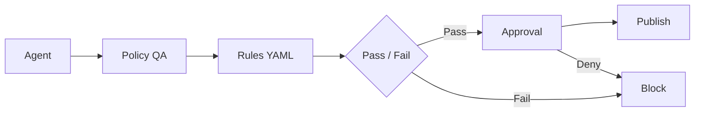

The diagram represents the required control chain. Any implementation that allows an agent to publish without passing through policy evaluation, rule loading, and approval handling is non-compliant.

## 7.13 Section Summary

Governance is enforced at runtime. Rules are explicit and machine-readable. Publish is gated. Contradictions are surfaced instead of flattened. Audit trail is mandatory. `/wiki` integrity is protected by policy, and the metadata DB supports governance without replacing `/wiki` as the source of truth.

Boundary conditions are absolute:

- no rule bypass allowed
- no publish without required validation
- no silent conflict resolution
- no agent may override governance policy
- `/wiki` remains protected from invalid publication

# 8. Knowledge Manager Interface (KMI) and Infopedia UX Design

## 8.1 UX Architecture Overview

KMS exposes two distinct user-facing applications with separate authority boundaries and interaction models.

- KMI is the maintenance and governance surface for the Knowledge Manager
- Infopedia is the browse-only knowledge consumption surface for Knowledge Consumers
- KMI supports workflow execution, validation review, approval, and finalization
- Infopedia supports discovery, reading, navigation, and status-aware consumption

Two surfaces, two responsibilities: governed maintenance vs read-only knowledge navigation.

The same finalized `/wiki` knowledge may appear in both surfaces, but the interaction contract is different. KMI can change what becomes finalized truth through governed workflows. Infopedia can only present finalized knowledge and metadata derived from `/wiki` and supporting indexes.

## 8.2 KMI Design Principles

KMI is a workflow application, not a conversational assistant. Its design must make maintenance state visible and decisions explicit.

Core principles:

- workflow-driven, not chat-driven
- stage visibility over hidden automation
- diff-based review over opaque updates
- rule violations surfaced explicitly
- contradictions surfaced explicitly
- approval actions must be deliberate
- operational artifacts must be inspectable

KMI must not become:

- a generic chatbot
- a free-form markdown editor bypassing rules
- a consumer browse portal

The UI should reinforce the governed lifecycle. A user should always know what stage a run is in, what changed, what is blocked, what is waiting for review, and what is eligible for finalization.

## 8.3 Infopedia Design Principles

Infopedia is a read-only navigation layer optimized for fast discovery and stable consumption.

Core principles:

- fast, simple, read-only
- tree-first navigation
- hyperlink traversal
- search and filter support
- freshness and status visibility
- no maintenance authority

Infopedia must not become:

- a second source of truth
- an editing surface
- a raw-source browser

The application should make finalized knowledge easy to find, easy to read, and easy to traverse without exposing maintenance actions or raw draft state.

## 8.4 KMI Information Architecture

KMI should be organized around maintenance workflows and review stages rather than around generic document management.

| Screen | Primary Purpose | Main User Actions | Key Data Shown | Outputs or Decisions |
|---|---|---|---|---|
| Dashboard | Summarize current maintenance state | Open runs, inspect queues, jump to issues | Recent runs, pending reviews, contradictions, health issues | Triage decisions and next-action selection |
| New Run / Intake | Start a governed maintenance run | Enter source path, validate path, launch run | Path validation, source preview, run options | Run creation or rejection |
| Run Detail | Show orchestration and stage progress | Inspect stages, open artifacts, drill into failures | Stage timeline, counts, statuses, warnings | Diagnosis and stage-level decisions |
| Source Review | Review ingested sources and notes | Open source files, annotate, mark relevance | Source list, parse quality, source notes | Source acceptance or remediation |
| Proposed Changes / Impact Review | Understand affected knowledge pages | Inspect impacted pages, compare scope | Change summary, impacted pages, confidence | Accept, defer, or escalate changes |
| Diff Review | Review exact markdown modifications | Read diffs, compare before/after sections | Structured diffs, source trace markers, rule violations | Approve, reject, or request revision |
| Contradictions / Open Questions | Resolve conflicting claims | Inspect conflicts, link evidence, create open questions | Severity, conflicting sources, proposed resolution | Resolve, escalate, or keep open |
| Approvals / Finalization | Final gate before publish | Review blockers, approve or reject finalization | Validation summary, eligible items, blockers | Finalize or block publish |
| Maintenance Health / Lint | Track ongoing quality issues | Open stale items, fix links, assign refresh | Broken links, stale pages, duplicates, open questions | Maintenance action or remediation task |
| Rules / Policy Visibility | Make governance visible to users | Inspect rules and applicability | Rule inventory, severity, scope, failures | Policy-aware maintenance decisions |

Each screen supports a bounded decision. KMI should not blur review, approval, and finalization into a single opaque action.

## 8.5 KMI Dashboard

The dashboard is a control panel, not a landing page. It should answer what requires attention now and what is blocked.

Dashboard content:

- recent runs
- run statuses
- pending reviews
- contradictions requiring attention
- pages pending approval
- lint/health summary
- freshness issues
- latest finalized updates

| Dashboard Widget | Purpose | Primary Action |
|---|---|---|
| Recent runs | Show latest maintenance executions | Open run detail |
| Run statuses | Show blocked, in progress, complete, failed states | Resume investigation |
| Pending reviews | Surface items waiting on human review | Open diff or approval screen |
| Contradictions | Surface open conflicts and their severity | Open contradiction review |
| Pages pending approval | Show finalization queue | Approve, reject, defer |
| Lint / health summary | Summarize structural issues | Open maintenance health |
| Freshness issues | Highlight stale or overdue content | Queue refresh work |
| Latest finalized updates | Show what changed in `/wiki` | Inspect publish summary |

The dashboard should be filterable by run, page family, severity, and status so the Knowledge Manager can focus on unresolved governance work.

## 8.6 KMI Intake and Run Initiation UX

The new run screen starts the governed ingestion workflow.

Required inputs:

- local source path input
- optional domain hint
- optional run notes
- optional dry-run / strictness controls if consistent with policy and prior sections

The UI must validate the path before run creation and surface the result immediately.

Required feedback states:

- invalid path
- empty folder
- inaccessible path
- supported vs unsupported file summary

Numbered flow:

1. User enters a local source path.
2. UI validates path existence and access.
3. UI optionally resolves folder contents and preview metadata.
4. UI shows supported file types and unsupported file counts.
5. User adds optional domain hint and run notes.
6. User starts a dry-run or governed run, subject to policy.
7. Backend creates a run record and begins orchestration.
8. KMI transitions to run detail and stage tracking.

The intake screen must prevent accidental launches from bad paths and must not imply that unsupported content is acceptable without review.

## 8.7 KMI Run Detail and Stage Tracking

Run detail must make orchestration visible rather than opaque. The user should be able to see what the system did, what it is doing now, and what it failed to do.

Run detail behavior:

- show ordered stages
- show current stage and status
- show source counts
- show parse outcomes
- show source-note counts
- show impact summary
- show warnings and failures
- show artifact links

| Stage | Status Values | User Meaning |
|---|---|---|
| Intake | queued, running, complete, failed | Source discovery and run creation state |
| Parse | queued, running, complete, failed | Source files are being parsed and classified |
| Normalize | queued, running, complete, failed | Raw input is being standardized into structured artifacts |
| Validate | queued, running, complete, failed, blocked | Rules and gates are being applied |
| Review | waiting, in_review, approved, rejected, escalated | Human decision is required or in progress |
| Finalize | queued, running, complete, failed, blocked | Final wiki write is being prepared or executed |
| Lint | queued, running, complete, failed | Post-publish checks and maintenance are executing |

The run timeline should show the current stage prominently and preserve the ordered stage history so the user can reason about failures without opening backend logs.

## 8.8 KMI Proposed Changes and Diff Review UX

This is the primary review surface for the Knowledge Manager. It must support structured, evidence-backed evaluation of proposed knowledge changes.

Core elements:

- list of impacted pages
- action type (`create`, `update`, `no-op`, `review`)
- confidence indicators
- source trace indicators
- rule violations inline
- before/after markdown diff
- section-level change visibility
- ability to approve, reject, defer, or escalate where policy allows

Review should always show the relationship between source evidence, generated knowledge, and target wiki pages. The review model must make it clear whether a change is a small correction, a semantic rewrite, or a new canonical entry.

| Review Element | Why It Exists | User Decision Supported |
|---|---|---|
| Impacted pages | Show what knowledge will change | Confirm scope and avoid accidental collateral edits |
| Action type | Explain the system’s intended operation | Approve, reject, or defer by change class |
| Confidence indicators | Expose uncertainty before publish | Decide whether human review is required |
| Source trace indicators | Show provenance coverage | Decide whether evidence is sufficient |
| Inline rule violations | Make policy failures visible in context | Fix, reject, or escalate |
| Before/after markdown diff | Show exact content delta | Review semantic change before finalization |
| Section-level visibility | Localize the change to a page area | Approve section edits without rereading the full page |

The review screen must not rely on a generic diff alone. It needs structured overlays for trace, confidence, and rule status so the Knowledge Manager can make a governed decision quickly.

## 8.9 KMI Contradictions and Open Questions UX

The contradiction surface is the place where conflicts remain explicit until they are resolved or intentionally carried forward as open questions.

Required elements:

- contradiction list
- severity
- affected pages
- conflicting evidence summary
- linked source notes/pages
- proposed resolution path
- action to mark for review / convert to open-question / resolve where permitted

Unresolved contradiction handling must remain explicit. The UI should show whether a contradiction is blocking publish, requiring escalation, or being maintained as an open question pending additional evidence.

The review workflow should preserve the conflict record even when a temporary publication decision is made under policy. No screen should visually imply that a contradiction no longer exists until it is explicitly resolved.

## 8.10 KMI Approvals and Finalization UX

The approval surface is the final governed checkpoint before publication to `/wiki`.

Expected content:

- queue of staged revisions
- validation results summary
- approval blockers
- eligible auto-finalize indicators
- explicit approve/reject actions
- finalization result summary

The user must know exactly what is being finalized and why. There should be no silent publication, no hidden auto-commit, and no ambiguous approval state.

The finalization screen should show:

- which pages are included
- which rules passed
- which rules failed or were escalated
- whether contradictions remain open
- whether the publish action is blocked, eligible, or already executed

## 8.11 KMI Maintenance Health and Lint UX

Maintenance health screens track the long-tail quality of finalized knowledge and working artifacts.

Primary findings:

- stale pages
- orphan pages
- broken links
- missing source trace
- duplicate canonical pages
- unresolved open questions
- pages needing refresh

| Health Finding | Severity | Suggested Action |
|---|---|---|
| Stale pages | Warning or error based on freshness policy | Queue refresh and review source drift |
| Orphan pages | Warning | Re-link or remove from taxonomy |
| Broken links | Warning or error based on importance | Repair references or mark as intentionally deprecated |
| Missing source trace | Error | Add trace or block publish on refresh |
| Duplicate canonical pages | Error | Deduplicate and choose one authoritative page |
| Unresolved open questions | Warning or error based on impact | Escalate, resolve, or retain as managed conflict |
| Pages needing refresh | Warning | Trigger maintenance run or targeted update |

The health view should support triage, filtering, and assignment. It is a maintenance queue, not a passive report.

## 8.12 KMI Permissions and Action Boundaries

The Knowledge Manager has broad authority in KMI, but that authority is still bounded by governance.

Through KMI, the Knowledge Manager can:

- trigger runs
- inspect artifacts
- review diffs
- approve/reject
- resolve or escalate contradictions within policy
- finalize where permitted

KMI must still not allow:

- bypass of validation
- direct edit of finalized files outside workflow
- publish without required gates

KMI authority is explicit and operational, but it remains bounded by the governance model in Section 7. The interface should make permissions visible through disabled actions, blocked states, and review prompts rather than hiding unsupported controls.

## 8.13 Infopedia Information Architecture

Infopedia should organize finalized knowledge into a simple read path that helps users discover what exists and where to read it.

| Area | Purpose | Main User Actions | Key Data Shown |
|---|---|---|---|
| Tree Navigation | Provide hierarchical entry into finalized knowledge | Expand nodes, click pages, browse families | Domains, page families, page titles |
| Search Results | Help users locate pages quickly | Search, refine, open results | Titles, snippets, freshness, status |
| Page View | Render finalized markdown for reading | Read, scroll, follow links | Full page content, metadata, status |
| Related Pages / Backlinks | Show connected knowledge | Traverse related content | Parent/child links, backlinks, siblings |
| Filters / Facets | Narrow browse and search results | Filter by type, domain, freshness, status | Facet counts, matching pages |
| Freshness / Status Indicators | Show whether content is current | Inspect page state, decide trust level | Freshness, review state, update age |

Infopedia should keep the navigation model simple enough that users can answer “what knowledge exists?” and “what is the authoritative page?” without seeing workflow controls.

## 8.14 Infopedia Navigation and Browse Model

Tree navigation should be derived from finalized wiki content and supporting metadata, not maintained as a separate truth store.

Navigation behavior:

- organize by page family, domain, or another deterministic hierarchy
- support expandable nodes
- click through to page view
- support discovery of what knowledge exists

The browse model should preserve canonical hierarchy while allowing users to move laterally through links and backlinks.

```text
Infopedia
├─ Domain
│  ├─ Page family
│  │  ├─ Page
│  │  └─ Related page
│  └─ Page family
└─ Domain
   └─ Page family
```

```text
Tree navigation -> page family -> page view -> related pages -> backlinks -> other families
```

The tree is a view over finalized knowledge, not a parallel authoring structure. If the `/wiki` hierarchy changes, Infopedia reflects it through backend-derived navigation data.

## 8.15 Infopedia Search and Page View UX

Infopedia search should support full-text discovery over finalized knowledge and status-aware filtering where the metadata is available.

Supported browse behavior:

- full-text search over finalized knowledge
- filter by page type, domain, freshness, confidence, status if appropriate
- page rendering of markdown
- related links and backlinks
- display of source trace summary, confidence, and freshness

| Page View Element | Purpose | Derived From |
|---|---|---|
| Markdown body | Render authoritative knowledge for reading | Finalized `/wiki` content |
| Source trace summary | Explain provenance at a glance | Metadata and governance records |
| Confidence indicator | Show strength of the underlying knowledge | Validation and review results |
| Freshness indicator | Show update age or review recency | Run history and page metadata |
| Related links | Enable lateral navigation | Wiki links and metadata graph |
| Backlinks | Show where the page is referenced | Link index or metadata graph |

Page view should optimize readability without changing truth. The rendering layer may shape presentation, but it must not reinterpret the content or invent governance status.

## 8.16 KMI vs Infopedia UX Boundary

The boundary between KMI and Infopedia is structural, not cosmetic.

| Aspect | KMI | Infopedia |
|---|---|---|
| Primary purpose | Maintenance, review, approval, finalization | Browse, search, read |
| User role | Knowledge Manager | Knowledge Consumer |
| Authority | Governed write path | Read-only presentation path |
| Workflow awareness | High | Low |
| Action surface | Run, review, approve, reject, finalize | Open, search, filter, traverse |
| Source visibility | Raw and structured source evidence | Finalized knowledge and metadata summaries |
| Conflict handling | Explicit contradiction management | Read-only display of finalized state and status |
| Finalization capability | Yes, through governed workflow | No |

The same finalized `/wiki` knowledge may appear in both contexts, but authority differs. KMI is action-oriented and workflow-aware. Infopedia is consumption-oriented and read-only.

## 8.17 UX State Model and Status Indicators

The UI should surface the same core state vocabulary across both surfaces so users can reason about run progress and content trust.

Common statuses:

- run status
- page status
- review_required
- confidence
- freshness
- contradiction severity

These states should appear as badges, warnings, queues, and filters. The implementation should keep the semantics consistent across KMI and Infopedia even when the presentation differs.

- badges indicate discrete state
- warnings indicate degraded trust or incomplete work
- queues indicate items requiring action
- filters expose state subsets for triage and browse

Status values must be derived from backend data rather than inferred only from UI state.

## 8.18 UI-to-Backend Interaction Expectations

The UI should be thin over backend logic. It should present state, dispatch actions, and render results rather than re-implementing governance or workflow logic in the browser.

KMI needs:

- run status
- artifacts
- diff data
- validation results
- approval actions
- contradictions
- health findings

Infopedia needs:

- navigation tree
- page content
- related links
- search results
- metadata indicators

Policy decisions happen in backend services, not only in frontend state. The frontend may initiate a review or approval action, but the backend must decide whether that action is allowed and whether the underlying publish path is valid.

## 8.19 UX Diagrams and Example Flows

### KMI maintenance workflow UX

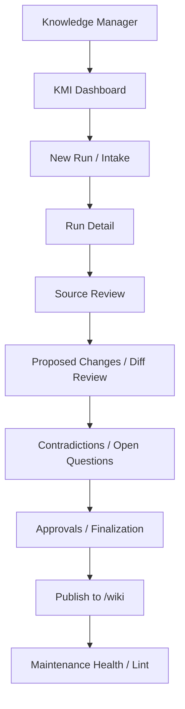

### Infopedia browse flow

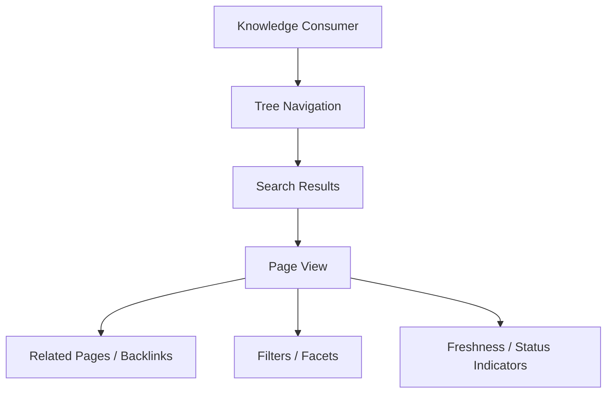

### KMI and Infopedia separation over `/wiki`

```text
              +-----------------------+
              |          KMI          |
              | maintenance, review   |
              | approval, finalize    |
              +-----------+-----------+
                          |
                          | governed write path
                          v
                    +------------+
                    |   /wiki    |
                    | finalized  |
                    | knowledge  |
                    +------------+
                          ^
                          | read-only surface
              +-----------+-----------+
              |       Infopedia       |
              | browse, search, read   |
              +-----------------------+
```

### Knowledge Manager journey

1. The Knowledge Manager opens KMI and reviews the dashboard.
2. A recent run shows one contradiction, one missing source trace, and two pages pending approval.
3. The Knowledge Manager opens the run detail to inspect stage progress and artifact links.
4. The user opens diff review, confirms the changes are scoped to one metric page, and inspects inline source traces.
5. The user opens contradiction review, resolves one issue, and leaves one open question pending further evidence.
6. The user moves to approvals, sees a blocking validation failure on the remaining page, and rejects finalization until the source trace is added.

### Knowledge Consumer journey

1. The Knowledge Consumer opens Infopedia and searches for a canonical metric page.
2. Search results show the page title, freshness indicator, and current status.
3. The user opens the page view and reads the finalized markdown.
4. The user follows a related page link to a connected process definition.
5. The user uses tree navigation to discover sibling pages in the same domain without seeing any maintenance controls.

## 8.20 Section Summary

KMI is the governed maintenance interface. Infopedia is the read-only navigation layer. The UX mirrors the authority boundaries of KMS, so review, contradictions, and approvals are visible in KMI while finalized knowledge remains easy to discover in Infopedia.

This separation preserves trust and usability:

- KMI handles workflow, validation, review, and finalization
- Infopedia handles browse, search, and reading
- finalized `/wiki` knowledge remains the shared content substrate
- raw source folders are not consumer-facing browse surfaces
- UI is not the source of truth; `/wiki` is

# 9. Data Model, Storage, APIs, and Runtime Services

## 9.1 Data and Runtime Model Overview

KMS uses a split storage model so content truth, operational state, and retrieval projections remain separate.

- raw sources live in the local filesystem
- finalized knowledge lives in `/wiki`
- metadata DB stores operational state
- runtime services coordinate lifecycle
- search/index structures support retrieval

`/wiki` remains canonical for finalized knowledge. The metadata DB is authoritative for operational metadata, not knowledge truth.

Filesystem for content truth, metadata DB for lifecycle control.

## 9.2 Storage Layer Responsibilities

KMS storage must preserve explicit authority boundaries. Supporting stores may accelerate workflow, but they must not replace finalized wiki content as truth.

| Storage Layer | Stores | Written By | Read By | Authority |
|---|---|---|---|---|
| Raw source filesystem | Immutable upstream source files and folders | External source owners, intake process | Source discovery, parsing, analysis | Supporting input only |
| Wiki filesystem (`/wiki`) | Finalized markdown knowledge and authoritative pages | Publisher service | KMI, Infopedia, downstream consumers | Canonical knowledge truth |
| Metadata database | Runs, revisions, approvals, contradictions, QA, lint, projections metadata | Runtime services, orchestrator, approval workflow | KMI, services, Infopedia projection | Operational authority only |
| Optional artifact storage | Extracted intermediates, parse outputs, review bundles, diffs | Parsing, normalization, draft services | KMI, validation, debugging | Supporting artifact store |
| Optional search/index store | Search documents, navigation indexes, operational search projections | Search/index service, projection service | KMI search, Infopedia search | Supporting projection store |

Only `/wiki` is a finalized knowledge store. All other layers support lifecycle control, indexing, or review.

## 9.3 Core Metadata Entities

The metadata model should be minimal, explicit, and sufficient to support governed maintenance and read-only navigation.

| Entity | Purpose | Key Identity | Relationship to `/wiki` or Runs | Type |
|---|---|---|---|---|
| Run | Represents one maintenance execution | `run_id` | Owns source intake, validations, and output revisions | Operational |
| SourceFile | Represents a discovered file in the raw source set | `source_file_id` | Belongs to a run and may map to source documents | Structural |
| SourceDocument | Represents parsed source content | `source_document_id` | Informs revision proposals and traceability | Structural |
| WikiPage | Represents a canonical wiki page | `page_id` or slug | Maps to a finalized `/wiki` page | Structural |
| WikiPageRevision | Represents a staged or finalized change to a page | `revision_id` | Connected to a wiki page and run | Operational |
| ImpactRecord | Captures what pages or sections are affected by a source set | `impact_id` | Derived from run analysis and revision planning | Projection |
| ContradictionRecord | Captures detected conflict conditions | `contradiction_id` | Attaches to page, revision, or run context | Operational |
| QAReport | Captures validation outcomes and rule results | `qa_report_id` | Attaches to a run or revision | Operational |
| ApprovalRecord | Captures human review decision | `approval_id` | Gates revision finalization | Operational |
| LintFinding | Captures post-publish or maintenance issues | `lint_finding_id` | Attaches to page, revision, or run | Operational |
| InfopediaNode | Represents navigation projection for browse UI | `node_id` or derived path | Derived from finalized wiki pages | Projection |
| SearchDocument | Represents indexed retrieval payload | `search_doc_id` or content hash | Derived from `/wiki` and metadata | Projection |

These entities are not all equivalent. Some are source-of-record operational facts, some are structural links, and some are derived projections for UX and retrieval.

## 9.4 Conceptual Relational Model

The relational model should preserve the lifecycle from intake to finalization while keeping projections derived from canonical content.

| Relationship | Meaning |
|---|---|
| Run has many SourceFiles | One maintenance run can ingest multiple inputs |
| SourceFiles may yield SourceDocuments | A file may parse into one or more structured documents |
| SourceDocuments inform ImpactRecords | Parsed evidence drives impact analysis |
| WikiPages have many WikiPageRevisions | A page accumulates staged and finalized edits |
| QAReports attach to revisions or runs | Validation is run-level or revision-level |
| ContradictionRecords may attach to pages or runs | Conflicts are tracked in operational context |
| ApprovalRecords gate finalization | A revision cannot finalize without approval where required |
| InfopediaNodes are derived from finalized wiki pages | Navigation is projection data, not truth |

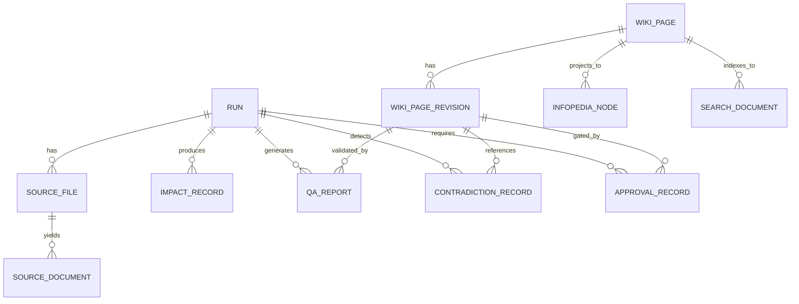

The graph is intentionally directional. Projections follow finalized content; they do not define it.

## 9.5 Entity-Level Field Definitions

The system should keep entity schemas pragmatic and implementation-ready without over-normalizing early.

| Entity | High-Level Fields |
|---|---|
| Run | `run_id`, `status`, `source_path`, `domain_hint`, `run_notes`, `created_at`, `started_at`, `completed_at`, `created_by`, `summary_counts`, `blocked_reason` |
| SourceFile | `source_file_id`, `run_id`, `path`, `file_type`, `discovered_at`, `parse_status`, `document_count`, `hash`, `error_summary` |
| WikiPage | `page_id`, `slug`, `title`, `page_type`, `path`, `status`, `freshness_status`, `confidence_status`, `current_revision_id`, `updated_at` |
| WikiPageRevision | `revision_id`, `page_id`, `run_id`, `status`, `change_type`, `section_changes`, `source_trace_ids`, `diff_summary`, `created_at`, `finalized_at` |
| ContradictionRecord | `contradiction_id`, `run_id`, `page_id`, `revision_id`, `severity`, `status`, `conflicting_claims`, `source_refs`, `open_question_page_id`, `created_at` |
| ApprovalRecord | `approval_id`, `revision_id`, `decision`, `reviewer_id`, `reviewed_at`, `reason`, `override_requested`, `policy_version` |

Field sets should support traceability, staged review, and audit-friendly querying. The same identifiers should be reused consistently across services and API responses.

## 9.6 Run and Revision State Models

Run and revision states must align with the workflow behavior exposed in KMI.

| Run State | Meaning |
|---|---|
| created | Run record exists, orchestration has not started |
| in_progress | Services are actively discovering, parsing, validating, or drafting |
| completed | Run finished successfully and produced its expected artifacts |
| blocked | Governance or validation stopped progression before finalization |
| failed | Runtime execution failed due to error or unrecoverable service problem |

| Revision State | Meaning |
|---|---|
| staged | Revision exists as a candidate change |
| review_required | Human review is required before progression |
| approved | Revision passed required approval checks |
| rejected | Revision was not accepted for finalization |
| finalized | Revision has been published into `/wiki` |

Run states support KMI orchestration visibility. Revision states support diff review, approval, and publish control.

## 9.7 Runtime Services Inventory

KMS requires bounded backend services so workflow logic remains explicit and testable.

| Service | Responsibility | Main Inputs | Main Outputs | Side Effects / Writes |
|---|---|---|---|---|
| Run Orchestration Service | Coordinates end-to-end run progression | Source path, run config, policy state | Run status transitions, stage dispatch | Writes run state and stage history |
| Source Discovery Service | Enumerates source files and supported inputs | Raw source path | Source file inventory | Writes source file records |
| Parsing/Normalization Service | Parses raw files into structured documents | Source files | Parsed documents, parse errors | Writes source documents and parse artifacts |
| Source Analysis Service | Detects impacts, candidates, and structural changes | Source documents | Impact records, candidate revisions | Writes impact records |
| Source Note Service | Captures notes, annotations, and supporting commentary | Source files, source documents, user notes | Source notes, annotations | Writes source note records |
| Wiki Draft Service | Builds staged wiki page revisions | Impact records, source documents, page templates | Draft revisions, diffs | Writes staged revisions and draft artifacts |
| Policy Validation Service | Evaluates rules, source trace, and publish eligibility | Revisions, rules, metadata | Validation results, block/escalate decisions | Writes QA reports and validation events |
| Contradiction Service | Detects and manages conflicts | Source documents, revisions, page metadata | Contradiction records, open questions | Writes contradiction records |
| Approval Service | Records human decisions and gate outcomes | Approval requests, revision context | Approval records, decision status | Writes approval records |
| Publisher Service | Writes finalized content into `/wiki` | Approved revisions, publish payloads | Published pages, publish summary | Writes `/wiki` and publish audit records |
| Lint Service | Checks freshness, links, structure, and quality | Finalized pages, metadata | Lint findings | Writes lint findings |
| Search/Index Service | Builds operational and browse indexes | Wiki pages, metadata, revisions | Search documents, index updates | Writes search/index projections |
| Infopedia Projection Service | Builds browse projection for tree and related pages | Finalized wiki pages, metadata | Infopedia nodes, navigation edges | Writes projection records |

These services are separable for testing and deployment, but they must share a consistent metadata contract.

## 9.8 API Surface Overview

KMI and Infopedia should depend on service APIs, not direct database access. API contracts expose governed capabilities and hide persistence details.

Communication is JSON via REST or GraphQL APIs.
Common stack: FastAPI or Flask for the backend, React for the frontend.

Required API categories:

- Run APIs
- Source APIs
- Review/Diff APIs
- Approval APIs
- Contradiction APIs
- Health/Lint APIs
- Wiki Read APIs
- Infopedia Navigation/Search APIs

APIs are service contracts, not direct database exposure. The API layer must preserve governance checks and must not provide a bypass path around validation or approval.

## 9.9 Representative API Endpoints

Representative endpoints should expose workflow state and read surfaces without leaking persistence structure.

| Method | Path | Purpose | Primary Consumer |
|---|---|---|---|
| `POST` | `/api/runs` | Create a new governed maintenance run | KMI |
| `GET` | `/api/runs/{run_id}` | Fetch run status and summary | KMI |
| `GET` | `/api/runs/{run_id}/artifacts` | List run artifacts and outputs | KMI |
| `GET` | `/api/reviews/{revision_id}/diff` | Fetch review diff and validation context | KMI |
| `POST` | `/api/approvals/{revision_id}` | Submit approval or rejection decision | KMI |
| `GET` | `/api/wiki/pages/{slug}` | Read finalized wiki page content | KMI, Infopedia |
| `GET` | `/api/infopedia/tree` | Fetch navigation tree projection | Infopedia |
| `GET` | `/api/infopedia/search` | Search finalized knowledge | Infopedia |
| `GET` | `/api/contradictions/{id}` | Read contradiction detail | KMI |
| `GET` | `/api/health/findings` | Read lint and maintenance issues | KMI |

The endpoint set should be stable enough to support route-based UI development and service-level integration tests.

## 9.10 Request/Response Contract Examples

Run creation, status retrieval, diff review, and page read responses should be concrete and machine-readable.

```json
{
  "source_path": "/Users/chethan/sources/finance",
  "domain_hint": "finance",
  "run_notes": "Monthly metric refresh",
  "strictness": "standard",
  "dry_run": false
}
```

```json
{
  "run_id": "run_20260405_001",
  "status": "in_progress",
  "source_path": "/Users/chethan/sources/finance",
  "created_at": "2026-04-05T09:30:00Z",
  "current_stage": "validate",
  "summary_counts": {
    "source_files": 18,
    "source_documents": 24,
    "proposed_revisions": 3,
    "blocked_items": 1
  }
}
```

```json
{
  "revision_id": "rev_metric_margin_003",
  "page_id": "page_metric_margin",
  "status": "review_required",
  "confidence": "medium",
  "source_trace_status": "partial",
  "rule_violations": [
    {
      "rule_id": "rule.metric_requires_source_trace",
      "severity": "error",
      "message": "Metric definition requires one approved source trace."
    }
  ],
  "diff": {
    "summary": "Updated definition text and refreshed source trace section.",
    "sections_changed": ["definition", "source-trace"]
  }
}
```

```json
{
  "slug": "canonical-metrics/gross-margin",
  "title": "Gross Margin",
  "status": "finalized",
  "freshness": "current",
  "confidence": "high",
  "source_trace_summary": [
    "finance-policy-2026-03",
    "monthly-close-notes-2026-04"
  ],
  "content_markdown": "# Gross Margin\n\n...",
  "related_pages": [
    {
      "slug": "canonical-process/monthly-close",
      "title": "Monthly Close"
    }
  ],
  "backlinks": 7
}
```

## 9.11 Search and Indexing Model

KMI and Infopedia need different retrieval shapes from the same underlying canonical and operational stores.

- KMI needs operational search and filtering across runs, revisions, contradictions, and lint findings
- Infopedia needs search and navigation over finalized wiki pages
- search and index projections are derived from `/wiki` and metadata
- search does not replace canonical storage

Vector search, if used, is optional secondary support only and must not replace the curated knowledge architecture.

```mermaid
flowchart LR
  A[/wiki/ Finalized Pages] --> B[Projection Builder]
  C[Metadata DB] --> B
  B --> D[Search Document Index]
  B --> E[Infopedia Node Index]
  D --> F[KMI Search]
  E --> G[Infopedia Search / Tree]
```

The index layer should be rebuildable from canonical content plus metadata so search remains a projection, not a source of truth.

## 9.12 Infopedia Projection Model

Infopedia should read finalized wiki content plus derived navigation and status metadata.

- InfopediaNode or equivalent is a projection, not separate truth
- projection refresh occurs after publish or indexed refresh
- page metadata and navigation metadata should remain linked through stable identifiers

Navigation data should include page family, hierarchy position, backlinks, and status indicators. Content data should remain rooted in `/wiki` content and page metadata. The projection layer may denormalize for fast browsing, but it must not invent authoritative state.

## 9.13 Storage and Authority Boundaries

The storage hierarchy must be explicit and non-overlapping.

- raw source filesystem is upstream input only
- `/wiki` is canonical finalized knowledge
- metadata DB is operational support
- search/index stores are projections
- Infopedia nodes are derived navigation artifacts

No supporting store may replace `/wiki` as knowledge truth. The database is allowed to know workflow state, approvals, contradictions, and projections, but it is not allowed to become the knowledge substrate itself. Downstream AI systems must consume via governed retrieval paths, not raw DB access.

## 9.14 Failure and Consistency Expectations

Runtime services should fail in ways that preserve knowledge integrity and auditability.

| Failure Point | Expected Behavior | Consistency Requirement |
|---|---|---|
| Metadata persistence failure | Stop or retry workflow update; do not mark completion incorrectly | `/wiki` publication must not be considered complete without metadata acknowledgment |
| Wiki write failure | Prevent publish completion and surface error | Canonical content must not partially finalize without recorded failure state |
| Partial run data failure | Retain existing records and mark incomplete state | Audit trail must preserve what happened before failure |
| Projection/index failure | Leave canonical content unchanged and mark projection stale | Search and navigation may degrade, truth must not change |
| Retry of run or stage | Reuse idempotent identifiers where possible | Re-execution must not duplicate finalized records |
| Approval persistence failure | Block finalization until decision is stored | No silent approval or publish without decision record |

Engineering rule: if a supporting store is unavailable, the system may degrade, but it must not corrupt `/wiki` or invent successful completion.

## 9.15 Diagrams and Artifacts

### Storage architecture

```text
                 +----------------------+
                 | Raw Source Filesystem |
                 | upstream input only   |
                 +----------+-----------+
                            |
                            v
 +-------------------+  +--------------------+  +----------------------+
 | Metadata Database  |  | Runtime Services   |  | Optional Artifacts   |
 | runs, approvals,   |<->| orchestration,    |<->| parse outputs, diffs |
 | contradictions,    |   | validation, draft  |  | review bundles       |
 | projections meta   |   +---------+---------+  +----------------------+
 +---------+---------+            |
           |                      v
           |              +------------------+
           |              | Wiki Filesystem  |
           |              | /wiki canonical  |
           |              +--------+---------+
           |                       |
           v                       v
 +----------------------+   +----------------------+
 | Search / Index Store |   | Infopedia Projection |
 | derived projections  |   | derived navigation   |
 +----------------------+   +----------------------+
```

### Entity relationship

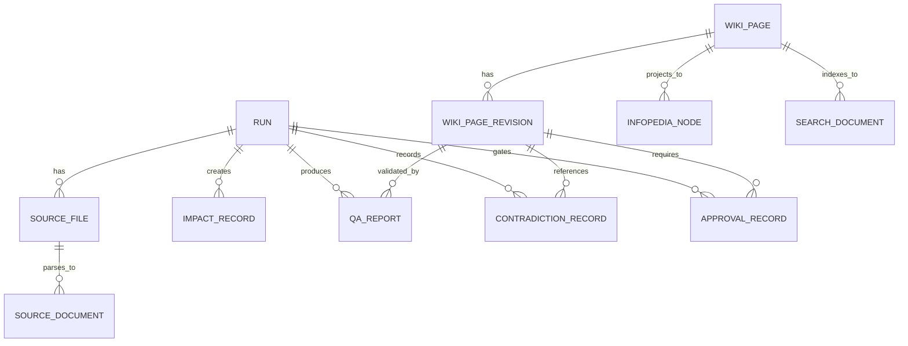

### Runtime service interaction

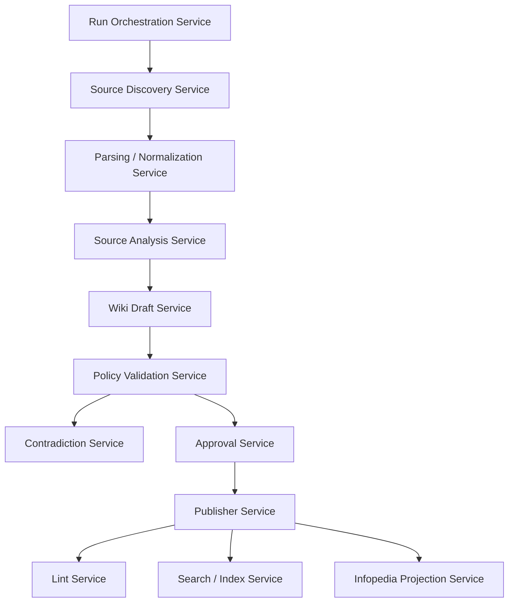

### JSON entity snippet

```json
{
  "wiki_page_revision": {
    "revision_id": "rev_metric_margin_003",
    "page_id": "page_metric_margin",
    "run_id": "run_20260405_001",
    "status": "review_required",
    "change_type": "update",
    "source_trace_ids": ["trace_finance_policy_01"],
    "created_at": "2026-04-05T09:45:00Z"
  }
}
```

### JSON API response snippet

```json
{
  "run_id": "run_20260405_001",
  "status": "in_progress",
  "current_stage": "validate",
  "blocked": false,
  "artifacts": [
    {
      "type": "diff_bundle",
      "id": "artifact_diff_114"
    }
  ]
}
```

## 9.16 Section Summary

KMS uses `/wiki` as canonical knowledge, the metadata DB as lifecycle control, runtime services as the operational backbone, and APIs as governed access points.

Supportive search and projection layers accelerate retrieval, but they do not redefine truth. The engineering model is the foundation for implementation because it separates content authority from workflow state, keeps publish control explicit, and preserves auditability across the full lifecycle.

# 10. Implementation Plan, Repository Structure, Testing, and Deployment

## 10.1 Implementation Strategy Overview

Implementation should proceed in dependency order so the control plane exists before high-level UI or automation depth is added.

- build the core Python backend and data model before advanced React UI
- establish wiki and governance foundations before automation depth
- build KMI and Infopedia on stable service contracts
- integrate agents and skills through governed services, not as bolted-on prompts

Build the control plane first, then the workflows, then the surfaces, then harden the system.

This order prevents false progress. If the storage model, validation gates, and publish boundary are not stable, UI work will only produce disconnected mock surfaces and agent work will only produce uncontrolled automation.

## 10.2 Recommended Repository Structure

The repository should separate canonical content, raw inputs, backend services, frontends, automation, and shared conventions.

### Application tree

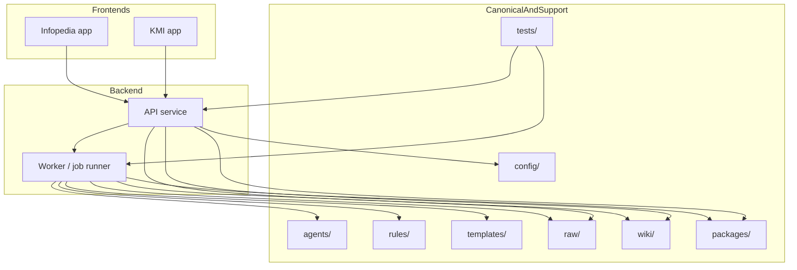

```text
kms/
├─ pyproject.toml
├─ apps/
│  ├─ api/
│  │  └─ src/kms_api/
│  ├─ worker/
│  │  └─ src/kms_worker/
│  ├─ kmi/
│  │  └─ src/
│  └─ infopedia/
│     └─ src/
├─ config/
├─ agents/
├─ rules/
├─ templates/
├─ wiki/
├─ raw/
├─ docs/
├─ tests/
├─ packages/
│  ├─ domain/
│  │  └─ src/kms_domain/
│  ├─ shared/
│  │  └─ src/kms_shared/
│  └─ config/
└─ scripts/
```

Folder purposes:

- `/pyproject.toml` contains the Python backend project definition, dependency management, and backend tooling configuration
- `/apps/api` contains the Python backend HTTP API service, service composition, and request handlers
- `/apps/worker` contains the Python background worker for run orchestration jobs and scheduled tasks
- `/apps/kmi` contains the React Knowledge Manager Interface frontend package and Vite entrypoints
- `/apps/infopedia` contains the React read-only navigation frontend package and Vite entrypoints
- `/config` contains centralized runtime configuration, environment templates, and secret references
- `/agents` contains agent definitions, prompts, and bounded workflow specs
- `/rules` contains executable governance policy definitions
- `/templates` contains canonical markdown templates and structured page blueprints
- `/wiki` contains finalized knowledge and remains the canonical content substrate
- `/raw` contains immutable upstream source inputs during local development
- `/docs` contains design, operational, and usage documentation
- `/tests` contains integration, end-to-end, fixture, and regression tests
- `/packages/domain` contains shared Python domain entities and domain logic
- `/packages/shared` contains reusable Python utilities, logging, error, and typing helpers
- `/packages/config` contains shared environment and runtime configuration definitions
- `/scripts` contains build, validation, and maintenance scripts

The top-level layout should make it difficult to confuse source input, generated artifacts, and canonical knowledge.

## 10.3 Build Phases

The implementation plan should be phased so each layer becomes usable before the next one is added.

| Phase | Goal | Key Outputs | Dependencies |
|---|---|---|---|
| 1. Repository scaffold and shared conventions | Establish structure, naming, config, and test harness | Folder layout, shared packages, linting, baseline CI, conventions | None |
| 2. Metadata DB and core domain models | Create authoritative operational data model | Migrations, ORM models, entity repositories, seed data | Phase 1 |
| 3. Raw source discovery + ingestion pipeline | Discover, classify, and register source files | Source registry service, parsers, discovery jobs, source artifacts | Phase 2 |
| 4. Wiki schema/templates + wiki services | Generate structured wiki pages from governed drafts | Templates, wiki draft service, revision records, page writers | Phase 2, Phase 3 |
| 5. Governance/rules engine | Enforce validation, review, and publish gates | Rules loader, validation service, approval gates, QA reports | Phase 2, Phase 4 |
| 6. Run orchestration and agent/skill integration | Sequence runs and bounded automation | Orchestrator jobs, agent execution contracts, skill invocation boundaries | Phase 3, Phase 5 |
| 7. KMI screens and review workflows | Deliver maintenance UI for governed review | Dashboard, run detail, diff review, approval screens, contradiction screens | Phase 5, Phase 6 |
| 8. Infopedia navigation and page rendering | Deliver read-only browse and search experience | Tree view, page view, search UI, status indicators | Phase 4, Phase 6 |
| 9. Search/index projection | Build derived retrieval and navigation projections | Indexer, search documents, Infopedia nodes, refresh jobs | Phase 4, Phase 5 |
| 10. Hardening, testing, and local deployment polish | Stabilize reliability and developer experience | Test suites, fixtures, health checks, dev startup scripts, observability | All prior phases |

## 10.4 Phase-by-Phase Deliverables

Each phase should produce tangible artifacts that can be validated independently.

Phase 1 deliverables:

- repository scaffold
- package boundaries
- environment config shape
- centralized config folder structure and env example layout
- Python backend project scaffold and React frontend app scaffold
- baseline CI and lint rules
- shared test conventions

Phase 2 deliverables:

- database migrations
- `Run`, `SourceFile`, `WikiPage`, `WikiPageRevision`, `ApprovalRecord`, `ContradictionRecord` models
- repository layer contracts
- status enums and shared identifiers

Phase 3 deliverables:

- source registry service
- file discovery jobs
- supported/unsupported file classification
- parse outputs and normalization artifacts
- run-level source summaries

Phase 4 deliverables:

- markdown page templates
- wiki draft builder
- revision writer
- page path/slug conventions
- canonical content fixtures

Phase 5 deliverables:

- policy validation service
- rules loader for `/rules/*.yaml`
- source trace validation
- contradiction gating
- approval gating and QA reporting

Phase 6 deliverables:

- run orchestration jobs
- agent/skill execution wrappers
- bounded handoff contracts
- stage state transitions and audit events

Phase 7 deliverables:

- KMI dashboard
- run detail view
- source review and diff review screens
- contradiction and approval workflows
- maintenance health screens

Phase 8 deliverables:

- Infopedia tree navigation
- page rendering for finalized markdown
- search and filter UI
- page status and freshness indicators

Phase 9 deliverables:

- search document projection
- Infopedia node projection
- derived index refresh jobs
- retrieval consistency checks

Phase 10 deliverables:

- end-to-end regression suite
- local startup orchestration
- operational health checks
- developer fixtures and seed data
- publish-path smoke tests

## 10.5 Repository Conventions and Engineering Standards

The implementation should use consistent conventions across services, models, and UI.

- naming should distinguish canonical pages, revisions, runs, and projections
- module boundaries should align to domain responsibilities, not generic technical layers
- status enums should be shared across backend and frontend contracts
- schema ownership should belong to backend domain modules, not frontend code
- markdown template ownership should live in `/templates`
- rules file ownership should live in `/rules`
- error handling should be explicit, structured, and audit-friendly
- type safety expectations should be enforced at service boundaries and API contracts
- config management should be environment-driven and centralized
- the main `/config` area should hold configuration manifests, environment templates, and secret references only; actual API keys and secret values must be injected at runtime and never committed to the repository
- Python backend code should live under the API, worker, and shared/domain packages; React frontend code should live under the KMI and Infopedia app packages
- API communication should use JSON over REST or GraphQL contracts, not direct database access from the UI

Domain logic belongs in backend/services, not only frontend. Frontend code should consume stable APIs and render state. All `/wiki` writes must go through governed services only.

## 10.6 Local Development and Runtime Topology

Local development should mirror the same authority boundaries as the design.

Required local components:

- Python API service
- Python worker / job runner
- metadata DB
- React KMI frontend
- React Infopedia frontend
- local filesystem mounts for `/raw` and `/wiki`
- optional local search/index service

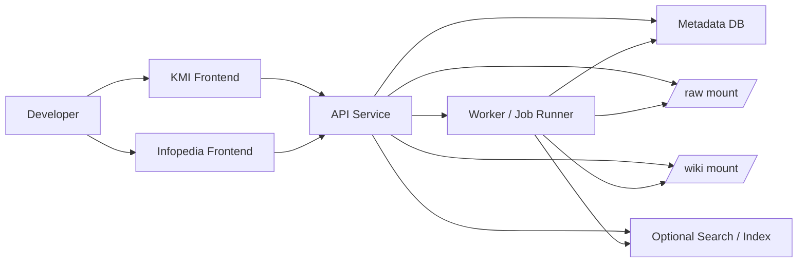

For a usable developer environment, the API, worker, metadata DB, `/raw`, and `/wiki` mounts must be available together. KMI and Infopedia should start against the same contracts used in higher environments.

React frontends should run against the Python backend service, and the backend should expose the same JSON contracts in local development that it will expose in later deployment environments.

## 10.7 Testing Strategy

Testing should validate domain behavior, governed workflows, and UI integration at different depths.

| Test Layer | What It Validates | Example Targets |
|---|---|---|
| Unit tests | Small service, validator, parser, and rule behavior | Python source parser, rule evaluator, status transitions |
| Integration tests | Runs, publish flow, and approval flow across services | Python orchestrator, metadata DB, publisher, validation service |
| End-to-end tests | Complete KMI and Infopedia workflows | Run initiation, diff review, approval, page browse |
| Golden tests | Deterministic markdown output and templates | Wiki page generation, diff formatting, navigation rendering |
| Regression tests | Rule behavior and policy outcomes over time | Blocked publish cases, contradiction handling, approval triggers |
| Fixture-based tests | Realistic source folders and wiki outputs | Sample runs, canonical pages, lint failures, contradictions |

Tests must be deterministic. If output varies by runtime order or uncontrolled external state, the implementation is not yet ready for stable use.

Backend tests should be written with `pytest` or an equivalent Python test runner, while frontend tests should cover React components and browser workflows with the chosen React test stack.

## 10.8 Test Data and Fixtures

Fixture coverage should be realistic enough to exercise the real workflow, not toy examples that only validate happy paths.

Required fixture categories:

- sample raw source folders
- supported and unsupported files
- parsed normalization outputs
- source-note examples
- canonical wiki pages by type
- contradiction scenarios
- approval-required scenarios
- lint-failure scenarios

Fixtures should reflect actual page families, source traces, and governance outcomes. This ensures the tests validate the real policy surface, not just abstract schema checks.

## 10.9 Deployment and Environment Model

The deployment model should support local-first development and remain compatible with future containerized or cloud deployment.

Requirements:

- environment-configured paths and services
- separation of config from code
- file-system or volume requirements for `/raw` and `/wiki`
- compatibility with containerized execution later
- ability to point the same codebase at local or remote metadata stores and search/index services

This section does not define enterprise infrastructure, but the design must be deployment-ready. The same authority boundaries that apply locally must hold in later environments.

## 10.10 Operational Readiness and Observability

Operational readiness should make the system inspectable during runs, publish attempts, and failures.

| Operational Signal | Why It Matters | Surface |
|---|---|---|
| Run status visibility | Shows whether maintenance is moving or blocked | KMI dashboard, run detail |
| Structured logs | Supports debugging and audit reconstruction | API, worker, and orchestration logs |
| Failure visibility | Prevents silent loss of runs or publish attempts | KMI, approval, and health screens |
| Artifact inspection | Enables review of diffs and source evidence | KMI run and diff views |
| Publish auditability | Proves what reached `/wiki` and why | Publish summary, approval record |
| Health checks | Validates API, worker, DB, and wiki access | Ops endpoints, startup checks |
| Metrics around runs, failures, validations, approvals | Supports reliability and workflow monitoring | Metrics backend and dashboards |

Operational readiness is not optional. If the system cannot explain what it is doing, it is not yet fit for governed knowledge publication.

## 10.11 Example End-to-End Build Sequence

A practical build sequence should follow the same order as the dependency model.

1. Scaffold the repository and shared conventions.
2. Implement DB entities, enums, and migrations.
3. Add source discovery and ingestion pipeline support.
4. Add wiki draft service and templates.
5. Add validation gates and governance rules.
6. Add run orchestration and controlled agent integration.
7. Add KMI run, review, and approval screens.
8. Add Infopedia browse, tree, and search surfaces.
9. Add search and navigation projections.
10. Add tests, fixtures, health checks, and local deployment polish.

This sequence preserves correctness. It avoids building user-visible surfaces before the governed workflow that those surfaces must reflect.

## 10.12 Risks and Delivery Considerations

| Risk | Impact | Mitigation |
|---|---|---|
| UI before service stability | Mocked screens diverge from real workflow and state | Build API and domain services first, then bind UI to stable contracts |
| Weak schema discipline | Inconsistent entities and hard-to-query metadata | Centralize models, migrations, and status enums in shared domain code |
| Over-automating before governance is solid | Unauthorized or low-confidence publication paths | Implement validation and approval gates before agent depth |
| Mixing metadata truth with wiki truth | Database becomes an alternate source of knowledge | Keep `/wiki` canonical and treat metadata as operational support only |
| Insufficient fixture coverage | Happy-path tests miss critical failure modes | Build realistic source, contradiction, and approval fixtures early |
| Non-deterministic test outputs | Regression tests become unreliable | Stabilize templates, ordering, and timestamps in test fixtures |

The main delivery risk is sequencing drift. If implementation order is not controlled, the system will accumulate duplicate truth sources, bypass paths, and weakly governed UI behavior.

## 10.13 Final Consistency Pass Requirement

This final section is the closing integration point for the document. The implementation should treat the full design as a single specification and reconcile it before coding proceeds.

Required consistency checks:

- naming consistency across all 10 sections
- removal of duplicated concepts where possible
- reconciliation of any conflicting terminology
- alignment of architecture, workflows, agents, rules, UI, and data model
- ensuring `/wiki` remains canonical everywhere

Document hygiene is part of implementation readiness. If the terminology is inconsistent, the codebase will inherit that ambiguity.

## 10.14 Section Summary

KMS is now fully specified across vision, architecture, knowledge model, ingestion, agents, governance, UX, runtime, and implementation plan. The document is complete enough to drive code generation and iterative build execution.

Implementation must preserve governance, determinism, and single-source-of-truth principles. The repository structure, service boundaries, tests, and deployment model should all reinforce `/wiki` as the canonical knowledge substrate.

KMS system design is complete enough to serve as the master source specification for phased implementation and Codex-driven code generation.
