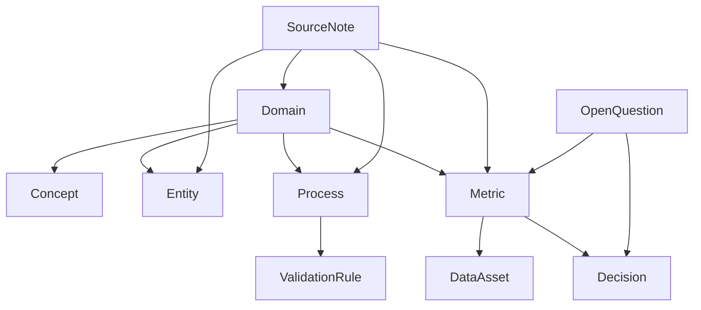
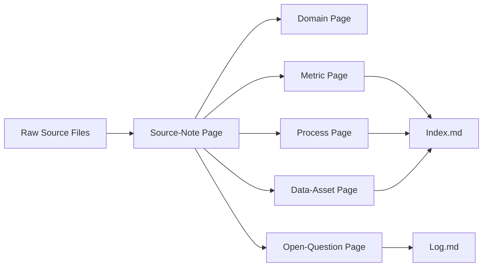

# KMS System Design

# 1. Vision, Scope, and Operating Model

## 1.1 System Definition

KMS stands for Knowledge Management System. It is an enterprise-grade knowledge maintenance and publishing system that transforms raw source material into curated, structured, finalized markdown knowledge that can be consumed by humans and AI systems.

KMS is not a document store, not a generic search engine, and not a chat interface. It is a governed knowledge control plane with an explicit maintenance workflow, a single finalized knowledge substrate, and a separate read-only navigation layer.

### KMS in one statement

- KMS is the governed system that turns immutable raw sources into finalized markdown knowledge in `/wiki`, under Knowledge Manager control, for consumption by people and AI systems.

KMS exists to produce durable knowledge, preserve decision quality, and keep curated understanding synchronized with changing business context. Its unit of output is finalized markdown knowledge, not raw text, ad hoc answers, or ephemeral chat state.

## 1.2 Problem Statement

Analytics and reporting teams depend on business definitions, process rules, lineage context, metric logic, historical decisions, and operational exceptions. In most organizations, that knowledge is fragmented across source documents, issue threads, slide decks, local notes, tribal memory, and partially maintained repositories. The result is predictable:

- raw source materials are scattered and inconsistent
- knowledge decays as business rules, processes, and definitions change
- teams repeatedly recreate the same context for every analysis or report
- Copilot-style workflows become weak when they are fed unstable or uncurated context
- business definitions, process rules, and prior decisions are not available in a reusable form
- humans can browse source material, but AI systems need stable, governed, structured knowledge to be useful

KMS solves a knowledge curation and maintenance problem, not merely a retrieval problem. Its purpose is to control how knowledge becomes finalized, how it is refreshed, and how it is exposed for downstream consumption. Retrieval alone does not create trusted institutional memory. KMS does.

## 1.3 Business Purpose and Strategic Role

KMS is foundational infrastructure for reimagined analytics and reporting processes. It gives knowledge users a governed knowledge base that can be reused across analysis, reporting, validation, and process execution without requiring the organization to rebuild context every time.

Strategically, KMS serves four roles:

- it preserves institutional memory in durable markdown form
- it standardizes how knowledge is maintained and finalized
- it supports governed AI enablement for knowledge-intensive work
- it provides reusable context for future systems that depend on durable, trusted knowledge

The system is designed to accelerate knowledge users without removing managerial control over what becomes truth. Knowledge can be proposed, reviewed, refined, approved, and published, but final authority remains with the Knowledge Manager. That control is essential because the value of KMS depends on trust, consistency, and traceable finalization.

KMS is also intended to support GitHub Copilot-style reimagined processes by supplying curated markdown that can be used as stable context. The same finalized knowledge substrate is intended to support future agentic AI systems, including Business Analytics Agentic AI and Reporting Agentic AI, where the AI must operate against governed knowledge rather than unstructured source noise.

## 1.4 Core Layers

KMS is organized into three core layers plus an immutable upstream source area.

### Knowledge Manager Interface (KMI)

KMI is the control surface for knowledge maintenance and governance.

- Purpose: orchestrate knowledge refresh, review, validation, approval, and finalization
- Primary user: Knowledge Manager
- Responsibilities: accept local source paths, trigger runs, inspect proposed changes, evaluate contradictions, apply rules, and decide what becomes finalized knowledge
- Must never: serve as a consumer browse layer, allow uncontrolled truth changes, or expose finalized knowledge editing as an ungoverned direct path

KMI is the only sanctioned write path for finalized knowledge. It is the maintenance engine, the governance surface, and the place where truth is controlled.

### Wiki Layer

The Wiki Layer is the finalized knowledge substrate stored under `/wiki`.

- Purpose: hold the authoritative markdown knowledge set that represents finalized truth
- Primary user: downstream AI systems and human readers who need the governed knowledge content itself
- Responsibilities: persist curated markdown pages, keep knowledge human-readable, provide a stable source of truth for consumption
- Must never: function as a raw document dump, accept uncontrolled edits outside the governed maintenance flow, or become a transient working area for draft-only content

The Wiki Layer is the single source of truth for finalized knowledge. It is optimized for AI consumption, but it must remain readable and maintainable by humans.

### Infopedia

Infopedia is the read-only navigation layer on top of finalized wiki markdown files.

- Purpose: provide human-friendly exploration of finalized knowledge
- Primary user: knowledge consumers
- Responsibilities: tree-based navigation, hyperlink traversal, search, and browse experience similar to Wikipedia-style knowledge exploration
- Must never: serve as a maintenance surface, modify finalized truth, or bypass governed knowledge finalization

Infopedia is for reading and navigating finalized knowledge, not for producing or approving it.

### Immutable Raw Source Inputs

Raw source files remain in a local source folder and are treated as immutable upstream inputs.

- Purpose: supply source material for knowledge maintenance runs
- Primary user: KMI during maintenance operations
- Responsibilities: provide source evidence and context for knowledge updates
- Must never: be edited in place as part of final knowledge publication, or be treated as finalized knowledge

The immutability of raw source inputs is intentional. It preserves auditability and keeps the maintenance workflow anchored to a stable source boundary.

## 1.5 Operating Model

KMS operates as a governed maintenance pipeline with separated concerns between source intake, knowledge finalization, and knowledge consumption.

The operating model is straightforward:

1. Source materials land in a local source path as immutable inputs.
2. The Knowledge Manager triggers a run in KMI.
3. KMI analyzes the sources, applies rules and validations, and proposes knowledge updates.
4. When required, the Knowledge Manager reviews proposed updates, checks contradictions, and makes final decisions.
5. Finalized markdown knowledge is refreshed in `/wiki`.
6. Infopedia reflects the finalized wiki content for browse-only navigation.
7. Downstream AI systems and human users consume the finalized knowledge.

This model establishes clear authority boundaries:

- maintenance authority is centralized in KMI
- finalized knowledge is centralized in `/wiki`
- human browsing is separated into Infopedia
- source inputs remain immutable

That separation is fundamental. KMS should not blur maintenance with consumption, and it should not allow consumption layers to become hidden write paths. The system must make truth explicit, controlled, and refreshable.

## 1.6 Scope

KMS is in scope for the following capabilities at a high level:

- local-folder-driven source intake trigger
- governed maintenance of markdown knowledge
- structured finalized wiki pages under `/wiki`
- human-readable and AI-usable markdown knowledge
- browse and navigation layer for knowledge consumers
- support for Copilot-based reimagined workflows
- design extensibility for future agentic AI use
- validation, approval, confidence, freshness, and source trace concepts

The scope is knowledge curation and controlled publication. KMS is responsible for producing trusted finalized knowledge and making it consumable in a predictable way.

## 1.7 Non-Goals / Out of Scope

KMS is explicitly not the following:

- not a chatbot product
- not a generic enterprise search engine
- not a vector database replacing curated knowledge
- not a raw document dump
- not a source extraction or connector platform
- not a direct editing tool for consumers in Infopedia
- not an unguided autonomous system that changes truth without control

These exclusions are deliberate. KMS is built around governed finalization, not around unrestricted interaction or unsupervised content mutation. Search, chat, extraction, and autonomy may appear in surrounding ecosystems, but they are not the core identity of KMS.

## 1.8 Target Users and Consumption Model

KMS serves three distinct consumer groups with different responsibilities and privileges.

### Knowledge Manager

The Knowledge Manager curates, reviews, governs, and finalizes knowledge. This role owns the maintenance workflow in KMI and makes the final decision on what becomes published truth in `/wiki`.

### Knowledge Consumers

Knowledge consumers browse, search, read, and understand finalized knowledge through Infopedia and related read surfaces. They rely on the published knowledge, but they do not modify it directly.

### Downstream AI Systems

Downstream AI systems consume finalized markdown knowledge as a structured knowledge substrate. They use KMS content as governed context rather than as raw untrusted input.

KMS must support two AI consumption patterns:

1. prompt-driven, Copilot-style consumption where curated markdown is used as stable context for answering, drafting, or assisting
2. agentic, workflow-driven consumption where AI systems use finalized knowledge to plan, validate, and ground execution

Both patterns depend on the same principle: the finalized knowledge in `/wiki` is the primary artifact. KMS should support passive AI consumption and active AI orchestration, but the governing logic and truth ownership remain centralized.

## 1.9 Design Principles

### Curated knowledge over raw retrieval

KMS is optimized for finalized knowledge, not for exposing a pile of source fragments. Retrieval is useful only when it serves curation and consumption of trusted knowledge.

### Determinism over improvisation

Knowledge published by KMS should be stable, repeatable, and governed. The system should minimize ambiguity in what is considered final.

### One source of truth

The finalized markdown set in `/wiki` is the authoritative knowledge layer. Other layers can assist with maintenance or browsing, but they do not compete with the final store of truth.

### Separation of maintenance and consumption

KMI maintains and finalizes knowledge. Infopedia and downstream consumers read it. This separation prevents accidental writes from consumer surfaces and keeps governance clear.

### Governance-first

Every final knowledge change must be reviewable, controlled, and aligned to policy. Governance is not a secondary feature; it is the operating model.

### Structured markdown over free-form sprawl

Knowledge should be expressed in disciplined markdown so it is readable by humans and consistent for AI systems. Free-form accumulation of notes is not an acceptable final state.

### Bounded intelligence

KMS should support AI assistance without delegating truth authority to AI. AI can propose, summarize, compare, and ground work, but finalization remains controlled.

### Human control over finalization

The Knowledge Manager decides what becomes finalized knowledge. Human control is essential where business definitions, reporting logic, and process rules carry operational impact.

### Extensibility toward agentic AI

KMS should remain usable as the knowledge foundation for future agentic systems. The knowledge model should be durable enough to support planning, validation, and execution grounding without redesigning the truth layer.

## 1.10 Section Summary

KMS is a governed Knowledge Management System that turns immutable raw sources into finalized markdown knowledge under Knowledge Manager control. The system is built around three separated layers: KMI for maintenance and governance, `/wiki` for finalized knowledge, and Infopedia for read-only navigation.

This structure matters because analytics and reporting work depends on durable institutional memory, not on repeated reconstruction from fragmented source material. KMS creates that memory in a controlled form that humans can browse and AI systems can consume.

The same finalized knowledge substrate is intended to support both Copilot-style reimagined workflows and future agentic AI systems. KMS therefore functions as a knowledge control plane, a maintenance-first system, and a reusable intelligence substrate for governed human and AI consumption.

# 2. User Roles, Personas, and Core Workflows

## 2.1 Role Model Overview

KMS supports three primary actor classes:

1. Knowledge Managers
2. Knowledge Consumers
3. Downstream AI Systems

These roles are not interchangeable. They have different permissions, different responsibilities, and different relationships to truth.

### Role separation summary

- Knowledge Managers own knowledge maintenance authority and finalization decisions.
- Knowledge Consumers read and navigate finalized knowledge but do not change it.
- Downstream AI Systems consume finalized knowledge as governed context but do not govern truth.

This separation is central to KMS. Maintenance, consumption, and runtime AI usage are distinct operating modes and must remain distinct in the system design.

## 2.2 Knowledge Manager Persona

The Knowledge Manager is the authoritative maintainer of knowledge in KMS. This persona exists because knowledge cannot be treated as self-authoring or self-finalizing in an enterprise setting where definitions, reporting logic, process rules, and historical decisions matter.

The Knowledge Manager is not merely a UI user. This role owns the maintenance and finalization workflow end to end.

### Responsibilities

- provide local source paths to KMI
- initiate maintenance runs in KMI
- review source-driven knowledge proposals
- examine contradictions, gaps, and uncertainty
- approve proposed updates when they are fit for publication
- reject proposed updates when they are incorrect, incomplete, or premature
- escalate unresolved issues when the source state or business rule is ambiguous
- decide what becomes finalized markdown knowledge in `/wiki`
- maintain governance discipline across updates and refresh cycles
- protect knowledge quality, freshness, structure, and source trace

### Authorized decisions

The Knowledge Manager is authorized to decide:

- whether a source set should be processed
- whether a proposed change is accepted, revised, or rejected
- whether a contradiction requires escalation or can be resolved
- whether knowledge is ready to be published as finalized truth
- whether a knowledge refresh should wait until the source state is sufficiently complete

### Interfaces used

- KMI for initiating runs, reviewing proposals, and controlling finalization
- `/wiki` indirectly through governed publication outcomes, not through uncontrolled direct editing

### Outputs governed

- finalized markdown knowledge
- approval or rejection decisions
- resolution of contradictions and open questions
- refreshed authoritative wiki content

### What the Knowledge Manager must not do

- directly edit finalized truth through Infopedia
- bypass policy, validation, or approval logic
- treat raw source as final knowledge
- allow uncontrolled autonomous publication without governance
- use consumer-facing navigation surfaces as maintenance tools

The Knowledge Manager owns the truth maintenance process, not just the interface used to trigger it.

## 2.3 Knowledge Consumer Persona

Knowledge Consumers are users of knowledge, not maintainers of truth. They rely on finalized knowledge to understand business rules, reporting logic, prior decisions, and curated context without participating in the publication workflow.

Typical Knowledge Consumers include analysts, reporting teams, business users, reviewers, and other knowledge users who need stable domain understanding.

### What they use Infopedia for

- browse the knowledge tree
- search finalized knowledge
- open linked pages
- read structured, source-backed markdown
- understand what knowledge exists
- follow related concepts and navigation paths
- use finalized markdown as input into other work

### What they should be able to do

- discover finalized knowledge efficiently
- read the authoritative version of a topic
- navigate related knowledge without reading raw source material
- use published knowledge in analytics, reporting, and review workflows

### What they must never be allowed to do directly

- modify final knowledge through Infopedia
- bypass Knowledge Manager authority
- treat raw source folders as browse-first knowledge surfaces
- finalize or publish knowledge directly
- overwrite governed truth outside KMI-mediated workflows

Knowledge Consumers benefit from KMS by gaining access to curated, stable, human-readable knowledge. They do not participate in maintenance decisions.

## 2.4 Downstream AI Systems Persona

Downstream AI Systems are a formal consumer class in KMS. The system is designed not only for human readers but also for AI systems that consume finalized wiki markdown as governed context.

Downstream AI Systems must rely on finalized knowledge, not raw source noise, because their outputs are only as reliable as the knowledge substrate they receive.

### A. Prompt-driven / Copilot-style consumption

Examples:

- GitHub Copilot-assisted reimagined processes
- prompt-driven analytics
- prompt-driven reporting
- AI assistance using curated markdown files as context

In this model, KMS acts as a passive but governed knowledge source. The AI system reads finalized markdown to ground prompts, drafting, explanation, summarization, or analysis.

### B. Agentic / workflow-driven consumption

Examples:

- Business Analytics Agentic AI
- Reporting Agentic AI
- future domain-specific agents

In this model, KMS is an active operational knowledge dependency. The agent uses finalized knowledge for:

- planning input
- validation grounding
- explanation context
- structured domain memory

### AI system constraints

- downstream AI systems consume finalized knowledge
- they do not own wiki maintenance
- they do not define truth
- they should rely primarily on curated `/wiki` knowledge, not raw sources
- they must treat KMS knowledge as governed context, not as mutable truth

KMS supports both passive AI consumption and active AI orchestration, but neither mode is allowed to bypass Knowledge Manager governance.

## 2.5 Role-to-Layer Mapping

The relationship between roles and layers is intentionally asymmetric.

### Knowledge Manager

- KMI: primary operating surface for maintenance, review, validation, and finalization
- Wiki Layer: indirect publication target through governed workflow
- Infopedia: not a maintenance surface
- Raw source folders: upstream inputs provided for maintenance runs

### Knowledge Consumer

- KMI: not used for maintenance authority
- Wiki Layer: indirect dependency through finalized content
- Infopedia: primary browse and read surface
- Raw source folders: not a consumer destination

### Downstream AI Systems

- KMI: not a governing interface
- Wiki Layer: primary knowledge substrate for consumption
- Infopedia: optional human-oriented companion surface, not the AI truth store
- Raw source folders: not the preferred runtime knowledge source

### Layer ownership clarity

- Knowledge Manager primarily operates through KMI
- Knowledge Consumers primarily operate through Infopedia
- AI systems primarily consume `/wiki`
- raw source folders are upstream maintenance inputs, not consumer-facing destinations
- `/wiki` is authoritative, but it is not directly managed by consumers
- Infopedia is derived from finalized wiki content, not a separate truth store

This mapping prevents role drift. It keeps maintenance, consumption, and runtime usage in separate lanes.

## 2.6 Core Workflow Categories

KMS has five core workflow categories.

### 1. Knowledge maintenance workflow

- Purpose: transform immutable source material into proposed knowledge updates
- Primary actor(s): Knowledge Manager, KMI
- Inputs: local source path, existing `/wiki` content, governance rules
- Outputs: proposed updates, contradiction signals, refresh candidates
- Where it occurs: KMI, with publication outcome to `/wiki`

### 2. Knowledge review and approval workflow

- Purpose: determine whether proposed knowledge should become finalized truth
- Primary actor(s): Knowledge Manager
- Inputs: proposed updates, validation results, uncertainty flags, source trace
- Outputs: approved, rejected, or escalated decisions
- Where it occurs: KMI

### 3. Knowledge consumption workflow

- Purpose: let humans discover and read finalized knowledge
- Primary actor(s): Knowledge Consumers
- Inputs: finalized wiki content
- Outputs: understanding, navigation, and reuse in human work
- Where it occurs: Infopedia

### 4. AI consumption workflow

- Purpose: let AI systems ground prompts or workflows in finalized knowledge
- Primary actor(s): Downstream AI Systems
- Inputs: finalized `/wiki` markdown
- Outputs: answers, drafts, plans, validations, or execution support
- Where it occurs: downstream AI systems consuming KMS content

### 5. Ongoing governance and hygiene workflow

- Purpose: keep knowledge current, coherent, and trustworthy over time
- Primary actor(s): Knowledge Manager, governance rules, KMI
- Inputs: freshness signals, contradictions, source updates, aging knowledge
- Outputs: refreshed knowledge, review actions, unresolved issues, retained truth
- Where it occurs: primarily KMI and `/wiki`

These workflow categories keep maintenance distinct from consumption and make governance an ongoing activity rather than a one-time publication event.

## 2.7 End-to-End Knowledge Maintenance Workflow

The core KMS lifecycle moves from raw source to finalized knowledge through a controlled maintenance path.

1. Source materials exist in a local folder path as immutable inputs.
2. The Knowledge Manager enters or provides that source path in KMI.
3. A maintenance run is initiated from KMI.
4. KMI discovers the source materials and analyzes them against existing knowledge.
5. The system generates proposed knowledge changes, refresh candidates, and contradiction signals.
6. Low-confidence areas, gaps, and rule issues are surfaced for review.
7. The Knowledge Manager reviews the proposed changes when review is required.
8. The Knowledge Manager approves, rejects, revises, or escalates the proposed updates.
9. Approved changes refresh the finalized markdown knowledge in `/wiki`.
10. Infopedia reflects the updated finalized knowledge for browse-only consumption.
11. Downstream consumers and AI systems use the new finalized state.

This workflow establishes a strict boundary:

- raw source does not become truth automatically
- proposed changes are not equivalent to finalized knowledge
- KMI is the control checkpoint
- finalized `/wiki` content is the publication outcome

The system may automate analysis and proposal generation, but finalization remains governed.

## 2.8 Knowledge Review and Approval Workflow

Review is the mechanism that converts proposed knowledge into controlled truth. Not every run should require human review, but every run must remain reviewable and governable.

### Lifecycle states

- proposed: a candidate knowledge change has been generated
- staged: the change is prepared for decision and validation
- review required: human judgment is needed before publication
- approved: the Knowledge Manager has accepted the change
- rejected: the Knowledge Manager has declined the change
- finalized: the change is published into `/wiki`
- open question: a contradiction or missing dependency remains unresolved

### Review principles

- human review is required when the system encounters contradiction, uncertainty, policy conflict, or low confidence
- approval matters because it is the publication boundary between proposal and truth
- contradictions must be surfaced, not silently overwritten
- unresolved issues must remain visible until resolved or explicitly deferred
- governance preserves trust by making finalization deliberate

### Review behavior

1. KMI presents the proposed knowledge state and supporting evidence.
2. The Knowledge Manager evaluates the proposal against source trace, policy, and current finalized content.
3. The Knowledge Manager decides whether the proposal can be finalized, needs revision, or must be rejected.
4. If a contradiction cannot be resolved safely, the issue remains open rather than being hidden.
5. Only approved updates advance to finalized `/wiki` content.

This workflow keeps the system self-managed without making it ungoverned. Automation can prepare decisions, but governance controls publication.

## 2.9 Knowledge Consumption Workflow

Knowledge Consumers use KMS after knowledge is finalized. Their workflow is intentionally separate from maintenance.

1. The consumer opens Infopedia.
2. The consumer browses the tree or searches for a topic.
3. The consumer opens the relevant finalized page.
4. The consumer follows related links or adjacent pages as needed.
5. The consumer reads the structured knowledge and uses it in their work.

This workflow helps users understand what knowledge exists, not just what source material exists.

Infopedia is designed to surface finalized knowledge in a navigable form so consumers do not need to inspect raw source artifacts to orient themselves.

## 2.10 AI Consumption Workflow

Downstream AI Systems consume finalized knowledge in two primary ways.

### 1. Prompt-driven / Copilot-style usage

1. A user or application issues a prompt in a Copilot-style workflow.
2. The AI system uses curated `/wiki` markdown as governed context.
3. The AI system produces an answer, draft, summary, or analysis grounded in finalized knowledge.

In this pattern, KMS acts as a stable knowledge source that improves consistency and reduces reliance on scattered raw inputs.

### 2. Agentic usage

1. An agent receives a task, plan, or workflow objective.
2. The agent consumes finalized `/wiki` markdown as structured domain memory.
3. The agent uses the knowledge to plan, validate, explain, or execute within bounds.

In this pattern, finalized markdown matters because agent reliability depends on durable, governed knowledge rather than opportunistic retrieval from raw material.

### What KMS provides to AI consumption

- curated knowledge instead of raw fragmentation
- stable truth instead of changing source noise
- human-reviewed context instead of ungoverned content
- structured markdown that can support both prompt and workflow use cases

KMS does not make the AI authoritative. It makes the knowledge substrate authoritative.

## 2.11 Separation of Authority and Responsibility

KMS depends on clear authority boundaries.

- Only KMI-mediated workflows can change finalized knowledge.
- Consumers cannot mutate truth through Infopedia.
- AI consumers cannot redefine truth.
- Raw inputs are not the same as finalized knowledge.
- `/wiki` is the authoritative substrate.

This boundary applies across both human and AI usage modes.

### Authority separation

- maintenance authority: Knowledge Manager through KMI
- publication authority: governed finalization into `/wiki`
- browsing authority: Knowledge Consumers through Infopedia
- runtime AI consumption: Downstream AI Systems using finalized markdown

### Responsibility separation

- the Knowledge Manager owns governance and finalization
- the Knowledge Consumer owns reading and interpretation
- the AI system owns runtime use of knowledge, not truth definition

The purpose of these boundaries is to prevent accidental truth mutation, preserve trust, and keep operational responsibility aligned with role type.

## 2.12 Section Summary

KMS separates maintainers, consumers, and AI systems into distinct roles with distinct privileges. The Knowledge Manager owns maintenance and finalization through KMI, Knowledge Consumers read finalized knowledge through Infopedia, and Downstream AI Systems consume finalized `/wiki` content as governed context.

The workflows are intentionally different: maintenance transforms source into proposed knowledge, review converts proposal into approved truth, consumption reads finalized knowledge, and AI uses finalized knowledge for prompt-driven or agentic work. This separation is necessary for trust, governance, and long-term maintainability.

# 3. System Architecture and Layered Design

## 3.1 Architectural Overview

KMS is composed of five architectural layers:

- upstream raw source layer
- maintenance and orchestration layer
- finalized knowledge layer
- read-only navigation layer
- metadata and runtime services layer

The three product layers defined earlier remain the primary user-facing structure:

- Knowledge Manager Interface (KMI)
- Wiki Layer
- Infopedia

The broader architecture adds the backend services and storage layers required to operate those product layers reliably. The architectural principle is fixed:

- raw source is immutable input
- KMI is the governed maintenance surface
- `/wiki` is the finalized knowledge substrate
- Infopedia is a read-only projection and navigation surface
- metadata and orchestration services coordinate lifecycle, not replace the wiki as source of truth

### Architecture in one statement

- KMS turns immutable raw sources into governed finalized markdown in `/wiki` through KMI-mediated maintenance services, then projects that finalized knowledge into Infopedia for read-only consumption and downstream AI use.

## 3.2 Layered Architecture Model

KMS should be understood as an explicit stack of layers with clear dependency direction.

### Layer A - Raw Source Input Layer

- Purpose: hold immutable upstream source artifacts for maintenance processing
- Key contents/components: local filesystem source path, exports, documents, reports, notes, extracts
- Depends on: nothing inside KMS; it is upstream input
- Exposes to adjacent layers: source material for discovery, parsing, and analysis
- Must never: be treated as finalized knowledge or edited in place as truth

This layer is the boundary between external reality and KMS maintenance. It supplies evidence, not publication.

### Layer B - Knowledge Maintenance Layer

- Purpose: analyze sources, generate proposals, validate changes, and coordinate governed publication
- Key contents/components: KMI frontend, maintenance backend, orchestration logic, agents/skills/rules execution, source analysis, proposal generation, review and approval coordination
- Depends on: raw source input layer, metadata/runtime services, existing `/wiki` content
- Exposes to adjacent layers: proposed updates, validation outcomes, publication decisions, run status
- Must never: bypass governance, silently publish truth, or become the authoritative knowledge store

This layer is where maintenance authority is exercised. It prepares knowledge for publication, but it does not replace the published artifact.

### Layer C - Finalized Knowledge Layer

- Purpose: store the canonical finalized knowledge set
- Key contents/components: markdown files under `/wiki`, structured page taxonomy, canonical finalized knowledge
- Depends on: governed publication from the maintenance layer
- Exposes to adjacent layers: authoritative markdown content for Infopedia, downstream AI systems, and other consumers
- Must never: accept uncontrolled writes, become a draft workspace, or be replaced by metadata records

This layer is the source of truth for KMS.

### Layer D - Knowledge Navigation Layer

- Purpose: provide browse and discovery access to finalized knowledge
- Key contents/components: Infopedia, tree navigation, search, browse UI, hyperlink traversal, page rendering
- Depends on: finalized `/wiki` content and supporting metadata/indexing
- Exposes to adjacent layers: read-only views of finalized knowledge and navigation context
- Must never: mutate finalized knowledge, maintain separate truth, or act as an authoring surface

This layer is a projection over finalized wiki content, not an independent content authority.

### Layer E - Metadata and Runtime Services Layer

- Purpose: support orchestration, governance, indexing, and operational visibility
- Key contents/components: run records, approvals, revisions, contradictions, QA reports, indexing metadata, runtime services for UI and workflow behavior
- Depends on: maintenance events, publication outcomes, and finalized knowledge references
- Exposes to adjacent layers: workflow state, operational history, navigation aids, validation results, and observability signals
- Must never: replace `/wiki` as the knowledge substrate or become a second truth store

This layer is operational infrastructure. It exists so the system can coordinate, explain, and recover, but it is not the final knowledge artifact.

## 3.3 Major System Components

The architecture requires concrete components that future implementation can map into applications, services, and storage.

### Frontend components

#### Knowledge Manager Interface (KMI) application

- Responsibility: provide the governed control surface for maintenance, review, contradiction handling, approval, and publication
- High-level inputs: source path, run status, validation output, contradictions, proposals, metadata state
- High-level outputs: run initiation, review actions, approval decisions, governed publication requests
- Authoritative or supporting: supporting control surface, not the truth store
- Read/write: read operational state and write workflow decisions and approval actions
- Layer: Knowledge Maintenance Layer

#### Infopedia application

- Responsibility: render and navigate finalized knowledge in a browse-first experience
- High-level inputs: finalized `/wiki` content, indexing metadata, page structure, search metadata
- High-level outputs: read-only page views, navigation paths, search results, linked page traversal
- Authoritative or supporting: supporting projection layer, not authoritative
- Read/write: read-only with respect to finalized knowledge
- Layer: Knowledge Navigation Layer

### Backend components

#### API service

- Responsibility: provide the application-facing service boundary for KMI and Infopedia
- High-level inputs: UI requests, authentication context, run commands, browse requests
- High-level outputs: workflow responses, status, page data, search results, metadata lookups
- Authoritative or supporting: supporting
- Read/write: read/write to operational metadata and workflow state, read to knowledge and index sources as needed
- Layer: Metadata and Runtime Services Layer

#### Run orchestration service

- Responsibility: coordinate the lifecycle of a maintenance run from input to publication decision
- High-level inputs: source path, existing wiki content, policy rules, orchestration directives
- High-level outputs: run state transitions, task dispatch, step completion status, failure handling signals
- Authoritative or supporting: supporting
- Read/write: writes operational run state, reads source and wiki content
- Layer: Knowledge Maintenance Layer

#### Source discovery and parsing service

- Responsibility: discover source artifacts and normalize them into processable representations
- High-level inputs: raw source folder contents, source path configuration
- High-level outputs: discovered files, parsed text, normalized source records, extraction artifacts
- Authoritative or supporting: supporting
- Read/write: reads raw source, may write transient artifacts to support storage
- Layer: Knowledge Maintenance Layer

#### Source analysis service

- Responsibility: analyze normalized source material against current knowledge and rules
- High-level inputs: parsed source content, current `/wiki` pages, rules and validation context
- High-level outputs: proposed knowledge deltas, contradiction signals, confidence indicators, refresh recommendations
- Authoritative or supporting: supporting
- Read/write: reads sources and knowledge, writes proposals and analysis outputs to operational storage
- Layer: Knowledge Maintenance Layer

#### Wiki drafting / refresh service

- Responsibility: produce or update finalized markdown candidates for publication
- High-level inputs: approved proposals, structured page model, source trace, refresh directives
- High-level outputs: candidate markdown files, page refresh artifacts, publication-ready outputs
- Authoritative or supporting: supporting writer, not the truth store itself
- Read/write: writes to wiki publication pipeline, reads existing wiki content and proposals
- Layer: Knowledge Maintenance Layer

#### Policy validation service

- Responsibility: enforce structural, freshness, traceability, and governance rules
- High-level inputs: proposals, source trace, page structure, policy rules
- High-level outputs: validation pass/fail, rule violations, review requirements
- Authoritative or supporting: supporting
- Read/write: reads proposals and rules, writes validation outcomes
- Layer: Metadata and Runtime Services Layer

#### Contradiction handling service

- Responsibility: detect, classify, and retain unresolved conflicts in a visible state
- High-level inputs: source conflicts, overlap with existing knowledge, policy constraints
- High-level outputs: contradiction records, resolution candidates, unresolved issue states
- Authoritative or supporting: supporting
- Read/write: reads sources and wiki content, writes contradiction records
- Layer: Metadata and Runtime Services Layer

#### Approval and finalization service

- Responsibility: apply Knowledge Manager decisions and publish approved knowledge
- High-level inputs: approval actions, reviewed proposals, validated publication candidates
- High-level outputs: finalized markdown in `/wiki`, finalized publication records, revision markers
- Authoritative or supporting: supporting write path into the canonical knowledge layer
- Read/write: writes finalized markdown and publication metadata
- Layer: Knowledge Maintenance Layer and Finalized Knowledge Layer boundary

#### Search and index service

- Responsibility: build and serve searchable structures for KMI and Infopedia
- High-level inputs: finalized wiki content, page metadata, operational records
- High-level outputs: search indexes, browse indexes, retrieval metadata
- Authoritative or supporting: supporting
- Read/write: reads `/wiki` and metadata, writes index structures
- Layer: Metadata and Runtime Services Layer

#### Infopedia projection / refresh service

- Responsibility: transform finalized wiki content into a browse-ready projection
- High-level inputs: finalized markdown pages, page relationships, search metadata
- High-level outputs: refreshed browse views, navigation structures, presentation metadata
- Authoritative or supporting: supporting
- Read/write: reads `/wiki`, writes derived navigation or cache state
- Layer: Knowledge Navigation Layer and Metadata and Runtime Services Layer boundary

### Storage / persistence components

#### Local raw source folder

- Responsibility: store immutable upstream source inputs
- High-level inputs: external exports, documents, notes, extracts
- High-level outputs: readable source files for maintenance processing
- Authoritative or supporting: supporting input, not authoritative
- Read/write: read-only to KMS workflows
- Layer: Raw Source Input Layer

#### Local or mounted wiki folder

- Responsibility: persist finalized markdown knowledge
- High-level inputs: approved publication outputs
- High-level outputs: authoritative finalized pages
- Authoritative or supporting: authoritative
- Read/write: write by publication services only, read by consumers and AI systems
- Layer: Finalized Knowledge Layer

#### Metadata database

- Responsibility: persist operational run state, approvals, contradictions, revisions, and QA records
- High-level inputs: workflow events and service outputs
- High-level outputs: queryable operational state and history
- Authoritative or supporting: supporting, not authoritative for knowledge truth
- Read/write: read/write
- Layer: Metadata and Runtime Services Layer

#### Optional search index

- Responsibility: support search and browse experiences over finalized knowledge and operational metadata
- High-level inputs: finalized wiki content and metadata
- High-level outputs: searchable structures and query responses
- Authoritative or supporting: supporting
- Read/write: write derived index, read finalized content and metadata
- Layer: Metadata and Runtime Services Layer

#### Optional artifact storage for extracted text or run outputs

- Responsibility: retain transient or derived artifacts from maintenance and analysis
- High-level inputs: parsed text, analysis outputs, generated candidates
- High-level outputs: recoverable artifacts for audit, troubleshooting, or rerun support
- Authoritative or supporting: supporting
- Read/write: read/write as operational artifact storage
- Layer: Metadata and Runtime Services Layer

## 3.4 Source of Truth and Authority Boundaries

KMS must preserve a strict authority hierarchy.

- Raw source files are not the knowledge source of truth.
- Finalized markdown in `/wiki` is the source of truth.
- Metadata DB is operational support, not authoritative knowledge.
- Infopedia is a projection over finalized knowledge, not a second truth store.
- KMI is a control and workflow surface, not the final knowledge store itself.

This matters because trust in KMS depends on a single canonical publication artifact. If the system allows truth to be split across raw source, metadata state, UI state, or browse projections, then human users and AI systems will receive inconsistent answers and no clear publication boundary will exist.

The authority model improves:

- trust, because there is one published knowledge layer
- auditability, because truth changes are tied to governed runs
- deterministic reuse, because downstream consumers read the same artifact
- AI consumption reliability, because AI is grounded in canonical markdown
- human browse consistency, because Infopedia reflects the same finalized content for everyone

## 3.5 Read/Write Responsibility Model

The architecture must define read/write responsibilities explicitly.

### Responsibility matrix

- Raw source layer
  - Reads: KMI maintenance services
  - Writes: none during KMS operation
  - Role: immutable upstream input

- KMI
  - Reads: source artifacts, wiki content, metadata, validation results
  - Writes: workflow decisions, approvals, run actions, review outcomes
  - Role: governed maintenance control surface

- Wiki writer / finalization service
  - Reads: approved proposals, source trace, existing wiki content
  - Writes: finalized markdown in `/wiki`
  - Role: authoritative publication writer

- Infopedia
  - Reads: finalized wiki content, browse metadata, search metadata
  - Writes: none to finalized knowledge
  - Role: read-only browse surface

- Metadata DB services
  - Reads: workflow events, content identifiers, validation state, publication state
  - Writes: run records, approvals, contradiction records, revisions, QA reports
  - Role: operational support store

- Downstream AI consumers
  - Reads: finalized wiki content and supporting browse metadata where needed
  - Writes: none to KMS knowledge stores
  - Role: runtime consumers of governed knowledge

This model keeps publication authority isolated from consumption authority.

## 3.6 End-to-End Data Flow

The system flow starts with immutable source material, passes through governed maintenance, and ends in finalized publication and consumption.

In prose:

The Knowledge Manager selects a local source path and initiates a run through KMI. Backend services discover and normalize the source material, analyze it against existing knowledge, and generate proposals, validation results, and contradiction signals. The Knowledge Manager reviews the proposals when human judgment is required. Approved changes are written into `/wiki` as finalized markdown. Infopedia and related indexes are then refreshed from the finalized content. Human users and downstream AI systems consume the updated canonical knowledge.

### Numbered sequence

1. Source path selection
2. Source discovery
3. Parsing and normalization
4. Maintenance workflow orchestration
5. Proposal generation
6. Validation and contradiction checks
7. Review and finalization
8. Write to `/wiki`
9. Refresh Infopedia projection and index
10. Human and AI consumption of finalized knowledge

The important architectural rule is that proposal generation does not equal publication. The knowledge only becomes final after the governed write path updates `/wiki`.

## 3.7 KMI Architecture Role

KMI is the primary operational control surface in the architecture. It is not a UI shell wrapped around a file editor.

Architecturally, KMI sits above the maintenance services and interacts with them to:

- start runs
- review system output
- surface rule violations
- resolve contradictions
- approve publication
- observe maintenance health and status

KMI is the human governance point in the architecture. It coordinates decisions, but it does not itself replace the backend services that analyze, validate, and publish knowledge.

### KMI must not become

- a chat interface
- a consumer browse tool
- a hidden direct file editor that bypasses rules
- an alternate truth store

The purpose of KMI is to govern maintenance, not to collapse governance into an unstructured editor.

## 3.8 Wiki Layer Architecture Role

The Wiki Layer under `/wiki` is the canonical knowledge artifact produced by KMS.

It is:

- the finalized knowledge substrate
- structured markdown
- the canonical knowledge output
- a durable knowledge interface for both humans and AI systems

The Wiki Layer must support:

- structured page taxonomy
- source trace
- linkability
- human readability
- AI usability

It is not just storage. It is the publication surface for governed knowledge. Every downstream consumer should treat `/wiki` as the authoritative artifact that represents what KMS has finalized.

## 3.9 Infopedia Architecture Role

Infopedia is the read-only architectural layer for navigation and discovery.

It:

- reads finalized wiki content
- provides browse and search
- presents hierarchical and tree-based navigation
- supports hyperlink traversal and page discovery
- may use indexing metadata for speed and organization
- remains read-only with respect to finalized knowledge

Infopedia must not:

- become an alternate authoring surface
- create a second inconsistent content store
- bypass `/wiki` as the canonical source

Infopedia is useful because it converts finalized markdown into a browse-first experience, but it remains a projection over the canonical content, not a competing truth layer.

## 3.10 Metadata and Runtime Services

Metadata and runtime services exist to support the operating lifecycle of KMS.

They support:

- run orchestration
- revision history
- approvals
- contradiction records
- QA findings
- indexing and search metadata
- health and observability

These services are essential infrastructure because they make the system observable, recoverable, and governable. They do not replace `/wiki` as the knowledge source of truth.

The metadata database is necessary even though markdown is the final knowledge substrate because the system needs to retain operational state that is separate from canonical knowledge content. Examples include approval timestamps, run outcomes, contradiction status, validation results, and publication history. Those records support governance; they do not define truth.

## 3.11 Search and Indexing Position in the Architecture

Search and indexing are supporting capabilities that sit beside, not above, the canonical knowledge layer.

KMS needs search and index structures for two reasons:

- Infopedia needs searchable and navigable knowledge
- KMI needs operational search and filtering over runs, pages, contradictions, and outputs

Indexing may be derived from finalized wiki content and metadata. It should never become a replacement for canonical markdown. Vector retrieval, if ever added, is secondary support only and must not replace curated knowledge architecture.

The architectural rule is simple: search helps users and services find canonical knowledge; it does not define the knowledge itself.

## 3.12 Failure Boundaries and Recovery Model

KMS must fail explicitly and preserve canonical knowledge integrity.

### Source path inaccessible

- Required behavior: fail the run explicitly, preserve a run record, and avoid partial publication
- Recovery expectation: rerun after the source path is corrected

### File parsing failure

- Required behavior: isolate the failing artifact, record the parse issue, and prevent malformed content from entering final publication
- Recovery expectation: fix the source or parser, then rerun

### Invalid or malformed source artifact

- Required behavior: flag the artifact as invalid, preserve evidence, and prevent silent normalization into truth
- Recovery expectation: correct the source or exclude it through governed review

### Contradiction blocks publication

- Required behavior: hold the workflow in a visible unresolved state and avoid overwriting finalized truth
- Recovery expectation: human review or source clarification before finalization

### Policy validation failure

- Required behavior: stop publication for the affected knowledge unit, record the violation, and retain the reason
- Recovery expectation: revise the proposal or update the governed rule set

### Wiki write failure

- Required behavior: fail publication explicitly, preserve the prior finalized state, and record the failure
- Recovery expectation: rerun publication after the storage issue is resolved

### Metadata persistence failure

- Required behavior: preserve finalized wiki integrity first, then fail or degrade operational recording explicitly rather than corrupting truth
- Recovery expectation: repair metadata persistence and reconcile run history

### Infopedia projection refresh failure

- Required behavior: preserve finalized `/wiki` content and mark the projection as stale until refreshed
- Recovery expectation: rerun the projection refresh without altering canonical knowledge

The recovery model is governed by one priority: prevent partial truth publication. Supporting systems may fail independently, but finalized knowledge must remain intact or fail closed.

## 3.13 Architecture Diagram

```text
                    +-----------------------------------+
                    |   Knowledge Manager / Reviewer   |
                    +------------------+----------------+
                                       |
                                       v
                           +-----------------------+
                           |   KMI Application     |
                           +-----------+-----------+
                                       |
                 +---------------------+---------------------+
                 |                                           |
                 v                                           v
+-------------------------------+               +-------------------------------+
|  Backend Maintenance Services  |               | Metadata / Runtime Services   |
|-------------------------------|               |-------------------------------|
| - run orchestration            |               | - run records                 |
| - source discovery/parsing     |               | - approvals                   |
| - source analysis              |               | - contradictions              |
| - policy validation            |               | - revisions                   |
| - contradiction handling       |               | - QA reports                  |
| - wiki drafting/finalization   |               | - search metadata             |
| - search/index services        |               | - health/observability        |
+---------------+---------------+               +---------------+---------------+
                |                                               |
                | reads raw source                               | reads/writes operational state
                v                                               v
       +----------------------+                       +-----------------------+
       | Raw Source Folder    |                       |   Metadata Database   |
       | (immutable input)    |                       | (supporting store)    |
       +----------+-----------+                       +-----------+-----------+
                  |                                               |
                  | approved publication writes                  |
                  v                                               |
       +----------------------+                                   |
       |       /wiki          |<----------------------------------+
       | (finalized knowledge) |
       +----------+-----------+
                  |
                  v
       +----------------------+
       |      Infopedia       |
       | (read-only browse)   |
       +----------+-----------+
                  |
                  v
       +----------------------+
       | Downstream AI Systems|
       | (consumers only)     |
       +----------------------+
```

```text
Raw source -> KMI run -> analysis/proposal -> review -> finalize -> /wiki -> Infopedia -> humans / AI
```

The diagrams show a single publication path into `/wiki` and a separate read path out through Infopedia.

## 3.14 Architectural Extension Points

KMS should remain extensible without changing the core authority model.

Potential extension points include:

- adding new source parsers
- adding new page types
- adding vector-assisted retrieval as optional support
- adding analytics-specific rule packs
- adding downstream AI integrations
- adding richer observability

Extension is allowed only if the architectural boundaries remain intact:

- `/wiki` remains the source of truth
- maintenance stays governed through KMI
- Infopedia stays read-only
- support layers do not erode canonical authority

The design should tolerate growth in source types, knowledge types, and consumption patterns without allowing architectural drift.

## 3.15 Section Summary

KMS is a layered governed architecture with a fixed boundary between upstream input, maintenance, finalized knowledge, and read-only navigation. Raw source feeds governed maintenance in KMI, finalized knowledge lives in `/wiki`, Infopedia projects that knowledge for consumption, and metadata/runtime services support the lifecycle without replacing the canonical substrate.

This structure is what makes KMS suitable for durable human knowledge use and downstream AI consumption. The system stays governable because it keeps input, maintenance, publication, and navigation separate.

# 4. Knowledge Model, Wiki Taxonomy, and Markdown Schema

## 4.1 Knowledge Model Overview

KMS stores finalized knowledge as structured markdown pages in `/wiki`. These pages are not arbitrary notes. They are governed knowledge objects with a controlled page type, frontmatter, structured sections, source trace, relationships, and operational metadata for freshness and confidence.

The Wiki Layer is intentionally dual-purpose:

- human-readable, so knowledge consumers can browse and understand it
- machine-structured, so KMI, validation logic, Infopedia, and downstream AI systems can consume it reliably

### Knowledge model in one statement

- KMS represents finalized knowledge as typed markdown pages in `/wiki` with deterministic placement, required structure, traceable sources, and operational metadata that supports governance and AI use.

The knowledge model prevents `/wiki` from degenerating into free-form prose. Every page must belong to a controlled taxonomy and must encode enough structure to support maintenance, rendering, linking, and AI grounding.

## 4.2 Knowledge Object Categories

KMS must represent distinct knowledge object categories because not all knowledge plays the same role in governance or consumption.

- Domain knowledge: defines the business area, scope, and conceptual boundaries
- Entity knowledge: defines business objects, actors, tables, datasets, or operational subjects
- Process knowledge: defines workflows, handoffs, and operational steps
- Concept knowledge: defines terms, methods, and shared abstractions
- Decision knowledge: captures explicit historical choices, rationale, and consequences
- Metric knowledge: defines approved measures and business logic
- Data asset knowledge: defines datasets, tables, views, files, and their meaning
- Analysis pattern knowledge: captures repeatable analytical approaches and question patterns
- Validation rule knowledge: defines checks that preserve quality, trust, and consistency
- Source-derived knowledge notes: capture interpreted signals from source material without claiming final truth
- Unresolved/open-question knowledge: preserve contradictions, ambiguity, or pending decisions

These categories are separate because they serve different maintenance and consumption needs. A metric is not the same thing as a process. A source-derived note is not the same thing as a finalized decision. An open question is not the same thing as a concept definition.

Taxonomy is required to support:

- governance, because different knowledge objects require different validation and review behavior
- retrieval, because page types allow precise discovery
- navigation, because Infopedia can organize knowledge by controlled family
- validation, because rules can enforce type-specific structure
- AI consumption, because downstream systems need typed context rather than undifferentiated prose

## 4.3 Canonical Page Types

The following canonical page types exist in `/wiki` and are the only default knowledge page families.

### 1. `domain`

- Purpose: define a governed business domain and its scope
- Represents: the top-level area of knowledge, such as revenue reporting or customer onboarding analytics
- Created when: a knowledge boundary must be established for a major business area
- Typically contributed by: Knowledge Manager, domain stakeholders, source-note synthesis
- Consumed by: humans, KMI rules, Infopedia navigation, AI context builders
- Why it matters: it anchors taxonomy and organizes lower-level pages

### 2. `entity`

- Purpose: define a business object, operational subject, or analytical entity
- Represents: customers, accounts, products, orders, campaigns, datasets, or operational constructs
- Created when: a reusable object needs stable meaning and relationships
- Typically contributed by: Knowledge Manager, source-note synthesis, analytics subject matter experts
- Consumed by: humans, process pages, metric pages, AI systems
- Why it matters: entities create the semantic backbone for cross-linking knowledge

### 3. `process`

- Purpose: define a workflow or operational sequence
- Represents: how work moves, how decisions happen, and how systems or teams interact
- Created when: repeated workflow knowledge needs to be standardized
- Typically contributed by: Knowledge Manager, operational owners, source-note synthesis
- Consumed by: humans, validation rules, analysis patterns, AI systems
- Why it matters: processes explain operational behavior and dependencies

### 4. `concept`

- Purpose: define a term, idea, or analytical abstraction
- Represents: controlled vocabulary and shared understanding
- Created when: a term must be formally defined or disambiguated
- Typically contributed by: Knowledge Manager, analysts, source-note synthesis
- Consumed by: humans, metric pages, process pages, AI systems
- Why it matters: concepts reduce ambiguity and stabilize language

### 5. `decision`

- Purpose: record a governed choice and its rationale
- Represents: a finalized decision, an approved exception, or an accepted rule interpretation
- Created when: a material choice must be preserved for future reference
- Typically contributed by: Knowledge Manager after review and approval
- Consumed by: humans, validation logic, AI systems, audit-style review
- Why it matters: decisions preserve institutional memory and prevent re-litigation

### 6. `metric`

- Purpose: define an approved business measure
- Represents: how a metric is calculated, interpreted, segmented, and governed
- Created when: a metric becomes an authoritative business concept used in reporting or analytics
- Typically contributed by: Knowledge Manager, reporting teams, source-note synthesis
- Consumed by: humans, dashboards, analysis workflows, AI systems
- Why it matters: metrics are central to reimagined analytics and reporting processes

### 7. `data-asset`

- Purpose: define a dataset, table, view, file, or similar analytical asset
- Represents: the operational meaning and usage of a data source
- Created when: a data asset is used in governed analytics or reporting work
- Typically contributed by: Knowledge Manager, data owners, analytics engineering inputs, source-note synthesis
- Consumed by: humans, metric pages, process pages, validation rules, AI systems
- Why it matters: data assets are the operational substrate of analytics knowledge

### 8. `analysis-pattern`

- Purpose: capture a repeatable analytic approach or method
- Represents: standard questions, workflows, and interpretation patterns
- Created when: a recurring analytical task should be codified
- Typically contributed by: Knowledge Manager, analysts, reporting teams
- Consumed by: humans, Copilot-style workflows, agentic analytics systems
- Why it matters: patterns make analytical work reusable and consistent

### 9. `validation-rule`

- Purpose: define a rule that protects knowledge quality or reporting correctness
- Represents: structural checks, metric checks, source trace requirements, or governance constraints
- Created when: a rule needs to be enforced by KMI or related services
- Typically contributed by: Knowledge Manager, policy authors, governance logic
- Consumed by: KMI, validation services, humans, AI systems that need rule context
- Why it matters: validation rules preserve trust and prevent drift

### 10. `source-note`

- Purpose: capture interpreted signals from raw source material
- Represents: a governed intermediate knowledge artifact, not final truth
- Created when: source material is discovered and needs structured interpretation
- Typically contributed by: KMI maintenance workflows, source analysis services
- Consumed by: Knowledge Manager, impacted page generation, AI grounding for maintenance
- Why it matters: source notes preserve evidence and reduce direct coupling to raw source

### 11. `open-question`

- Purpose: preserve unresolved contradictions or pending decisions
- Represents: ambiguity, conflict, or a question that has not yet been safely finalized
- Created when: source material or governance state does not support finalization
- Typically contributed by: KMI, contradiction handling, Knowledge Manager review
- Consumed by: Knowledge Manager, governance workflows, review queues
- Why it matters: unresolved issues must remain visible instead of being flattened into false certainty

These page types are controlled schema. They are not suggestions and they are not arbitrary labels.

## 4.4 Knowledge Taxonomy and Folder Structure

The `/wiki` folder structure is deterministic and derived from page type.

```text
/wiki/
  index.md
  log.md
  domains/
  entities/
  processes/
  concepts/
  decisions/
  metrics/
  data-assets/
  analysis-patterns/
  validation-rules/
  source-notes/
  open-questions/
```

### Role of special and type folders

- `index.md`: canonical navigation and catalog root
- `log.md`: chronological knowledge maintenance and publication history artifact
- type-specific folders: hold finalized pages of the corresponding class

### Folder placement rules

- folder placement is deterministic
- page storage location must be derivable from page type
- storage location must not be arbitrary
- a page type always maps to exactly one canonical folder

### ASCII tree

```text
/wiki
├── index.md
├── log.md
├── domains/
├── entities/
├── processes/
├── concepts/
├── decisions/
├── metrics/
├── data-assets/
├── analysis-patterns/
├── validation-rules/
├── source-notes/
└── open-questions/
```

The folder taxonomy supports both human browsing and deterministic tooling.

## 4.5 Page Identity, Naming, and Slugging Model

Page identity is defined by the combination of page title, slug, type, and canonical file path.

### Rules

- slugs must be lowercase
- slugs must be hyphen-separated
- slugs must be deterministic
- slugs should be derived from the normalized page title or canonical business identifier
- canonical uniqueness must be enforced within the taxonomy and naming rules
- identity must remain stable enough for internal links and AI references
- slug drift must be minimized
- duplicate canonical pages must be avoided

### Naming examples

- `metric`: `net-revenue-retention`
- `data-asset`: `sales-orders-fact`
- `process`: `monthly-close-certification`
- `analysis-pattern`: `cohort-retention-analysis`
- `validation-rule`: `metric-source-reconciliation`

### Identity model

- title: human-readable canonical label
- slug: stable file-name-safe identifier
- type: canonical page family
- file path: deterministic location under the matching folder

Identity must not depend on incidental wording in the body content. The page title may evolve carefully, but the canonical slug and path should remain stable unless a controlled rename is required.

## 4.6 Common Page Frontmatter Schema

Every finalized wiki page must carry required frontmatter so KMI, Infopedia, validation, and AI systems can understand it without parsing body prose alone.

### Required fields

| Field | Meaning | Mandatory | Primary use |
|---|---|---:|---|
| `title` | Canonical human-readable page title | Yes | Rendering, navigation, search, links |
| `slug` | Deterministic page identifier | Yes | File naming, uniqueness, links |
| `type` | Canonical page type | Yes | Validation, routing, templates |
| `domain` | Owning domain or domain reference | Yes | Taxonomy, navigation, AI context |
| `status` | Lifecycle state such as `finalized` or `review_required` | Yes | Governance, surfacing, filtering |
| `source_refs` | Traceable source references | Yes | Auditability, maintenance, AI grounding |
| `last_updated` | Last governed refresh timestamp | Yes | Freshness, review prompts |
| `confidence` | Current confidence level in the page's truth quality | Yes | Escalation, surfacing, trust |
| `review_required` | Whether KMI should route this page for attention | Yes | Maintenance queues, governance |
| `related` | Related page references | Yes | Navigation, AI expansion, linking |
| `tags` | Controlled classification tags | Yes | Search, indexing, retrieval |
| `owners` | Stewards accountable for the page | Yes | Accountability, governance follow-up |

### Field semantics

- `title`: used by humans and rendering; should match the page's canonical meaning
- `slug`: used for deterministic identity and internal links
- `type`: controls allowed sections, folder placement, and validation rules
- `domain`: ties the page to a business area and supports browse hierarchy
- `status`: indicates lifecycle state such as `draft`, `review_required`, `finalized`, or `archived`
- `source_refs`: lists source-note references, raw source paths, or both where appropriate
- `last_updated`: supports freshness and maintenance prioritization
- `confidence`: signals whether the knowledge is stable, provisional, or uncertain
- `review_required`: surfaces pages that need human attention in KMI
- `related`: provides explicit adjacency and semantic linking
- `tags`: supports filtering and broad classification without replacing type
- `owners`: establishes stewardship and escalation accountability

### YAML frontmatter example

```yaml
---
title: Net Revenue Retention
slug: net-revenue-retention
type: metric
domain: customer-revenue-analytics
status: finalized
source_refs:
  - source-note/customer-revenue-analytics/net-revenue-retention-source-note
  - raw:/sources/reports/q4-revenue-ops-review.md
last_updated: 2026-04-05
confidence: high
review_required: false
related:
  - data-asset/customer-revenue-analytics/sales-orders-fact
  - process/customer-revenue-analytics/monthly-revenue-close
tags:
  - revenue
  - retention
  - subscription
owners:
  - knowledge-manager:revenue-ops
---
```

### Schema-like snippet

```text
FrontmatterSchema:
  title: string (required)
  slug: string (required, lowercase, hyphen-separated)
  type: enum(domain, entity, process, concept, decision, metric, data-asset, analysis-pattern, validation-rule, source-note, open-question) (required)
  domain: string (required)
  status: enum(draft, review_required, finalized, archived) (required)
  source_refs: array[string] (required, minItems: 1)
  last_updated: date or datetime string (required)
  confidence: enum(low, medium, high, provisional) (required)
  review_required: boolean (required)
  related: array[string] (required)
  tags: array[string] (required)
  owners: array[string] (required, minItems: 1)
```

KMI uses this frontmatter to route validation and review. Infopedia uses it to organize browse behavior. AI systems use it to identify the page type, trust level, and relationship context before reading the body.

## 4.7 Common Required Body Sections

Every page must contain a minimum shared body structure.

- Summary: concise, high-value overview of what the page represents
- Current Understanding: the currently accepted synthesized knowledge
- Source Trace: traceable evidence lineage supporting the page

### Why these sections are mandatory

- Summary makes pages usable for fast navigation and AI summarization
- Current Understanding separates accepted truth from raw evidence and narrative drift
- Source Trace preserves lineage and supports maintenance, audit, and grounding

Pages missing these sections are invalid because they do not satisfy the minimum structure required for governed knowledge.

### Minimum template

```markdown
# <Title>

## Summary

## Current Understanding

## Source Trace
```

The body may include type-specific sections in addition to the required shared sections.

## 4.8 Page-Type-Specific Required Sections

Each canonical page type has required sections that encode the meaning of that knowledge object.

### `domain`

- Summary
- Scope
- Key Concepts
- Key Entities
- Key Processes
- Metrics
- Open Questions
- Source Trace

This structure ensures the domain page acts as a controlled catalog anchor rather than a loose topic page.

### `entity`

- Summary
- Role / Purpose
- Relationships
- Data / Systems Touchpoints
- Known Caveats
- Source Trace

This structure keeps entity pages grounded in operational meaning and dependencies.

### `process`

- Summary
- Workflow
- Inputs
- Outputs
- Exceptions
- Dependencies
- Source Trace

This structure makes workflow logic explicit and reusable by humans and AI.

### `concept`

- Summary
- Definition
- Why It Matters
- Related Concepts
- Caveats
- Source Trace

This structure reduces ambiguity and stabilizes terminology.

### `decision`

- Summary
- Decision
- Context
- Alternatives Considered
- Consequences
- Source Trace

This structure preserves institutional memory and the rationale behind truth changes.

### `metric`

- Summary
- Business Definition
- Formula
- Grain / Scope
- Valid Segmentations
- Approved Sources
- Common Pitfalls
- Related Metrics
- Source Trace

This structure makes metrics precise enough for reporting, validation, and AI use.

### `data-asset`

- Summary
- Purpose
- Source System
- Grain
- Key Fields
- Join Keys
- Refresh Cadence
- Known Issues
- Downstream Usage
- Source Trace

This structure defines the operational meaning of a data source and how it should be used.

### `analysis-pattern`

- Summary
- When To Use
- Standard Questions
- Required Metrics
- Common Dimensions
- Typical Workflow
- Required Validations
- Interpretation Traps
- Source Trace

This structure supports repeatable analytical work and Copilot-style guidance.

### `validation-rule`

- Summary
- Rule Statement
- Applies To
- Why It Exists
- Validation Logic
- Failure Scenarios
- Escalation Guidance
- Source Trace

This structure makes rules executable in principle and understandable to humans.

### `source-note`

- Summary
- Source Details
- Extracted Signals
- Candidate Entities
- Candidate Metrics
- Candidate Processes
- Candidate Impacts
- Source Trace

This structure preserves interpreted evidence without claiming final truth.

### `open-question`

- Summary
- Question
- Conflicting Evidence
- Why Unresolved
- Required Review
- Source Trace

This structure keeps unresolved knowledge visible and governed.

### Worked skeletons

#### `metric` skeleton

```markdown
---
title: Net Revenue Retention
slug: net-revenue-retention
type: metric
domain: customer-revenue-analytics
status: review_required
source_refs:
  - source-note/customer-revenue-analytics/net-revenue-retention-source-note
last_updated: 2026-04-05
confidence: medium
review_required: true
related:
  - data-asset/customer-revenue-analytics/sales-orders-fact
  - process/customer-revenue-analytics/monthly-revenue-close
tags: [revenue, retention, subscription]
owners: [knowledge-manager:revenue-ops]
---

## Summary

## Current Understanding

## Business Definition

## Formula

## Grain / Scope

## Valid Segmentations

## Approved Sources

## Common Pitfalls

## Related Metrics

## Source Trace
```

#### `data-asset` skeleton

```markdown
---
title: Sales Orders Fact
slug: sales-orders-fact
type: data-asset
domain: customer-revenue-analytics
status: finalized
source_refs:
  - source-note/customer-revenue-analytics/sales-orders-fact-source-note
  - raw:/sources/data-dictionary/sales-orders-fact.csv
last_updated: 2026-04-05
confidence: high
review_required: false
related:
  - metric/customer-revenue-analytics/net-revenue-retention
  - process/customer-revenue-analytics/monthly-revenue-close
tags: [warehouse, fact-table, revenue]
owners: [knowledge-manager:data-platform]
---

## Summary

## Current Understanding

## Purpose

## Source System

## Grain

## Key Fields

## Join Keys

## Refresh Cadence

## Known Issues

## Downstream Usage

## Source Trace
```

## 4.9 Source Trace and Evidence Model

Every finalized claim must be traceable to one or more sources. Source trace is part of the knowledge object, not an optional attachment.

The conceptual chain is:

```text
raw source -> source-note -> impacted pages -> finalized wiki page references
```

### Why source trace matters

- source trace is required for trust
- source trace is required for maintenance
- source trace is required for AI grounding

Source trace must be preserved in frontmatter and/or page body. Finalized pages should not lose lineage to underlying raw material, and contradictions or low-confidence areas must not be flattened into false certainty.

### Example `source_refs`

```yaml
source_refs:
  - source-note/customer-revenue-analytics/net-revenue-retention-source-note
  - raw:/sources/reports/q4-revenue-ops-review.md
  - raw:/sources/meeting-notes/revenue-reviews/2026-03-28.md
```

### Source Trace section snippet

```markdown
## Source Trace

- Primary interpretation artifact: [Net Revenue Retention Source Note](/wiki/source-notes/customer-revenue-analytics/net-revenue-retention-source-note.md)
- Supporting raw source: `/sources/reports/q4-revenue-ops-review.md`
- Supporting raw source: `/sources/meeting-notes/revenue-reviews/2026-03-28.md`
- Related governed pages: [Sales Orders Fact](/wiki/data-assets/customer-revenue-analytics/sales-orders-fact.md), [Monthly Revenue Close](/wiki/processes/customer-revenue-analytics/monthly-revenue-close.md)
```

### ASCII lineage diagram

```text
Raw source files
      |
      v
Source-note page
      |
      v
Impacted domain/entity/process/metric pages
      |
      v
Finalized `/wiki` knowledge
      |
      v
Infopedia and downstream AI systems
```

## 4.10 Confidence, Freshness, Ownership, and Review Metadata

These metadata fields are operationally meaningful. They drive maintenance, surfacing, and trust decisions.

### `confidence`

- Meaning: the current stability and trust level of the page's knowledge
- Why it exists: to distinguish stable truth from provisional or low-certainty knowledge
- Controls conceptually: escalation behavior, review priority, AI trust weighting

### `last_updated` / freshness

- Meaning: when the page was last governed and refreshed
- Why it exists: to surface stale knowledge and trigger maintenance cycles
- Controls conceptually: freshness filtering, review prioritization, stale-page warnings

### `review_required`

- Meaning: whether the page should be surfaced for human attention in KMI
- Why it exists: to ensure unresolved or aged knowledge is not ignored
- Controls conceptually: maintenance queues, governance workflows, publication gating

### `owners`

- Meaning: the steward or stewards accountable for the page
- Why it exists: to give governance and follow-up a clear owner
- Controls conceptually: escalation routing, stewardship, accountability

### `status`

- Meaning: the lifecycle state of the page
- Why it exists: to distinguish draft, review-required, finalized, and archived knowledge
- Controls conceptually: publication eligibility, browse visibility, maintenance behavior

These fields are not decorative. They are used by KMI, validation logic, Infopedia surfacing, and downstream AI trust behavior.

## 4.11 Relationship and Linking Model

Pages must not be isolated. Cross-linking is part of the knowledge model.

### Relationship model

- related links: explicit adjacency between relevant pages
- backlinks: navigation back to parent or dependent pages
- typed semantic relationships: when possible, relationships should indicate why pages are related
- internal wiki links: canonical links between finalized wiki pages
- rendered hyperlinks: the browse view representation of those links

### Minimum linking behavior

- domain pages should link to their constituent concepts, entities, processes, and metrics
- process pages should link to entities, concepts, metrics, and validation rules where relevant
- metric pages should link to data assets and related processes
- data-asset pages should link to metrics and downstream usage contexts

### Why linking matters

- discoverability improves because users can traverse the knowledge graph
- navigation improves because Infopedia can render meaningful adjacency
- AI context assembly improves because related pages provide bounded context
- knowledge maintenance improves because dependency chains are visible

### Relationship diagram

```text
Domain
  ├── Concept
  ├── Entity
  ├── Process
  └── Metric
         ├── Data Asset
         └── Validation Rule

Decision pages often link back to Process, Metric, or Concept pages.
Source-note pages feed the linked finalized pages but remain distinct artifacts.
```

### Markdown link example

```markdown
See [Sales Orders Fact](/wiki/data-assets/customer-revenue-analytics/sales-orders-fact.md) for the source asset and [Monthly Revenue Close](/wiki/processes/customer-revenue-analytics/monthly-revenue-close.md) for the governing process.
```

## 4.12 Special Pages: index.md and log.md

### `index.md`

`index.md` is the root catalog of finalized wiki knowledge.

- it organizes page families
- it supports both human and AI traversal
- it serves as the canonical entry point for the Wiki Layer
- it should be updated consistently as the wiki evolves

### `log.md`

`log.md` records significant maintenance and publication events.

- it supports auditability
- it supports chronological understanding of knowledge changes
- it is not a replacement for DB-level operational records
- it is a knowledge-facing summary artifact

### Example outline snippets

#### `index.md`

```markdown
# KMS Knowledge Index

## Domains

## Entities

## Processes

## Concepts

## Decisions

## Metrics

## Data Assets

## Analysis Patterns

## Validation Rules

## Source Notes

## Open Questions
```

#### `log.md`

```markdown
# Knowledge Log

## 2026-04-05
- Published Net Revenue Retention metric page
- Resolved source contradiction for Sales Orders Fact grain
- Marked customer-revenue-analytics open question for review

## 2026-04-03
- Refreshed monthly revenue close process page
- Updated revenue validation rule set
```

## 4.13 Analytics and Reporting Knowledge Design Requirements

KMS exists to support reimagined analytics and reporting workflows, so the Wiki Layer must encode operational knowledge, not just narrative summaries.

It must explicitly support:

- metrics
- data assets
- analysis patterns
- validation rules
- decisions
- process steps
- business concepts

This is what makes KMS useful for GitHub Copilot-style workflows: the model can find structured metric definitions, supported data assets, and governed patterns instead of inferring business truth from arbitrary prose.

The same structure is what makes KMS viable for future Business Analytics Agentic AI and Reporting Agentic AI systems. Those systems need typed knowledge objects that can be traversed, validated, and assembled into grounded context.

Generic document-style wiki content is insufficient because it does not force the distinctions that analytics and reporting require. KMS must encode operational knowledge as a controlled taxonomy.

## 4.14 Validation Expectations for Wiki Pages

A wiki page is valid only when it satisfies the knowledge model rules.

### Validity checklist

- valid frontmatter exists
- page type is canonical and recognized
- required common sections are present
- required type-specific sections are present
- links are valid and point to canonical pages
- source trace is non-empty
- file placement is deterministic and matches page type
- slug, path, and title are aligned
- metadata fields are populated and coherent

Invalid pages must be caught before publication or surfaced for review depending on the governing workflow.

## 4.15 Example Canonical Page

The following example shows a fully formed canonical `metric` page.

```markdown
---
title: Net Revenue Retention
slug: net-revenue-retention
type: metric
domain: customer-revenue-analytics
status: finalized
source_refs:
  - source-note/customer-revenue-analytics/net-revenue-retention-source-note
  - raw:/sources/reports/q4-revenue-ops-review.md
  - raw:/sources/meeting-notes/revenue-reviews/2026-03-28.md
last_updated: 2026-04-05
confidence: high
review_required: false
related:
  - data-asset/customer-revenue-analytics/sales-orders-fact
  - process/customer-revenue-analytics/monthly-revenue-close
  - validation-rule/customer-revenue-analytics/net-revenue-retention-source-reconciliation
tags:
  - revenue
  - retention
  - subscription
owners:
  - knowledge-manager:revenue-ops
---

# Net Revenue Retention

## Summary

Net Revenue Retention measures how much recurring revenue is retained and expanded within an existing customer cohort over a defined period, net of contractions and churn.

## Current Understanding

Net Revenue Retention is the standard retention metric used for customer revenue analytics in KMS. It is treated as a governed business measure and must be interpreted against the monthly revenue close process and the approved sales orders fact source.

## Business Definition

Net Revenue Retention is the percentage of recurring revenue retained from an existing cohort after accounting for expansions, contractions, and churn during the measurement window.

## Formula

```text
NRR = (Starting Recurring Revenue + Expansion - Contraction - Churn) / Starting Recurring Revenue
```

## Grain / Scope

- Grain: customer cohort by month
- Scope: recurring revenue only
- Exclusions: one-time fees, non-recurring adjustments unless explicitly approved

## Valid Segmentations

- customer segment
- product line
- region
- acquisition channel

## Approved Sources

- [Sales Orders Fact](/wiki/data-assets/customer-revenue-analytics/sales-orders-fact.md)
- [Monthly Revenue Close](/wiki/processes/customer-revenue-analytics/monthly-revenue-close.md)

## Common Pitfalls

- mixing booked revenue with recognized recurring revenue
- using inconsistent cohort definitions
- comparing segments without the same measurement window

## Related Metrics

- Gross Revenue Retention
- Expansion Revenue
- Churn Rate

## Source Trace

- Primary interpretation artifact: [Net Revenue Retention Source Note](/wiki/source-notes/customer-revenue-analytics/net-revenue-retention-source-note.md)
- Supporting raw source: `/sources/reports/q4-revenue-ops-review.md`
- Supporting raw source: `/sources/meeting-notes/revenue-reviews/2026-03-28.md`
- Validation reference: [Net Revenue Retention Source Reconciliation](/wiki/validation-rules/customer-revenue-analytics/net-revenue-retention-source-reconciliation.md)
```

## 4.16 Knowledge Model Diagrams

### ASCII taxonomy diagram

```text
/wiki
├── index.md
├── log.md
├── domains/
│   └── customer-revenue-analytics.md
├── entities/
│   └── customer.md
├── processes/
│   └── monthly-revenue-close.md
├── concepts/
│   └── recurring-revenue.md
├── decisions/
│   └── net-revenue-retention-definition.md
├── metrics/
│   └── net-revenue-retention.md
├── data-assets/
│   └── sales-orders-fact.md
├── analysis-patterns/
│   └── cohort-retention-analysis.md
├── validation-rules/
│   └── metric-source-reconciliation.md
├── source-notes/
│   └── net-revenue-retention-source-note.md
└── open-questions/
    └── revenue-cohort-definition.md
```

### ASCII relationship diagram

```text
Domain
  |
  +--> Concept
  |
  +--> Entity
  |
  +--> Process
          |
          +--> Validation Rule
          |
          +--> Metric
                    |
                    +--> Data Asset
                    |
                    +--> Decision

Source-note pages feed all finalized pages above, but are not the same as finalized truth.
```

### Mermaid taxonomy graph



### Mermaid source lineage graph



## 4.17 Section Summary

KMS treats `/wiki` as structured, governed, canonical knowledge rather than free-form markdown. Page types are explicit and controlled, folder placement is deterministic, and required frontmatter and body sections make pages usable by humans, KMI, Infopedia, and downstream AI systems.

The taxonomy is designed for analytics and reporting knowledge, which means KMS must encode metrics, data assets, analysis patterns, validation rules, decisions, and unresolved questions as first-class knowledge objects. That structure is what makes the Wiki Layer durable, enforceable, and suitable for Copilot-style and future agentic AI usage.
